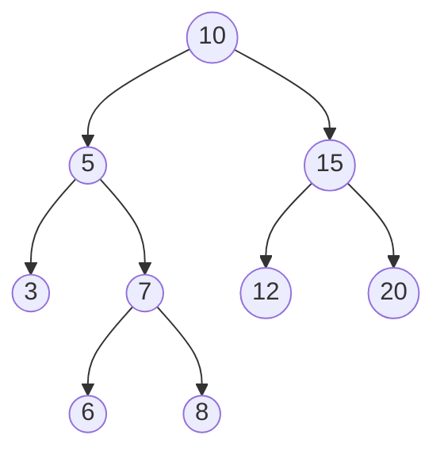
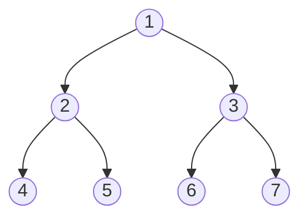
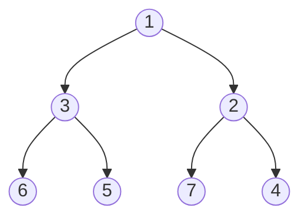

# 🌳 Arbres — Terminologie illustrée

---

## Arbre binaire d'exemple



---

## Vocabulaire annoté

| Terme | Définition | Sur l'exemple |
|-------|------------|---------------|
| **Racine** | Nœud sans parent | `10` |
| **Nœud** | Élément de l'arbre | tous |
| **Feuille** | Nœud sans enfant | `3, 6, 8, 12, 20` |
| **Nœud interne** | Nœud non feuille | `10, 5, 7, 15` |
| **Parent (père)** | Nœud directement au-dessus | parent de `7` = `5` |
| **Enfant (fils)** | Nœud directement en dessous | enfants de `5` = `3, 7` |
| **Frère** | Même parent | `3` et `7` sont frères |
| **Ancêtre** | Nœud sur le chemin vers la racine | `10, 5` sont ancêtres de `6` |
| **Descendant** | Nœud du sous-arbre | `6, 8` sont descendants de `7` |
| **Sous-arbre** | Tout l'arbre enraciné en un nœud | sous-arbre de `5` = `{5,3,7,6,8}` |
| **Profondeur** d'un nœud | Distance à la racine | profondeur de `6` = 3 |
| **Hauteur** d'un arbre | Profondeur max | `h = 3` |
| **Taille** | Nombre total de nœuds | `n = 9` |
| **Niveau k** | Ensemble des nœuds à profondeur k | niveau 2 : `3, 7, 12, 20` |
| **Arité** | Nb max d'enfants par nœud | binaire : 2 |

---

## Encadrement clé pour un arbre binaire

Pour un arbre binaire de hauteur `h` à `n` nœuds :

```
h + 1  ≤  n  ≤  2^(h+1) - 1
```

> Atteint à gauche pour un arbre filiforme (chaîne), à droite pour un arbre **parfait**.


---

## ABR (Arbre Binaire de Recherche)

**Propriété** : pour chaque nœud, **gauche < nœud < droite** (et idem récursivement).

L'arbre ci-dessus en est un. Vérification au nœud `15` :
- Sous-arbre gauche `12` < `15` ✅
- Sous-arbre droit `20` > `15` ✅

---

## Parcours d'arbre binaire



| Parcours | Ordre | Résultat |
|----------|-------|----------|
| **Préfixe** (racine, gauche, droite) | NGD | 1, 2, 4, 5, 3, 6, 7 |
| **Infixe** (gauche, racine, droite) | GND | 4, 2, 5, 1, 6, 3, 7 |
| **Suffixe** (gauche, droite, racine) | GDN | 4, 5, 2, 6, 7, 3, 1 |
| **Largeur** (BFS) | par niveau | 1, 2, 3, 4, 5, 6, 7 |

> Sur un **ABR**, le parcours **infixe donne les valeurs triées** par ordre croissant.

```python
class Noeud:
    def __init__(self, valeur, gauche=None, droite=None):
        self.valeur = valeur
        self.gauche = gauche
        self.droite = droite


def prefixe(n):
    if n is None:
        return []
    return [n.valeur] + prefixe(n.gauche) + prefixe(n.droite)


def infixe(n):
    if n is None:
        return []
    return infixe(n.gauche) + [n.valeur] + infixe(n.droite)


def suffixe(n):
    if n is None:
        return []
    return suffixe(n.gauche) + suffixe(n.droite) + [n.valeur]
```

---

## Tas (heap) min — exemple

Propriété : la valeur d'un nœud est **inférieure ou égale** à celles de ses enfants.


La racine contient toujours **le minimum**. Utilisé pour les files de priorité.

---

## Aide-mémoire complexité

| Opération | ABR équilibré | ABR quelconque |
|-----------|---------------|----------------|
| Recherche / insertion / suppression | O(log n) | O(n) |
| Parcours | O(n) | O(n) |
| Hauteur | O(n) | O(n) |
