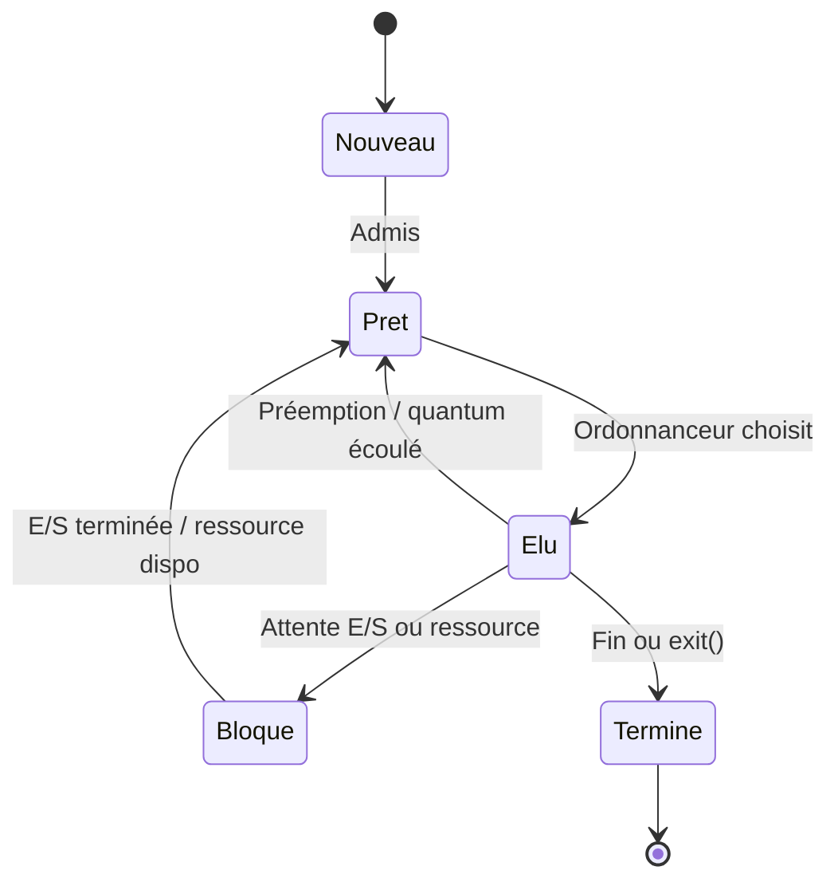
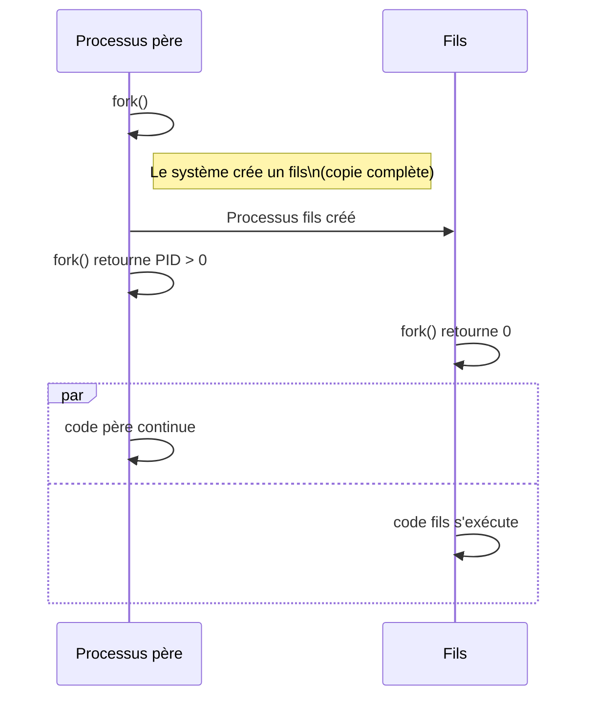
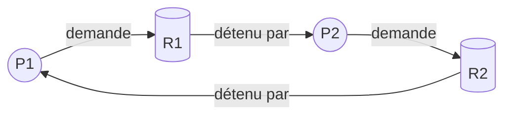
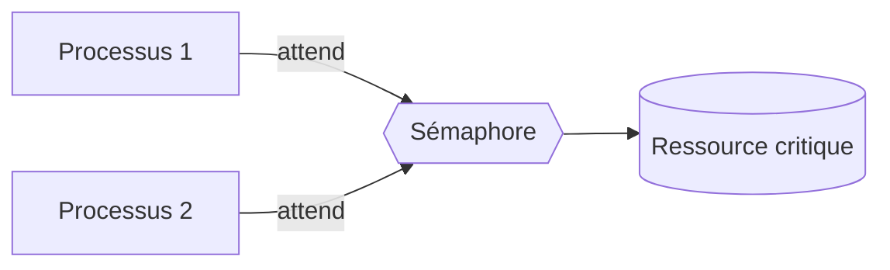
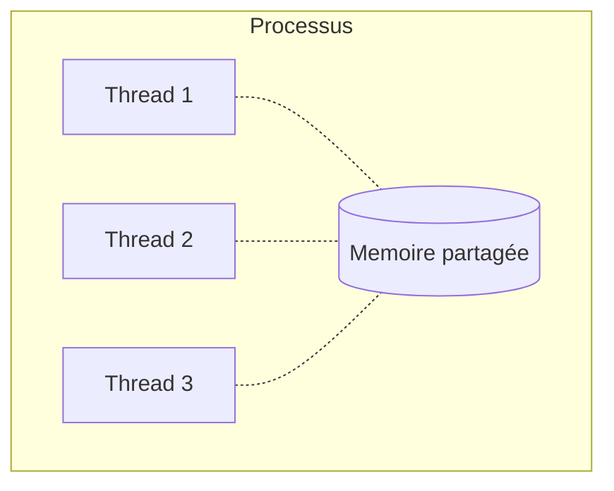

# 🔄 États d'un processus

---

## Automate des états (5 états)

| État | Signification |
|------|---------------|
| **Nouveau** | Processus créé mais pas encore prêt à s'exécuter |
| **Prêt** | Attend qu'un CPU lui soit attribué par l'ordonnanceur |
| **Élu** (en exécution) | Utilise actuellement le CPU |
| **Bloqué** | En attente d'un événement (E/S, signal, ressource) |
| **Terminé** | A fini son exécution ; ses ressources peuvent être libérées |

---

## Création d'un processus (Unix : `fork()`)

---

## Interblocage (deadlock)

**Conditions de Coffman** (les 4 doivent être réunies) :

1. **Exclusion mutuelle** : ressources non partageables.
2. **Occupation et attente** : processus qui détient une ressource en attend d'autres.
3. **Pas de préemption** : on ne peut pas forcer un processus à libérer.
4. **Attente circulaire** : cycle dans le graphe d'allocation.

### Graphe d'allocation — exemple d'interblocage

→ P1 attend R1 (détenu par P2), P2 attend R2 (détenu par P1) : **interblocage**.

---

## Ordonnancement — politiques classiques

| Politique | Principe |
|-----------|----------|
| **FCFS** (First Come First Served) | Premier arrivé, premier servi |
| **SJF** (Shortest Job First) | Le plus court d'abord |
| **Round Robin** | Tour par tour, quantum de temps fixe |
| **Priorité** | Le plus prioritaire d'abord |

---

## Ressources partagées et synchronisation

**Sémaphore** : compteur partagé qui régule l'accès à une ressource.

---

## Processus vs Thread

| Aspect | Processus | Thread |
|--------|-----------|--------|
| Mémoire | Isolée | Partagée avec les autres threads du même processus |
| Création | Lente | Rapide |
| Communication | Pipes, sockets, signaux | Variables globales |
| Plantage | N'affecte pas les autres | Peut planter tout le processus |

