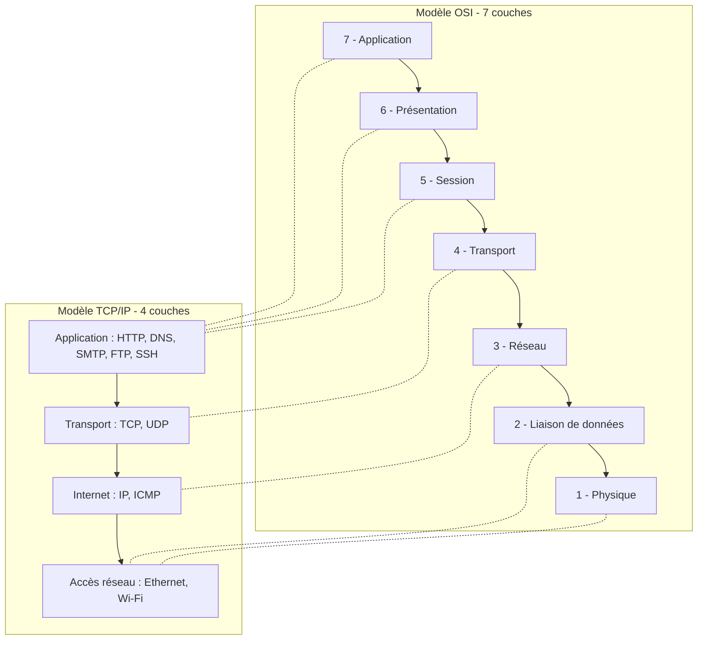
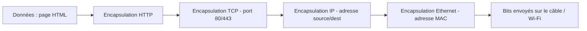
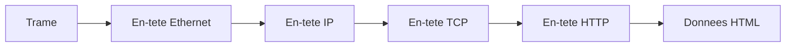
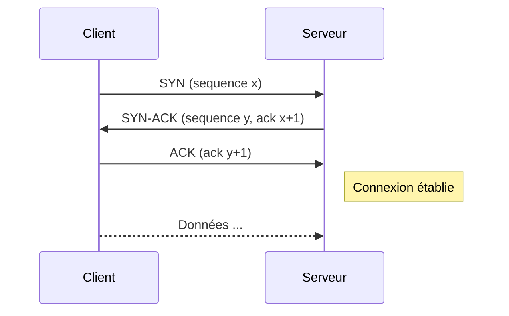

# 🌐 Modèles OSI et TCP/IP

---

## Comparaison OSI ↔ TCP/IP



---

## Tableau comparatif

| Couche OSI | Couche TCP/IP | Unité | Protocoles | Adresse |
|------------|---------------|-------|------------|---------|
| 7 Application | Application | Donnée | HTTP, HTTPS, DNS, SMTP, FTP, SSH | URL / nom |
| 6 Présentation | Application | Donnée | TLS/SSL, MIME, ASCII | — |
| 5 Session | Application | Donnée | NetBIOS | — |
| 4 Transport | Transport | Segment (TCP) / Datagramme (UDP) | TCP, UDP | Port |
| 3 Réseau | Internet | Paquet | IP, ICMP, ARP | Adresse IP |
| 2 Liaison | Accès réseau | Trame | Ethernet, PPP, MAC | Adresse MAC |
| 1 Physique | Accès réseau | Bit | RJ45, Wi-Fi, fibre | — |

---

## Encapsulation : exemple navigation web



À la **désencapsulation** côté serveur, on remonte les couches en sens inverse.



---

## Établissement TCP — handshake en 3 temps



Fermeture en 4 temps : FIN / ACK / FIN / ACK.

---

## Comparaison TCP vs UDP

| Critère | TCP | UDP |
|---------|-----|-----|
| Connecté ? | Oui (handshake) | Non |
| Fiable ? | Oui (ACK + retransmission) | Non |
| Ordonné ? | Oui | Non (à la charge de l'app.) |
| En-tête | 20 octets | 8 octets |
| Vitesse | Moyen | Rapide |
| Usage typique | HTTP, SSH, mail | DNS, jeux, VoIP, streaming |

---

## Calcul d'adresse réseau (CIDR)

Adresse IP : `192.168.1.42/24`

```
IP        : 11000000 . 10101000 . 00000001 . 00101010
Masque    : 11111111 . 11111111 . 11111111 . 00000000   (24 bits à 1)
ET binaire: 11000000 . 10101000 . 00000001 . 00000000
→ Adresse réseau    : 192.168.1.0
→ Adresse broadcast : 192.168.1.255   (bits hôte tous à 1)
→ Nombre d'hôtes    : 2^8 - 2 = 254
```

| Préfixe | Masque dot | Nb hôtes utilisables |
|---------|-----------|----------------------|
| /8 | 255.0.0.0 | 16 777 214 |
| /16 | 255.255.0.0 | 65 534 |
| /24 | 255.255.255.0 | 254 |
| /28 | 255.255.255.240 | 14 |
| /30 | 255.255.255.252 | 2 (liens point-à-point) |

---

## Plages IP privées (à connaître)

| Classe | Plage | CIDR |
|--------|-------|------|
| A | 10.0.0.0 – 10.255.255.255 | 10.0.0.0/8 |
| B | 172.16.0.0 – 172.31.255.255 | 172.16.0.0/12 |
| C | 192.168.0.0 – 192.168.255.255 | 192.168.0.0/16 |

→ Non routables sur Internet, traduites par **NAT**.

---

## Ports standards

| Port | Protocole |
|------|-----------|
| 20/21 | FTP |
| 22 | SSH |
| 23 | Telnet |
| 25 | SMTP |
| 53 | DNS |
| 67/68 | DHCP |
| 80 | HTTP |
| 110 | POP3 |
| 143 | IMAP |
| 443 | HTTPS |
| 3306 | MySQL |
| 5432 | PostgreSQL |
| 8080 | HTTP alternatif |
