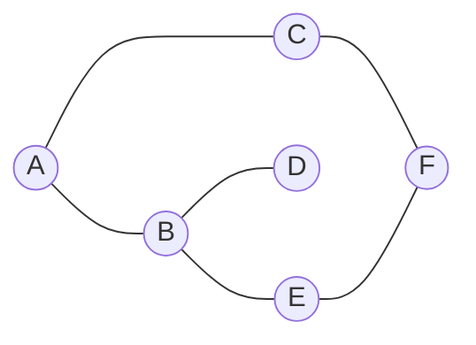
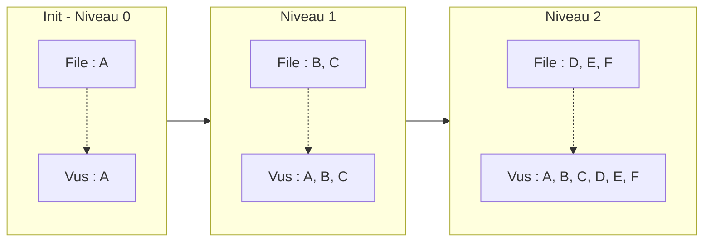
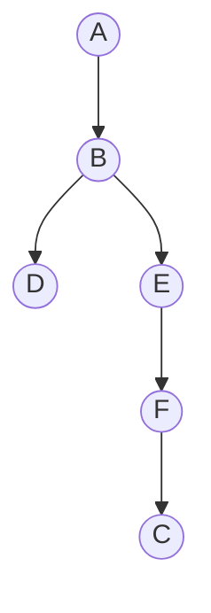

# 🕸 Parcours de graphes — BFS et DFS schématisés

---

## Graphe d'exemple



Voisinages :
- A : B, C
- B : A, D, E
- C : A, F
- D : B
- E : B, F
- F : C, E

---

## BFS (Breadth-First Search) — depuis A

**Principe** : explorer **niveau par niveau** à l'aide d'une **file (FIFO)**.



**Ordre de découverte** : `A → B → C → D → E → F`

```python
from collections import deque

def bfs(graphe, depart):
    """Parcours en largeur depuis le sommet `depart`.

    graphe : dict {sommet: [voisins]}
    Retourne la liste des sommets dans l'ordre de découverte.
    """
    vus = {depart}
    file = deque([depart])
    ordre = []
    while file:
        s = file.popleft()
        ordre.append(s)
        for v in graphe[s]:
            if v not in vus:
                vus.add(v)
                file.append(v)
    return ordre
```

---

## DFS (Depth-First Search) — depuis A

**Principe** : aller en **profondeur** d'abord, puis remonter (backtrack).
On utilise une **pile (LIFO)** — explicite ou via la **récursion**.



**Ordre de découverte** (récursif, voisins dans l'ordre alphabétique) :
`A → B → D → E → F → C`

```python
def dfs_recursif(graphe, depart, vus=None):
    """DFS récursif depuis `depart`."""
    if vus is None:
        vus = set()
    vus.add(depart)
    ordre = [depart]
    for v in graphe[depart]:
        if v not in vus:
            ordre.extend(dfs_recursif(graphe, v, vus))
    return ordre


def dfs_iteratif(graphe, depart):
    """DFS itératif avec une pile explicite."""
    vus = {depart}
    pile = [depart]
    ordre = []
    while pile:
        s = pile.pop()
        ordre.append(s)
        for v in graphe[s]:
            if v not in vus:
                vus.add(v)
                pile.append(v)
    return ordre
```

---

## Comparaison BFS vs DFS

| Aspect | BFS | DFS |
|--------|-----|-----|
| Structure auxiliaire | File (FIFO) | Pile (LIFO) ou récursion |
| Ordre de découverte | Niveau par niveau | Profondeur d'abord |
| Plus court chemin (non pondéré) | ✅ Oui | ❌ Non |
| Détection de cycle | Possible | ✅ Plus simple |
| Composantes connexes | ✅ | ✅ |
| Mémoire | Niveau le plus large | Hauteur de l'arbre |
| Complexité (liste d'adj.) | O(V + E) | O(V + E) |

---

## Plus court chemin BFS (non pondéré)

```python
def plus_court_chemin(graphe, depart, arrivee):
    """Plus court chemin entre depart et arrivee (graphe non pondéré).

    Renvoie la liste des sommets du chemin, ou None si inaccessible.
    """
    if depart == arrivee:
        return [depart]
    vus = {depart}
    file = deque([(depart, [depart])])
    while file:
        s, chemin = file.popleft()
        for v in graphe[s]:
            if v == arrivee:
                return chemin + [v]
            if v not in vus:
                vus.add(v)
                file.append((v, chemin + [v]))
    return None
```

---

## Détection de cycle (graphe non orienté, DFS)

```python
def a_un_cycle(graphe):
    """Renvoie True si le graphe contient un cycle (non orienté)."""
    vus = set()

    def dfs(s, parent):
        vus.add(s)
        for v in graphe[s]:
            if v not in vus:
                if dfs(v, s):
                    return True
            elif v != parent:
                return True   # cycle trouvé
        return False

    for s in graphe:
        if s not in vus:
            if dfs(s, None):
                return True
    return False
```
