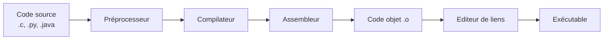
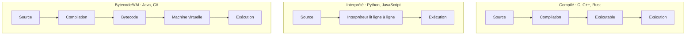
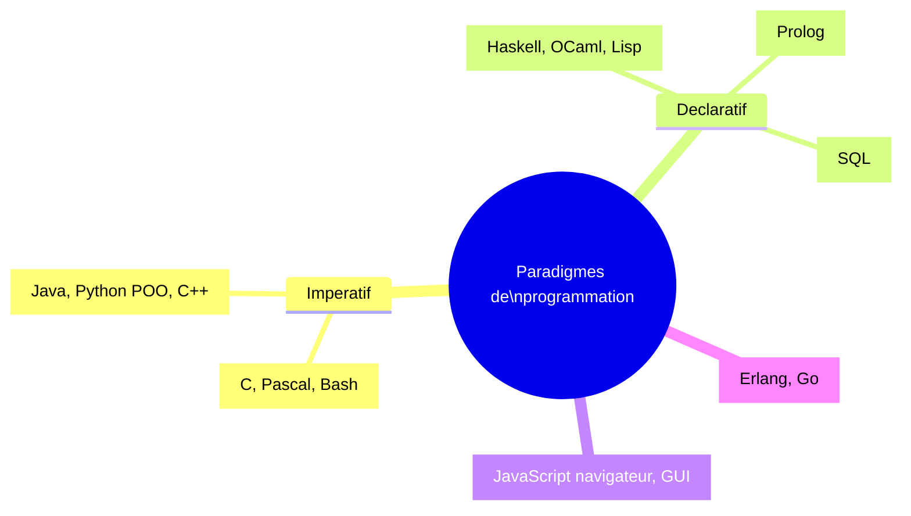

# 🛠 Pipeline de compilation et paradigmes

---

## Source → exécutable



| Étape | Rôle |
|-------|------|
| Préprocesseur | Inclusions (`#include`), macros, conditionnelles |
| Compilateur | Source → assembleur (analyse lexicale, syntaxique, sémantique) |
| Assembleur | Assembleur → code machine binaire (.o) |
| Éditeur de liens | Combine les .o + bibliothèques → exécutable |

---

## Compilation vs interprétation



| Type | Avantages | Inconvénients |
|------|-----------|---------------|
| Compilé | Rapide à l'exécution | Compilation à refaire si source change |
| Interprété | Portable, rapide à coder | Plus lent à l'exécution |
| Bytecode | Compromis (JIT) | Démarrage plus lent (VM) |

---

## Carte mentale des paradigmes



---

## Comparatif sur un exemple : somme d'une liste

```python
# Impératif (boucle)
def somme_imperative(L):
    s = 0
    for x in L:
        s += x
    return s

# Récursif (fonctionnel)
def somme_recursive(L):
    if not L:
        return 0
    return L[0] + somme_recursive(L[1:])

# Fonctionnel (réduction)
from functools import reduce
def somme_reduce(L):
    return reduce(lambda a, b: a + b, L, 0)

# Built-in (déclaratif)
def somme_builtin(L):
    return sum(L)
```

| Approche | Mots-clés / outils |
|----------|---------------------|
| Impérative | `for`, `while`, affectation |
| OO | `class`, `self`, `__init__` |
| Fonctionnelle | `lambda`, `map`, `filter`, `reduce`, immutabilité |
| Déclarative | SQL, regex, Prolog |
