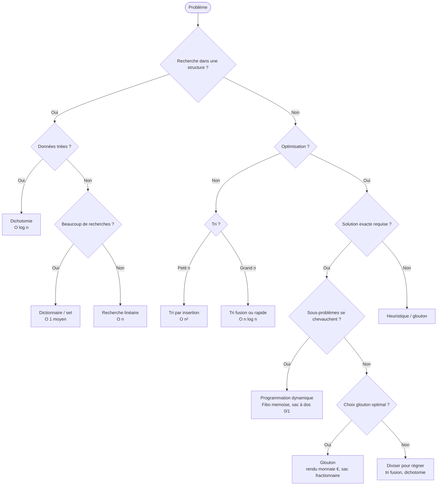
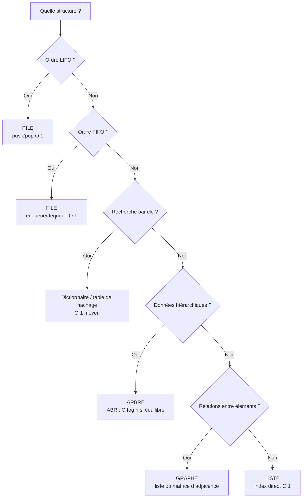
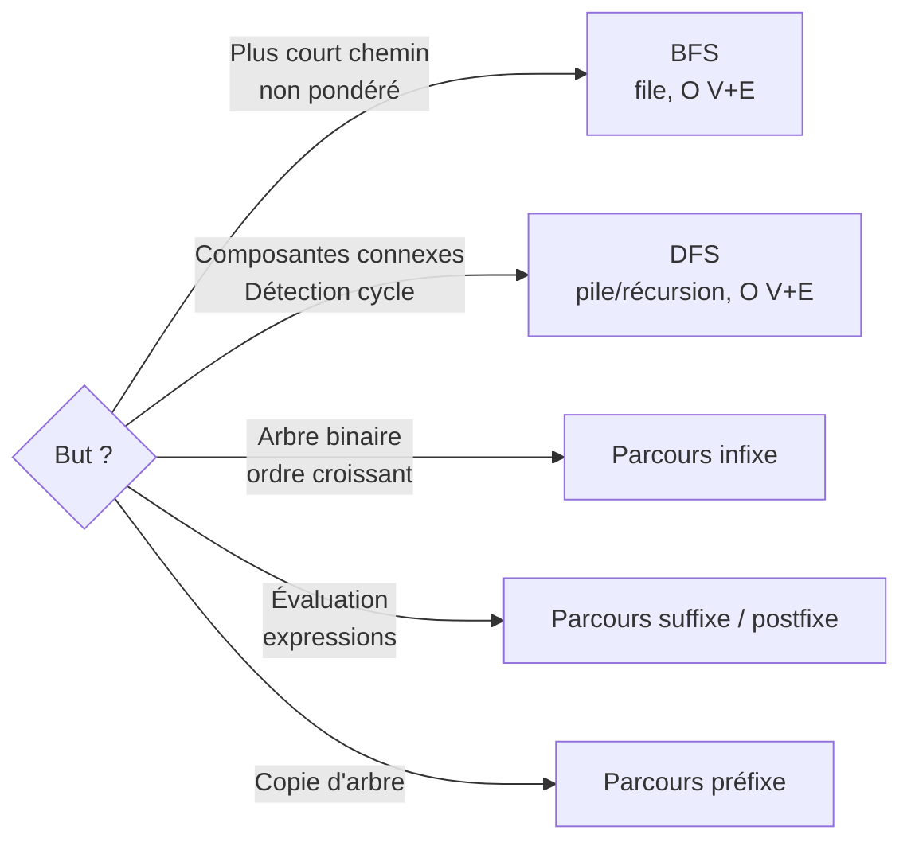

# 🧭 Arbre de décision — « Quel algorithme choisir ? »

Diagramme synthétique reliant un **type de problème** à la bonne **stratégie algorithmique**.
À garder en tête pour le bac NSI.

---

## Vue d'ensemble

---

## Choix de structure de données

---

## Quand chaque parcours ?

---

## Cheat-sheet « si je vois… alors »

| Indices dans l'énoncé | Algorithme |
|-----------------------|------------|
| « plus petit nombre de pièces » avec € | Glouton |
| « plus petit nombre de pièces » avec système quelconque | Programmation dynamique |
| « plus court chemin », graphe non pondéré | BFS |
| « tous les sommets atteignables » | DFS |
| « est-ce qu'il y a un cycle ? » | DFS avec marquage |
| « combien de chemins ? » dans un treillis | DP |
| « rechercher dans un texte » | Naïf / KMP |
| « trier n grandes valeurs » | Tri fusion ou rapide |
| « trouver l'élément le plus proche » | KNN |
| « tous les éléments d'un arbre dans l'ordre » | Parcours infixe |
| « hiérarchie » | Arbre |
| « liens entre entités » | Graphe |
