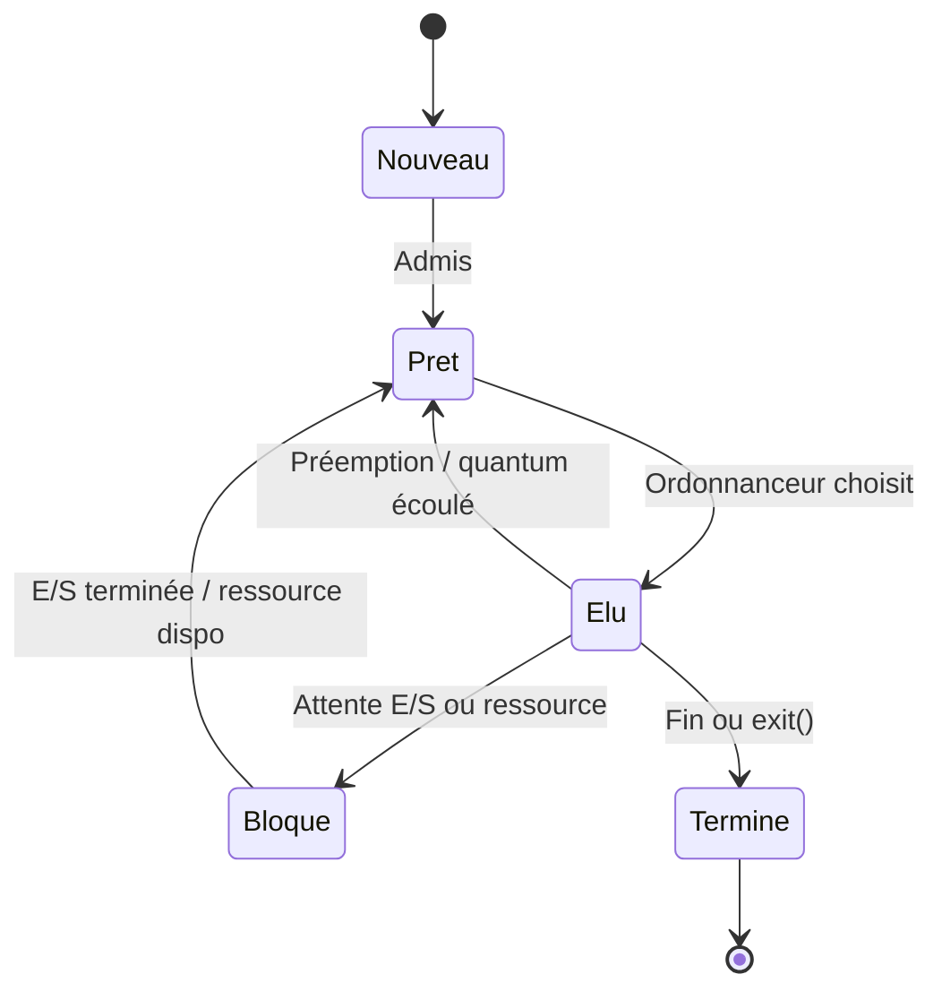
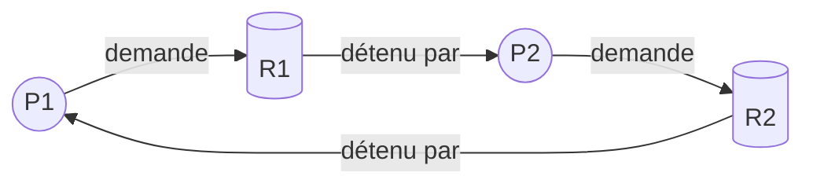

# 🔄 États d'un processus

---

## Automate des états (5 états)

| État | Signification |
|------|---------------|
| **Nouveau** | Processus créé mais pas encore prêt à s'exécuter |
| **Prêt** | Attend qu'un CPU lui soit attribué par l'ordonnanceur |
| **Élu** (en exécution) | Utilise actuellement le CPU |
| **Bloqué** | En attente d'un événement (E/S, signal, ressource) |
| **Terminé** | A fini son exécution ; ses ressources peuvent être libérées |

---

## Interblocage (deadlock)

**Conditions de Coffman** (les 4 doivent être réunies) :

1. **Exclusion mutuelle** : ressources non partageables.
2. **Occupation et attente** : processus qui détient une ressource en attend d'autres.
3. **Pas de préemption** : on ne peut pas forcer un processus à libérer.
4. **Attente circulaire** : cycle dans le graphe d'allocation.

### Graphe d'allocation — exemple d'interblocage

→ P1 attend R1 (détenu par P2), P2 attend R2 (détenu par P1) : **interblocage**.
