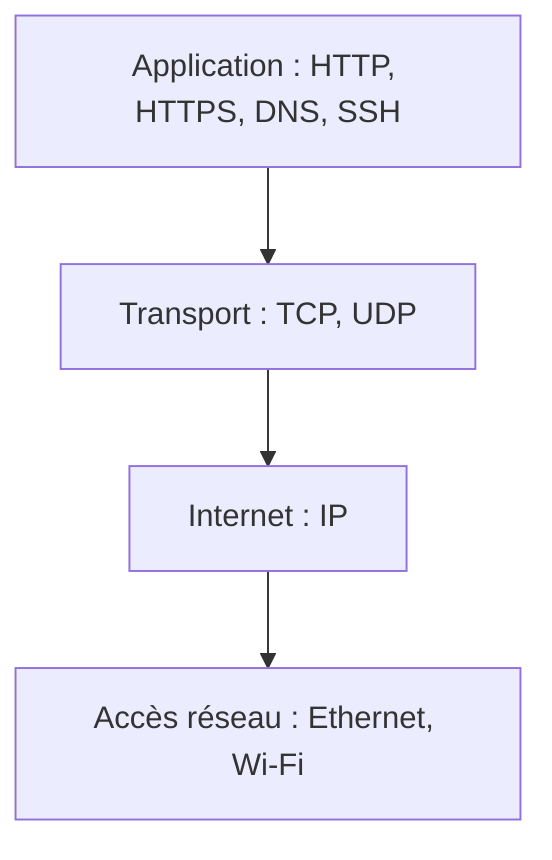
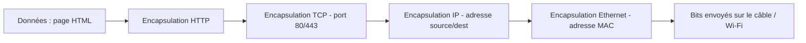
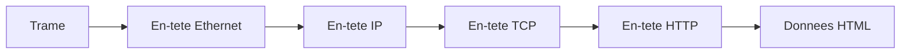

# 🌐 Modèle TCP/IP

!!! info "Périmètre BO"
    Au programme NSI : **TCP/IP en 4 couches** (avec encapsulation), adressage IPv4 + CIDR, plages privées, ports principaux. **Hors programme** : OSI 7 couches détaillé, NAT, IPv6, handshake TCP en 3 voies.

---

## Le modèle TCP/IP en 4 couches



| Couche TCP/IP | Unité | Protocoles | Adresse |
|---------------|-------|------------|---------|
| **Application** | Donnée | HTTP, HTTPS, DNS, SSH | URL / nom |
| **Transport** | Segment (TCP) / Datagramme (UDP) | TCP, UDP | Port |
| **Internet** | Paquet | IP | Adresse IP |
| **Accès réseau** | Trame / Bit | Ethernet, Wi-Fi, MAC | Adresse MAC |

> 💡 **OSI** est un modèle théorique en **7 couches** ; **TCP/IP** est ce qu'on utilise en pratique (4 couches). Au bac, on attend la connaissance du modèle TCP/IP.

---

## Encapsulation : exemple navigation web



À la **désencapsulation** côté serveur, on remonte les couches en sens inverse.



---

## Comparaison TCP vs UDP

| Critère | TCP | UDP |
|---------|-----|-----|
| Connecté ? | Oui | Non |
| Fiable ? | Oui (ACK + retransmission) | Non |
| Ordonné ? | Oui | Non |
| Vitesse | Moyen | Rapide |
| Usage typique | HTTP, SSH, mail | DNS, jeux, VoIP, streaming |

---

## Calcul d'adresse réseau (CIDR)

Adresse IP : `192.168.1.42/24`

```
IP        : 11000000 . 10101000 . 00000001 . 00101010
Masque    : 11111111 . 11111111 . 11111111 . 00000000   (24 bits à 1)
ET binaire: 11000000 . 10101000 . 00000001 . 00000000
→ Adresse réseau    : 192.168.1.0
→ Adresse broadcast : 192.168.1.255   (bits hôte tous à 1)
→ Nombre d'hôtes    : 2^8 - 2 = 254
```

| Préfixe | Masque dot | Nb hôtes utilisables |
|---------|-----------|----------------------|
| /8 | 255.0.0.0 | 16 777 214 |
| /16 | 255.255.0.0 | 65 534 |
| /24 | 255.255.255.0 | 254 |
| /28 | 255.255.255.240 | 14 |
| /30 | 255.255.255.252 | 2 (liens point-à-point) |

---

## Plages IP privées (à connaître)

| Plage | CIDR |
|-------|------|
| 10.0.0.0 – 10.255.255.255 | 10.0.0.0/8 |
| 172.16.0.0 – 172.31.255.255 | 172.16.0.0/12 |
| 192.168.0.0 – 192.168.255.255 | 192.168.0.0/16 |

---

## Ports standards (à connaître)

| Port | Protocole |
|------|-----------|
| 22 | SSH |
| 53 | DNS |
| 80 | HTTP |
| 443 | HTTPS |
