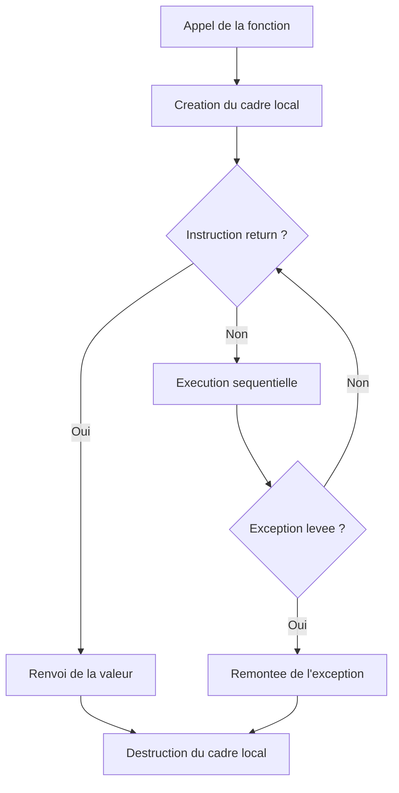

# Séquence 1 — Python : Remise en route

> Source : https://lyotardjulien.forge.apps.education.fr/terminale-specialite-nsi-au-lycee-notre-dame/00_sequence_0/sequence_0/
> PDFs : aucun PDF spécifique à cette séquence.

## TL;DR
- Maitriser les types natifs Python (`int`, `float`, `bool`, `str`, `list`, `tuple`, `dict`, `set`) et savoir distinguer **mutable** (`list`, `dict`, `set`) de **immuable** (`int`, `float`, `str`, `tuple`).
- Connaitre par cœur les structures de contrôle (`if/elif/else`, `while`, `for`, `break`, `continue`) et la définition de fonction (`def`, paramètres positionnels/nommés, valeur par défaut, `return`).
- Savoir lire et écrire une **compréhension de liste** ou de dictionnaire et utiliser les built-ins `len`, `range`, `sorted`, `enumerate`, `zip`, `map`, `filter`.
- Connaitre la gestion d'exceptions `try/except/else/finally`, l'ouverture de fichier avec `with` et l'`import` de modules.
- Comprendre la **portée** des variables (locale vs globale), le passage par référence pour les objets mutables et les **effets de bord**.

## Plan de la séquence
1. Variables, types et opérations de base.
2. Structures de contrôle (conditions et boucles).
3. Fonctions, portée, effets de bord.
4. Conteneurs : chaînes, listes, tuples, dictionnaires, ensembles.
5. Compréhensions de listes et de dictionnaires.
6. Fonctions built-in incontournables.
7. Exceptions, lecture/écriture de fichiers, modules.

## Notions clés

### Variables et typage dynamique
Une variable Python est une **étiquette** qui référence un objet. L'affectation `x = 3` crée un objet `int` `3` et lie le nom `x` à cet objet. Le type est porté par l'objet, pas par la variable : on parle de **typage dynamique**.

### Mutabilité
- **Immuables** : `int`, `float`, `bool`, `str`, `tuple`. Toute modification crée un **nouvel objet**.
- **Mutables** : `list`, `dict`, `set`. Modifiables en place ; passées par référence à une fonction.

### Slicing
Sur une séquence `s`, `s[a:b:p]` extrait les indices `a`, `a+p`, `a+2p`, ... strictement inférieurs à `b`. Les bornes peuvent être négatives (à partir de la fin). `s[::-1]` renverse la séquence.

### Compréhensions
Syntaxe concise pour créer des collections :
```python
carres = [x*x for x in range(10) if x % 2 == 0]
inverse = {v: k for k, v in dico.items()}
```

### Fonctions et portée
Variables définies dans une fonction sont **locales** par défaut. Pour modifier une globale, il faut `global`. À éviter au bac : préférer les paramètres et `return`.

## Vocabulaire
| Terme | Définition |
|-------|------------|
| Variable | Nom qui référence un objet en mémoire. |
| Type | Catégorie d'un objet (entier, flottant, chaîne...). |
| Mutable | Objet modifiable en place sans changer d'identité. |
| Immuable | Objet non modifiable ; toute modification crée un nouvel objet. |
| Tuple | Séquence ordonnée immuable, créée avec `(...)`. |
| Liste | Séquence ordonnée mutable, créée avec `[...]`. |
| Dictionnaire | Collection clé/valeur, créée avec `{cle: val, ...}`. |
| Compréhension | Construction concise d'une collection à partir d'un itérable. |
| Itérable | Objet sur lequel on peut faire `for x in obj`. |
| Effet de bord | Modification d'un objet hors de la portée locale. |
| Exception | Erreur survenue à l'exécution, captée par `try/except`. |
| Module | Fichier `.py` contenant fonctions/variables, importable. |
| Slicing | Extraction d'une sous-séquence par `s[a:b:p]`. |
| Portée | Zone du code où un nom est valide. |

## Algorithmes & code

### 1. Maximum d'une liste (parcours)
Principe : parcourir la liste en gardant en mémoire la plus grande valeur vue.
```python
def maximum(lst):
    """Retourne le plus grand element de la liste lst (non vide)."""
    # On suppose que lst contient au moins un element.
    plus_grand = lst[0]                # On initialise avec le premier
    for valeur in lst[1:]:             # Parcours des elements suivants
        if valeur > plus_grand:        # Mise a jour si on trouve mieux
            plus_grand = valeur
    return plus_grand
```
- Complexité temporelle : O(n).
- Complexité spatiale : O(1).
- Cas d'usage : statistiques de base, recherche d'extremum.

### 2. Recherche séquentielle
Principe : tester chaque élément jusqu'à trouver la cible ou atteindre la fin.
```python
def recherche(lst, cible):
    """Retourne l'indice de cible dans lst, ou -1 si absente."""
    for i, valeur in enumerate(lst):   # enumerate fournit (indice, valeur)
        if valeur == cible:
            return i                   # Trouve : on renvoie l'indice
    return -1                          # Non trouve
```
- Complexité temporelle : O(n) (pire et moyen cas).
- Complexité spatiale : O(1).
- Cas d'usage : liste non triée, petit volume.

### 3. Inversion de chaîne
Principe : utiliser le slicing négatif.
```python
def inverser(chaine):
    """Renvoie la chaine lue de droite a gauche."""
    return chaine[::-1]                # Slicing avec pas -1
```
- Complexité : O(n) en temps et espace (nouvelle chaîne créée).

### 4. Compter les occurrences avec un dictionnaire
Principe : itérer sur la séquence et incrémenter un compteur par clé.
```python
def occurrences(sequence):
    """Renvoie un dictionnaire {element: nombre d'occurrences}."""
    compteur = {}
    for elt in sequence:
        # dict.get(cle, defaut) renvoie defaut si cle absente
        compteur[elt] = compteur.get(elt, 0) + 1
    return compteur
```
- Complexité temporelle : O(n) en moyenne.
- Cas d'usage : analyse de texte, histogramme.

### 5. Lecture/écriture de fichier
```python
def lire_lignes(chemin):
    """Renvoie la liste des lignes (sans le retour a la ligne final)."""
    with open(chemin, "r", encoding="utf-8") as f:
        # rstrip enleve les espaces/retours de fin de ligne
        return [ligne.rstrip("\n") for ligne in f]

def ecrire_lignes(chemin, lignes):
    """Ecrit chaque element de lignes sur une ligne du fichier."""
    with open(chemin, "w", encoding="utf-8") as f:
        for ligne in lignes:
            f.write(ligne + "\n")
```
Le bloc `with` ferme automatiquement le fichier, même en cas d'exception.

### 6. Gestion d'exceptions
```python
def division(a, b):
    """Effectue a / b et renvoie None si b vaut 0."""
    try:
        resultat = a / b
    except ZeroDivisionError:
        # On capture precisement l'erreur attendue
        return None
    else:
        # Execute si aucune exception n'a ete levee
        return resultat
    finally:
        # Toujours execute (nettoyage)
        pass
```

### 7. Compréhensions et built-ins combinés
```python
# Liste des carres pairs entre 0 et 19
pairs_carres = [x * x for x in range(20) if x * x % 2 == 0]

# Dictionnaire {indice: valeur} a partir d'une liste
dico = {i: v for i, v in enumerate(["a", "b", "c"])}

# zip : combine deux iterables en tuples
prenoms = ["Anna", "Bob"]
ages = [17, 18]
couples = list(zip(prenoms, ages))     # [("Anna", 17), ("Bob", 18)]

# sorted : tri non destructif (renvoie une nouvelle liste)
trie = sorted([3, 1, 4, 1, 5], reverse=True)

# map / filter : transformation et filtrage
doubles = list(map(lambda x: 2 * x, [1, 2, 3]))   # [2, 4, 6]
positifs = list(filter(lambda x: x > 0, [-1, 0, 2]))  # [2]
```

## Diagramme : flux d'exécution d'une fonction



## Pièges classiques au bac
- **Confondre `=` (affectation) et `==` (test d'égalité)** dans une condition.
- **Modifier une liste passée en paramètre** sans s'en rendre compte (effet de bord).
- **`is` vs `==`** : `is` teste l'**identité** (même objet en mémoire), `==` teste l'**égalité** des valeurs. Au bac, on utilise presque toujours `==`.
- **Indices négatifs** : `lst[-1]` est le dernier élément, mais `lst[-1:0]` renvoie `[]` car le slicing va vers la droite par défaut.
- **Division** : `/` renvoie un `float`, `//` renvoie un `int` (division entière). `7/2 == 3.5` mais `7//2 == 3`.
- **Boucle `for i in range(len(lst))`** : préférer `for i, v in enumerate(lst)` quand on a besoin de la valeur.
- **Mutabilité du paramètre par défaut** : `def f(l=[])` partage la même liste entre tous les appels — bug classique.
- **Indentation** : 4 espaces, pas de mélange tabulation/espace.
- **Oublier `return`** : la fonction renvoie alors `None` implicitement.

## Questions types au bac

**Q1.** Que vaut `lst` après l'exécution suivante ?
```python
lst = [1, 2, 3]
def f(t): t.append(4)
f(lst)
```
> **Réponse modèle.** `lst` vaut `[1, 2, 3, 4]`. La liste est mutable et passée par référence, donc `append` la modifie en place.

**Q2.** Donner le type et la valeur de `t` :
```python
t = (5,)
```
> **Réponse modèle.** `t` est un **tuple à un élément** valant `(5,)`. La virgule est obligatoire ; sans elle, `(5)` serait un simple `int`.

**Q3.** Écrire en compréhension la liste des carrés des entiers de 1 à n inclus.
> **Réponse modèle.** `[k * k for k in range(1, n + 1)]`.

**Q4.** Que renvoie le code suivant et pourquoi ?
```python
try:
    x = int("abc")
except ValueError:
    x = 0
print(x)
```
> **Réponse modèle.** Affiche `0`. `int("abc")` lève `ValueError`, captée par `except`, ce qui assigne `0` à `x`.

**Q5.** Différence entre `list.sort()` et `sorted(list)`.
> **Réponse modèle.** `list.sort()` trie **en place** (modifie la liste, renvoie `None`). `sorted(list)` renvoie une **nouvelle liste triée** sans modifier l'originale.

## Liens
- Cours en ligne : https://lyotardjulien.forge.apps.education.fr/terminale-specialite-nsi-au-lycee-notre-dame/00_sequence_0/sequence_0/
- Ressource « Bon départ » : https://lyotardjulien.forge.apps.education.fr/bifurcation-site-coilhac-term/Bon_depart/bon_depart/
- Listes en compréhension : https://lyotardjulien.forge.apps.education.fr/bifurcation-site-coilhac-term/Bon_depart/listes/07_comprehension/
- Variables locales et effets de bord : https://lyotardjulien.forge.apps.education.fr/bifurcation-site-coilhac-term/Bon_depart/var_locales_bords/variables_locales_effet_bord/
- Vidéos référencées dans le cours : « Vidéo de rappel sur les chaînes de caractères », « Vidéo de rappel sur les listes et les dictionnaires », « Vidéo complète pour tout comprendre sur les dictionnaires » (URL YouTube non publiée dans le HTML de la page).
