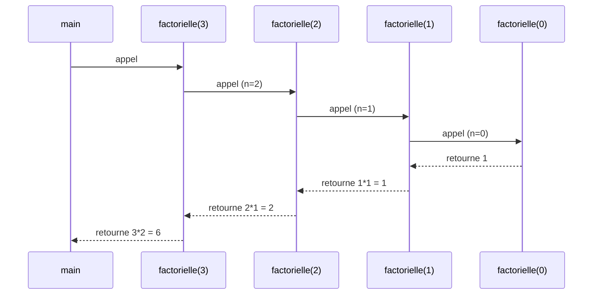
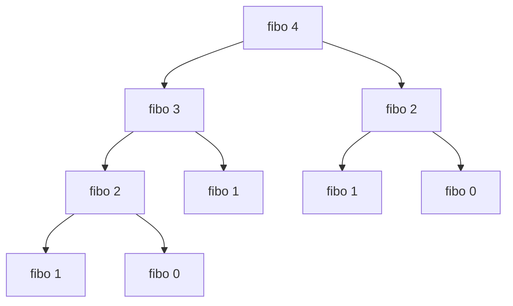

# Séquence 2 — Récursivité

> Source : https://lyotardjulien.forge.apps.education.fr/terminale-specialite-nsi-au-lycee-notre-dame/01_sequence_1/sequence_1/
> PDFs : `assets/pdf/NSI_Recursivite.pdf`

## TL;DR
- Une fonction est **récursive** lorsqu'elle s'appelle elle-même. Elle exige un **cas de base** (qui arrête la récursion) et un **cas récursif** (qui se rapproche du cas de base).
- À chaque appel, Python empile un **contexte d'exécution** (cadre) dans la **pile d'appels**. Sans cas de base, on obtient une `RecursionError` (limite par défaut ~1000).
- Pour analyser la complexité, on écrit une **équation de récurrence** sur le coût `T(n)` (ex. Hanoï : `T(n) = 2·T(n−1) + 1` ⇒ `T(n) = 2ⁿ − 1`).
- Récursif vs itératif : même puissance expressive ; le récursif est souvent plus lisible (Hanoï, fractales) mais coûte en mémoire (pile).
- Mémorisation (`@functools.cache` ou dictionnaire) transforme une récursion exponentielle (Fibonacci naïf en O(2ⁿ)) en linéaire (O(n)).

## Plan de la séquence
1. Les appels de fonctions et la pile d'appels.
2. Les fonctions récursives : factorielle, schéma général.
3. La récursivité dans tous les sens : Fibonacci, flocon de Koch, arbre de Pythagore.
4. Les Tours de Hanoï.

## Notions clés

### Définition formelle
Une fonction est dite **récursive** si, dans son corps, elle s'appelle elle-même (directement ou indirectement). Toute définition récursive correcte comporte :
1. **Au moins un cas de base** : configuration où la fonction renvoie un résultat sans nouvel appel récursif.
2. **Au moins un cas récursif** : configuration où la fonction s'appelle sur une donnée **strictement plus petite** (ce qui garantit la terminaison).

### Pile d'appels
Chaque appel de fonction ouvre un **cadre d'exécution** (paramètres, variables locales, adresse de retour) empilé dans la **pile d'appels**. À chaque `return`, le cadre est dépilé. La pile a une taille limitée :
```python
import sys
sys.getrecursionlimit()        # 1000 par defaut
sys.setrecursionlimit(10_000)  # On peut l'augmenter (avec prudence)
```

### Récurrence et complexité
- Factorielle : `T(n) = T(n−1) + 1` ⇒ `T(n) = O(n)`.
- Fibonacci naïf : `T(n) = T(n−1) + T(n−2) + 1` ⇒ `T(n) = O(φⁿ)` exponentielle.
- Hanoï : `T(n) = 2·T(n−1) + 1` ⇒ `T(n) = 2ⁿ − 1`.
- Dichotomie : `T(n) = T(n/2) + 1` ⇒ `T(n) = O(log n)`.

### Récursif vs itératif
Toute fonction récursive peut être réécrite de manière itérative (avec une boucle et éventuellement une pile explicite). L'inverse est vrai aussi. Le choix dépend de la lisibilité, des performances et des contraintes de pile.

## Vocabulaire
| Terme | Définition |
|-------|------------|
| Récursivité | Définition d'une fonction qui s'appelle elle-même. |
| Cas de base | Configuration sans appel récursif, qui arrête la récursion. |
| Cas récursif | Configuration où la fonction s'appelle sur une donnée plus petite. |
| Pile d'appels | Structure LIFO qui empile les contextes d'exécution. |
| RecursionError | Erreur levée quand la profondeur d'appel dépasse la limite. |
| Mémoïsation | Mémorisation des résultats déjà calculés pour éviter les recalculs. |
| Récurrence | Équation reliant `T(n)` à `T(k)` pour `k < n`. |
| Fractale | Figure auto-similaire (ex. flocon de Koch, arbre de Pythagore). |

## Algorithmes & code

### 1. Factorielle
Principe : `n! = n × (n−1)!`, cas de base `0! = 1`.
```python
def factorielle(n):
    """Calcule n! de maniere recursive (n entier >= 0)."""
    if n == 0:                # Cas de base
        return 1
    return n * factorielle(n - 1)   # Cas recursif
```
- Complexité temporelle : O(n).
- Complexité spatiale : O(n) (pile d'appels).
- Cas d'usage : combinatoire, permutations.

### 2. Fibonacci naïf
Principe : `F(n) = F(n−1) + F(n−2)`, cas de base `F(0)=0`, `F(1)=1`.
```python
def fibo(n):
    """Calcule le n-ieme terme de la suite de Fibonacci (version naive)."""
    if n < 2:                       # Cas de base : F(0)=0, F(1)=1
        return n
    return fibo(n - 1) + fibo(n - 2)
```
- Complexité temporelle : **O(2ⁿ)** (arbre d'appels exponentiel).
- Beaucoup de recalculs inutiles : `fibo(5)` recalcule `fibo(2)` 3 fois.

### 3. Fibonacci mémoïsé
```python
def fibo_memo(n, cache=None):
    """Fibonacci avec memoisation : O(n) en temps."""
    if cache is None:
        cache = {0: 0, 1: 1}        # Initialisation des cas de base
    if n in cache:
        return cache[n]             # On evite tout recalcul
    cache[n] = fibo_memo(n - 1, cache) + fibo_memo(n - 2, cache)
    return cache[n]

# Variante moderne avec functools.cache (Python >= 3.9)
from functools import cache

@cache
def fibo_cache(n):
    if n < 2:
        return n
    return fibo_cache(n - 1) + fibo_cache(n - 2)
```
- Complexité temporelle : O(n).
- Complexité spatiale : O(n) (cache + pile).

### 4. Tours de Hanoï
Principe : pour déplacer `n` disques de `source` vers `cible` via `aux`, on déplace `n−1` disques sur `aux`, on déplace le plus gros sur `cible`, puis les `n−1` disques de `aux` vers `cible`.
```python
def hanoi(n, source, cible, aux):
    """Affiche les deplacements pour resoudre les Tours de Hanoi."""
    if n == 0:                       # Cas de base : rien a deplacer
        return
    hanoi(n - 1, source, aux, cible)         # 1) Liberer le gros disque
    print(f"Deplacer disque {n} : {source} -> {cible}")  # 2) Le deplacer
    hanoi(n - 1, aux, cible, source)         # 3) Reposer les n-1 disques

# Exemple : hanoi(3, 'A', 'C', 'B')
# Deplacer disque 1 : A -> C
# Deplacer disque 2 : A -> B
# Deplacer disque 1 : C -> B
# Deplacer disque 3 : A -> C
# Deplacer disque 1 : B -> A
# Deplacer disque 2 : B -> C
# Deplacer disque 1 : A -> C
```
- Récurrence : `T(n) = 2·T(n−1) + 1`, `T(0) = 0`.
- Solution close : `T(n) = 2ⁿ − 1`.
- Complexité temporelle : **O(2ⁿ)**.
- Complexité spatiale : O(n) (pile de profondeur n).

### 5. Recherche dichotomique récursive
Principe : sur une **liste triée**, comparer au milieu et chercher dans la moitié appropriée.
```python
def dichotomie(lst, cible, gauche=0, droite=None):
    """Renvoie l'indice de cible dans lst triee, ou -1 si absente."""
    if droite is None:
        droite = len(lst) - 1
    if gauche > droite:              # Cas de base : intervalle vide
        return -1
    milieu = (gauche + droite) // 2
    if lst[milieu] == cible:
        return milieu
    if lst[milieu] < cible:
        return dichotomie(lst, cible, milieu + 1, droite)
    return dichotomie(lst, cible, gauche, milieu - 1)
```
- Complexité temporelle : **O(log n)**.
- Complexité spatiale : O(log n).
- Pré-condition : la liste doit être triée.

### 6. Parcours récursif de liste
```python
def somme(lst):
    """Somme des elements d'une liste, version recursive."""
    if not lst:                  # Liste vide : somme nulle
        return 0
    return lst[0] + somme(lst[1:])   # Tete + somme de la queue
```
- Complexité temporelle : O(n²) ici à cause du **slicing** qui copie la queue.
- Variante O(n) avec un index :
```python
def somme_idx(lst, i=0):
    if i == len(lst):
        return 0
    return lst[i] + somme_idx(lst, i + 1)
```

### 7. Inversion récursive d'une chaîne
```python
def inverser(chaine):
    """Renvoie la chaine lue de droite a gauche, recursivement."""
    if len(chaine) <= 1:         # Cas de base
        return chaine
    return inverser(chaine[1:]) + chaine[0]
```
- Complexité : O(n²) (copies de chaîne).

### 8. Comparaison itératif vs récursif (factorielle)
```python
def factorielle_iter(n):
    """Version iterative de la factorielle, O(1) en memoire de pile."""
    resultat = 1
    for k in range(2, n + 1):
        resultat *= k
    return resultat
```
La version itérative évite la pile d'appels et n'a aucun risque de `RecursionError`.

## Diagramme : pile d'appels de `factorielle(3)`



## Diagramme : arbre d'appels de `fibo(4)`


On voit que `fibo(2)` est calculé deux fois : motif d'explosion exponentielle.

## Pièges classiques au bac
- **Oublier le cas de base** ⇒ `RecursionError: maximum recursion depth exceeded`.
- **Cas récursif qui ne se rapproche pas du cas de base** (ex. `f(n) = f(n)` ou `f(n) = f(n+1)`) ⇒ boucle infinie de pile.
- **Confondre `return f(...)` et `f(...)`** : oublier le `return` renvoie `None`.
- **Récursivité non terminale en Python** : pas d'optimisation des appels terminaux ; chaque appel consomme un cadre.
- **Slicing dans la récursion** : `lst[1:]` recopie la liste à chaque appel, ce qui dégrade la complexité.
- **Confondre `T(n) = 2·T(n−1)` (Hanoï, exponentiel) et `T(n) = T(n/2)` (dichotomie, logarithmique)**.
- **Mémoïsation oubliée** sur Fibonacci ⇒ programme inutilisable au-delà de n ≈ 35.
- **Mauvaise utilisation des paramètres par défaut** : `def f(cache={})` partage le dict entre tous les appels.

## Questions types au bac

**Q1.** Donner la définition récursive de la fonction factorielle et préciser cas de base et cas récursif.
> **Réponse modèle.** Cas de base : `0! = 1`. Cas récursif : `n! = n × (n−1)!` pour `n ≥ 1`. Code : `def fact(n): return 1 if n == 0 else n * fact(n-1)`.

**Q2.** Combien d'appels récursifs effectue `fibo(n)` (version naïve) ?
> **Réponse modèle.** Le nombre d'appels est lui-même proche de `F(n+1)`, donc en `O(φⁿ)` avec `φ ≈ 1,618`. C'est exponentiel : on évite cette version pour `n` grand.

**Q3.** Combien de déplacements faut-il pour résoudre les Tours de Hanoï avec `n = 5` disques ?
> **Réponse modèle.** `T(5) = 2⁵ − 1 = 31` déplacements.

**Q4.** Pourquoi obtient-on parfois `RecursionError: maximum recursion depth exceeded` ?
> **Réponse modèle.** La pile d'appels Python est limitée (≈1000 par défaut). Un cas de base manquant ou une récursion sur une donnée trop grande dépasse cette limite. On peut l'augmenter avec `sys.setrecursionlimit`, ou réécrire la fonction de manière itérative.

**Q5.** Donner la complexité asymptotique d'une recherche dichotomique récursive dans une liste triée de taille `n`.
> **Réponse modèle.** `O(log n)` en temps. La récurrence est `T(n) = T(n/2) + 1`.

## Liens
- Cours en ligne : https://lyotardjulien.forge.apps.education.fr/terminale-specialite-nsi-au-lycee-notre-dame/01_sequence_1/sequence_1/
- PDF local : `assets/pdf/NSI_Recursivite.pdf` (cours de J. Courtois et M. Duffaud).
- Activités Capytale référencées : appels de fonctions (`be82-6936351`), fonctions récursives (`4fd1-6936352`, correction `05a3-7027238`), récursivité (`b621-6936349`, correction `6367-7027556`).
- Vidéos référencées dans le cours : « Vidéo sur la récursivité », « Suite de Fibonacci, Flocon de Koch et Arbre de Pythagore », « Vidéo sur les tours de Hanoï » (URL YouTube non publiées dans le HTML).
