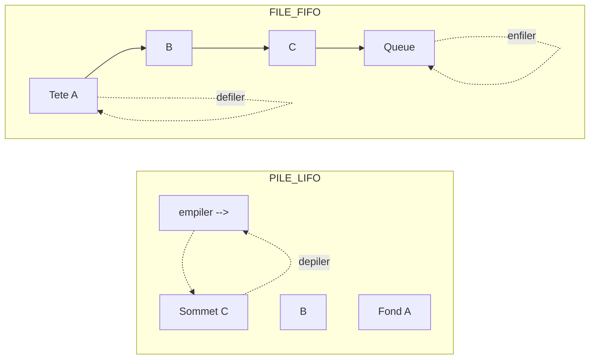

# Séquence 3 — Types abstraits de données (ADT : pile, file, liste)

> Source : https://lyotardjulien.forge.apps.education.fr/terminale-specialite-nsi-au-lycee-notre-dame/02_sequence_2/02_sequence_2/

## TL;DR
- Un **type abstrait de données (TAD)** spécifie *ce que* la structure stocke et *les opérations* disponibles, **sans** dire *comment* elles sont implémentées.
- **Pile (LIFO)** : dernier entré, premier sorti. Primitives : `creePile`, `pileVide`, `empiler`, `depiler`. Implémentable avec une `list` Python (`append`/`pop`).
- **File (FIFO)** : premier entré, premier sorti. Primitives : `creeFile`, `fileVide`, `enfiler`, `defiler`. Implémentable avec `list` (peu efficace) ou `collections.deque` (O(1)).
- **Encapsulation** : l'utilisateur ne manipule QUE les primitives, jamais la représentation interne. Cela permet de changer l'implémentation sans casser le code client.

## Plan de la séquence
1. Introduction aux types abstraits de données.
2. Structures linéaires : les PILES (analogie, primitives, usages, implémentation).
3. Structures linéaires : les FILES (analogie, primitives, usages, implémentation).
4. Vérification du parenthésage : application typique des piles.

## Notions clés

### Type abstrait vs type concret
- Un **TAD** est une **description** : il fixe le type des données et la **signature** de chaque opération.
- Un **type concret** (ou implémentation) est une **réalisation** dans un langage donné, avec un choix de représentation mémoire.
- Avantage : on peut changer l'implémentation sans modifier le code utilisateur. C'est le principe d'**encapsulation**.

### Pile (LIFO)
Structure linéaire dans laquelle l'ajout (`empiler`) et le retrait (`depiler`) ne se font qu'au **sommet**. Analogie : pile d'assiettes. Usages : pile d'appels d'un programme, fonction « annuler » (Ctrl+Z), historique de navigation, vérification de parenthésage, parcours en profondeur d'un graphe.

### File (FIFO)
Structure linéaire dans laquelle l'ajout (`enfiler`) se fait à la **queue** et le retrait (`defiler`) à la **tête**. Analogie : file d'attente. Usages : file d'impression, ordonnancement de tâches d'un OS, parcours en largeur d'un arbre/graphe, mise en mémoire tampon.

## Vocabulaire
| Terme | Définition |
|-------|------------|
| TAD | Type Abstrait de Données : spécification (données + opérations) indépendante de l'implémentation. |
| Primitive | Opération de base d'un TAD, à partir de laquelle on construit toutes les autres. |
| Encapsulation | Cacher la représentation interne ; n'autoriser que l'usage des primitives. |
| Pile (LIFO) | Last In, First Out — dernier entré, premier sorti. |
| File (FIFO) | First In, First Out — premier entré, premier sorti. |
| Sommet | Élément accessible d'une pile (le dernier empilé). |
| Tête (file) | Premier élément à défiler. |
| Queue (file) | Position où l'on enfile un nouvel élément. |

## Algorithmes & code

### 1. Pile : implémentation impérative avec `list` Python
Principe : la fin de la liste Python joue le rôle du sommet. `append` empile, `pop` dépile, le tout en O(1) amorti.
```python
def cree_pile():
    """Cree une pile vide."""
    return []

def pile_vide(p):
    """Renvoie True si la pile p est vide, False sinon."""
    return len(p) == 0

def empiler(p, e):
    """Ajoute l'element e au sommet de la pile p (effet de bord)."""
    p.append(e)

def depiler(p):
    """Retire et renvoie le sommet de la pile p. Erreur si p est vide."""
    if pile_vide(p):
        raise IndexError("depiler sur une pile vide")
    return p.pop()                # pop() renvoie et supprime le dernier
```
- Complexité par opération : O(1).
- Cas d'usage : pile d'appels, parcours en profondeur, vérification de parenthésage.

### 2. Pile : implémentation orientée objet
```python
class Pile:
    """Implementation objet d'une pile (LIFO)."""

    def __init__(self):
        # Attribut prive (par convention) : _contenu
        self._contenu = []

    def est_vide(self):
        return len(self._contenu) == 0

    def empiler(self, e):
        self._contenu.append(e)

    def depiler(self):
        if self.est_vide():
            raise IndexError("Pile vide")
        return self._contenu.pop()

    def sommet(self):
        """Renvoie le sommet sans le retirer (peek)."""
        if self.est_vide():
            raise IndexError("Pile vide")
        return self._contenu[-1]

    def taille(self):
        return len(self._contenu)
```

### 3. File : implémentation impérative avec `list`
```python
def cree_file():
    return []

def file_vide(f):
    return len(f) == 0

def enfiler(f, e):
    """Ajoute e a la fin de la file."""
    f.append(e)

def defiler(f):
    """Retire et renvoie l'element de tete (le plus ancien)."""
    if file_vide(f):
        raise IndexError("defiler sur une file vide")
    return f.pop(0)               # pop(0) : O(n), inefficace !
```
- `enfiler` : O(1).
- `defiler` : **O(n)** car `pop(0)` décale tous les éléments.

### 4. File : implémentation efficace avec `collections.deque`
```python
from collections import deque

def cree_file():
    return deque()

def enfiler(f, e):
    f.append(e)                   # Ajout a droite : O(1)

def defiler(f):
    if not f:
        raise IndexError("defiler sur une file vide")
    return f.popleft()            # Retrait a gauche : O(1)
```
- Toutes les primitives sont en O(1).
- Cas d'usage : parcours en largeur (BFS), files de tâches.

### 5. Vérification du parenthésage avec une pile (application classique)
```python
def parentheses_correctes(chaine):
    """Verifie que les parentheses ouvrantes/fermantes sont bien appariees."""
    pile = []
    paires = {')': '(', ']': '[', '}': '{'}
    for c in chaine:
        if c in "([{":
            pile.append(c)
        elif c in ")]}":
            if not pile or pile.pop() != paires[c]:
                return False
    return len(pile) == 0
```

## Diagramme : Pile vs File



## Pièges classiques au bac
- **Confondre PILE (LIFO) et FILE (FIFO)** : le bac aime poser la question avec une analogie concrète (assiettes vs file d'attente).
- **Utiliser des opérations Python interdites** lorsqu'on travaille avec un TAD : `len(pile)`, `pile[0]`, `pile.pop(0)` ne sont pas des primitives ; il faut s'en tenir à `empiler`/`depiler`/`pile_vide`.
- **Dépiler/défiler une structure vide** : doit lever une erreur explicite.
- **Sur une file implémentée par `list`**, `pop(0)` est en O(n) ; le bac peut demander une implémentation O(1) avec deux piles ou avec `deque`.
- **Oublier l'encapsulation** : l'utilisateur d'un TAD ne doit pas dépendre de la représentation choisie.

## Questions types au bac

**Q1.** Donner les quatre primitives d'une pile et leur signification.
> **Réponse modèle.** `creePile()` crée une pile vide ; `pileVide(P)` renvoie `True` si `P` est vide ; `empiler(P, e)` ajoute `e` au sommet ; `depiler(P)` retire et renvoie le sommet (erreur si vide).

**Q2.** Sur la pile `|a|b|c|` (a au sommet), donner l'état après `empiler(P, 'd')` puis deux `depiler(P)`.
> **Réponse modèle.** Après `empiler('d')` : `|d|a|b|c|`. Après deux `depiler` : `|b|c|` (on a retiré `d` puis `a`).

**Q3.** Pourquoi préfère-t-on `collections.deque` à `list` pour implémenter une file ?
> **Réponse modèle.** `list.pop(0)` est en O(n) car il décale tous les éléments. `deque.popleft()` est en O(1), ce qui rend `enfiler` et `defiler` efficaces.

**Q4.** Qu'apporte la notion de TAD par rapport à un type concret ?
> **Réponse modèle.** Le TAD sépare l'**interface** (opérations disponibles) de l'**implémentation** (représentation en mémoire). On peut changer l'implémentation sans modifier le code qui utilise la structure : c'est le principe d'**encapsulation**.

**Q5.** Citer deux applications concrètes d'une pile et deux applications d'une file.
> **Réponse modèle.** **Pile** : pile d'appels d'un programme, historique « annuler » (Ctrl+Z), parcours en profondeur (DFS), vérification de parenthésage. **File** : file d'impression, ordonnancement de processus, parcours en largeur (BFS) d'un graphe.

## Liens
- Cours en ligne : https://lyotardjulien.forge.apps.education.fr/terminale-specialite-nsi-au-lycee-notre-dame/02_sequence_2/02_sequence_2/
- Cours PILES : https://lyotardjulien.forge.apps.education.fr/bifurcation-site-coilhac-term/listes_piles_files/piles/
- Cours FILES : https://lyotardjulien.forge.apps.education.fr/bifurcation-site-coilhac-term/listes_piles_files/files/
