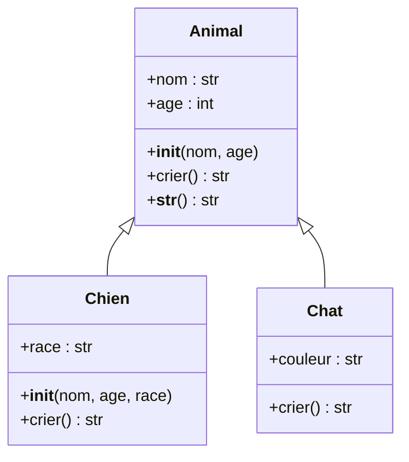
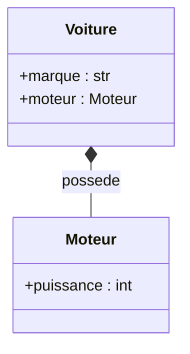

# Séquence 4 — Programmation orientée objet (POO)

> Source : https://lyotardjulien.forge.apps.education.fr/terminale-specialite-nsi-au-lycee-notre-dame/03_sequence_3/03_sequence_3/
> Sous-page : https://lyotardjulien.forge.apps.education.fr/bifurcation-site-coilhac-term/POO/1_cours_POO/

## TL;DR
- La **programmation orientée objet** structure le programme en **objets** qui possèdent un **état** (attributs) et un **comportement** (méthodes), et qui interagissent.
- Une **classe** est un *moule* ; un **objet** est une *instance* de cette classe créée par appel de la classe (`monObjet = MaClasse(...)`).
- Le **constructeur** `__init__(self, ...)` initialise les attributs d'instance ; `self` désigne l'objet en cours de construction/utilisation.
- L'**héritage** (`class Fille(Mere):`) réutilise et spécialise une classe existante. `super().methode()` appelle la version de la classe parente. Le **polymorphisme** permet de redéfinir une méthode (override).
- L'**encapsulation** consiste à manipuler un objet uniquement par ses méthodes ; on cache la représentation interne.

## Plan de la séquence
1. Vocabulaire de la POO : objets, classes, paradigme objet.
2. Le mot-clé `class` et la création d'objets.
3. Attributs et constructeur `__init__`.
4. Méthodes : signature, `self`, valeur de retour.
5. Méthodes spéciales (`__str__`, `__repr__`, `__eq__`, `__add__`, ...).
6. Objets et références ; le clonage.
7. Héritage simple, polymorphisme, composition.

## Notions clés

### Paradigme objet
Le paradigme objet structure les programmes en **entités indépendantes qui interagissent**. Chaque objet a :
1. Ses propres **caractéristiques** (état → attributs).
2. Un **comportement** (méthodes : ce qu'il sait faire).
3. Des **interactions** avec d'autres objets.

Avantages : modularité, réutilisabilité, maintenabilité, découpage du travail entre développeurs.

### Classe et instance
Une **classe** définit une famille d'objets : elle décrit leurs attributs et leurs méthodes communes. Un **objet** est une **instance** d'une classe, créée par appel de la classe. Analogie du moule : la classe est le moule, l'objet est la pièce moulée.

Convention : un nom de classe commence par une **majuscule** (`PascalCase`).

### Attributs
- **Attribut d'instance** : propre à chaque objet, défini en général dans `__init__` via `self.attr = ...`.
- **Attribut de classe** : partagé par toutes les instances, défini directement dans le corps de la classe (en dehors des méthodes).

### Méthodes
Une méthode est une fonction définie dans la classe. Son **premier paramètre est `self`**, qui représente l'instance sur laquelle on appelle la méthode. À l'appel `obj.methode(x)`, Python passe automatiquement `obj` comme `self`.

### Méthodes spéciales (dunder)
Méthodes au nom encadré de `__` qui personnalisent le comportement Python :

| Méthode | Rôle |
|---------|------|
| `__init__(self, ...)` | Constructeur, initialise les attributs. |
| `__str__(self)` | Représentation lisible (`print(obj)`). |
| `__repr__(self)` | Représentation technique (debug, REPL). |
| `__eq__(self, other)` | Test d'égalité `obj == other`. |
| `__lt__(self, other)` | Test `<`. Permet `sorted([objs])`. |
| `__add__(self, other)` | Surcharge de `+`. |
| `__len__(self)` | `len(obj)`. |

### Encapsulation
Principe : l'utilisateur d'une classe ne devrait manipuler ses objets qu'à travers ses méthodes publiques, jamais en accédant directement aux attributs internes. Convention Python : préfixer un attribut « privé » d'un underscore (`_attr`).

### Héritage
`class Fille(Mere):` indique que `Fille` **hérite** de `Mere` : elle reprend tous ses attributs et méthodes, et peut en ajouter ou en redéfinir. `super().methode(...)` appelle la version de la classe mère (utile dans `__init__` de la fille).

### Polymorphisme
Plusieurs classes peuvent proposer une méthode de **même nom**. Le code client appelle `obj.methode()` sans connaître la classe précise : Python sélectionne la bonne version. C'est ce qui rend l'héritage puissant.

### Composition vs héritage
- **Héritage** = relation « est-un » : `Chat est-un Animal`.
- **Composition** = relation « a-un » : `Voiture a-un Moteur`.

On préfère la composition quand il n'y a pas de relation de spécialisation naturelle.

## Vocabulaire
| Terme | Définition |
|-------|------------|
| Objet | Entité informatique avec un état et un comportement. |
| Classe | Définition d'une famille d'objets (modèle). |
| Instance | Objet concret créé à partir d'une classe. |
| Attribut | Variable interne à un objet (ou à une classe). |
| Méthode | Fonction définie dans une classe, appelée sur un objet. |
| `self` | Référence à l'objet courant dans une méthode. |
| Constructeur | Méthode `__init__`, appelée lors de la création d'un objet. |
| Encapsulation | Cacher la représentation interne, exposer une interface publique. |
| Héritage | Mécanisme par lequel une classe reprend une autre. |
| `super()` | Référence à la classe mère pour appeler ses méthodes. |
| Polymorphisme | Plusieurs classes implémentant une même méthode différemment. |
| Override | Redéfinition d'une méthode héritée dans une sous-classe. |
| Composition | Une classe contient un objet d'une autre classe (« a-un »). |

## Algorithmes & code

### 1. Une classe minimale
```python
class Ennemi:
    """Classe vide servant de moule."""
    pass

# Creation de deux instances independantes :
gros_mechant = Ennemi()
autre_ennemi = Ennemi()
```

### 2. Constructeur, attributs d'instance
```python
class Ennemi:
    """Un ennemi a une position, des points de vie et une rapidite."""

    def __init__(self, pos_x=0, pos_y=0, pv=100, rapidite=2):
        # self.attribut = ... cree un attribut d'instance.
        self.pos_x = pos_x
        self.pos_y = pos_y
        self.pv = pv
        self.rapidite = rapidite

# Instanciation :
e1 = Ennemi()                       # Valeurs par defaut
e2 = Ennemi(pos_x=10, pv=50)        # Arguments nommes
print(e1.pv)                        # Acces a l'attribut : 100
```

### 3. Attribut de classe vs attribut d'instance
```python
class Compteur:
    """Compte le nombre d'instances creees."""
    nb_instances = 0                # Attribut de CLASSE (partage)

    def __init__(self):
        Compteur.nb_instances += 1  # On utilise le nom de la classe

c1 = Compteur()
c2 = Compteur()
print(Compteur.nb_instances)        # 2
```

### 4. Méthodes
```python
class Ennemi:
    def __init__(self, pv=100):
        self.pv = pv

    def perd_pv(self, degats):
        """Diminue les pv de l'ennemi."""
        self.pv -= degats
        if self.pv < 0:
            self.pv = 0

    def est_mort(self):
        """Renvoie True si l'ennemi a ete tue."""
        return self.pv == 0

e = Ennemi()
e.perd_pv(30)                       # equivaut a Ennemi.perd_pv(e, 30)
print(e.pv)                         # 70
print(e.est_mort())                 # False
```

### 5. Méthodes spéciales
```python
class Point:
    """Point du plan avec surcharge des operateurs usuels."""

    def __init__(self, x, y):
        self.x = x
        self.y = y

    def __str__(self):
        # Representation lisible (print)
        return f"({self.x}, {self.y})"

    def __repr__(self):
        # Representation technique (REPL, debug)
        return f"Point({self.x}, {self.y})"

    def __eq__(self, autre):
        # Egalite : meme abscisse et meme ordonnee
        return isinstance(autre, Point) and self.x == autre.x and self.y == autre.y

    def __add__(self, autre):
        # Addition vectorielle : renvoie un NOUVEAU Point
        return Point(self.x + autre.x, self.y + autre.y)

    def __lt__(self, autre):
        # Ordre lexicographique sur (x, y)
        return (self.x, self.y) < (autre.x, autre.y)

p1 = Point(1, 2)
p2 = Point(3, 4)
print(p1 + p2)                      # (4, 6)
print(p1 == Point(1, 2))            # True
print(sorted([p2, p1]))             # [Point(1, 2), Point(3, 4)]
```

### 6. Héritage simple et `super()`
```python
class Animal:
    def __init__(self, nom, age):
        self.nom = nom
        self.age = age

    def crier(self):
        return "..."

    def __str__(self):
        return f"{self.nom} ({self.age} ans)"

class Chien(Animal):
    """Un chien EST un animal qui aboie."""

    def __init__(self, nom, age, race):
        super().__init__(nom, age)  # Appel du constructeur parent
        self.race = race

    def crier(self):                # Override (redefinition)
        return "Wouaf !"

medor = Chien("Medor", 5, "Labrador")
print(medor)                        # Medor (5 ans)
print(medor.crier())                # Wouaf !
print(isinstance(medor, Animal))    # True
```

### 7. Polymorphisme
```python
def faire_crier(animal):
    """Fonction polymorphe : marche pour tout objet repondant a .crier()."""
    print(animal.crier())

faire_crier(Chien("Rex", 3, "Berger"))    # Wouaf !
faire_crier(Animal("X", 0))               # ...
```

### 8. Composition (« a-un »)
```python
class Moteur:
    def __init__(self, puissance):
        self.puissance = puissance

class Voiture:
    """Une voiture A UN moteur (composition)."""

    def __init__(self, marque, puissance):
        self.marque = marque
        self.moteur = Moteur(puissance)   # Composition

v = Voiture("Renault", 110)
print(v.moteur.puissance)                 # 110
```

### 9. Exemple complet : classe `Pile` orientée objet
```python
class Pile:
    """Implementation objet d'une pile (LIFO)."""

    def __init__(self):
        self._contenu = []                # Attribut "prive" (convention)

    def est_vide(self):
        return len(self._contenu) == 0

    def empiler(self, e):
        self._contenu.append(e)

    def depiler(self):
        if self.est_vide():
            raise IndexError("Pile vide")
        return self._contenu.pop()

    def sommet(self):
        if self.est_vide():
            raise IndexError("Pile vide")
        return self._contenu[-1]

    def __len__(self):
        return len(self._contenu)         # Permet d'utiliser len(pile)

    def __str__(self):
        return "Pile(" + " | ".join(map(str, reversed(self._contenu))) + ")"

p = Pile()
p.empiler(1); p.empiler(2); p.empiler(3)
print(p)                                  # Pile(3 | 2 | 1)
print(p.depiler())                        # 3
print(len(p))                             # 2
```

## Diagramme : UML simple (héritage)



## Diagramme : composition



## Pièges classiques au bac
- **Oublier `self`** dans la signature d'une méthode : `def methode(x)` au lieu de `def methode(self, x)` ⇒ `TypeError`.
- **Oublier d'appeler `super().__init__(...)`** dans la classe fille : les attributs hérités ne sont pas initialisés.
- **Confondre attribut de classe et attribut d'instance** : `MaClasse.attr = ...` modifie pour tous ; `self.attr = ...` ne modifie que l'objet courant.
- **Surcharger `__eq__` sans `__hash__`** : l'objet n'est plus utilisable comme clé de dict ou élément d'un set.
- **Modifier un attribut mutable partagé** par défaut (`def __init__(self, l=[])` partage la même liste).
- **Confondre instance et classe** : `Pile` est la classe, `Pile()` est une instance.
- **Confondre `__str__` (pour `print`) et `__repr__` (pour le debug)** : si seul `__repr__` est défini, `print` l'utilise par défaut.
- **Encapsulation** : violer la convention en accédant directement à un attribut `_prive` est mal vu.
- **Héritage abusif** : si la relation n'est pas « est-un », préférer la composition.

## Questions types au bac

**Q1.** Quelle est la différence entre une classe et un objet ?
> **Réponse modèle.** Une **classe** est un modèle (un moule) qui définit les attributs et méthodes communs à une famille d'objets. Un **objet** est une **instance** d'une classe, créée par appel de la classe : il possède ses propres valeurs d'attributs.

**Q2.** À quoi sert la méthode `__init__` ?
> **Réponse modèle.** `__init__` est le **constructeur** : c'est la méthode automatiquement appelée à la création d'une nouvelle instance. Elle initialise les attributs d'instance via `self.attr = ...`.

**Q3.** Que fait `self` dans une méthode ?
> **Réponse modèle.** `self` est une **référence à l'objet courant** sur lequel la méthode est appelée. À l'appel `obj.methode(x)`, Python passe automatiquement `obj` comme `self`. Il permet d'accéder et de modifier les attributs (`self.attr`) et d'appeler d'autres méthodes (`self.autre()`).

**Q4.** Écrire une classe `CompteBancaire` avec les attributs `titulaire` et `solde`, une méthode `deposer(montant)` et une méthode `retirer(montant)` qui refuse si le solde devient négatif.
> **Réponse modèle.**
> ```python
> class CompteBancaire:
>     def __init__(self, titulaire, solde=0):
>         self.titulaire = titulaire
>         self.solde = solde
>
>     def deposer(self, montant):
>         self.solde += montant
>
>     def retirer(self, montant):
>         if montant > self.solde:
>             return False
>         self.solde -= montant
>         return True
> ```

**Q5.** Que fait `super().__init__(nom, age)` dans le constructeur d'une classe fille ?
> **Réponse modèle.** Il appelle le constructeur de la **classe mère**, ce qui initialise les attributs hérités (`self.nom`, `self.age`). Sans cet appel, ces attributs n'existeraient pas dans l'instance fille.

**Q6.** Donner un exemple de polymorphisme.
> **Réponse modèle.** Si `Chien` et `Chat` héritent d'`Animal` et redéfinissent `crier()`, la fonction `def faire_crier(a): print(a.crier())` fonctionne pour un `Chien` (« Wouaf ! ») comme pour un `Chat` (« Miaou ! ») sans connaître la classe précise : c'est le polymorphisme.

## Liens
- Cours en ligne : https://lyotardjulien.forge.apps.education.fr/terminale-specialite-nsi-au-lycee-notre-dame/03_sequence_3/03_sequence_3/
- Cours détaillé POO : https://lyotardjulien.forge.apps.education.fr/bifurcation-site-coilhac-term/POO/1_cours_POO/
- Documentation officielle Python : https://docs.python.org/fr/3/tutorial/classes.html
- Crédit du cours : extrait du livre « Informatique » (collection Fluoresciences, éditions Dunod), Delacroix et al.
