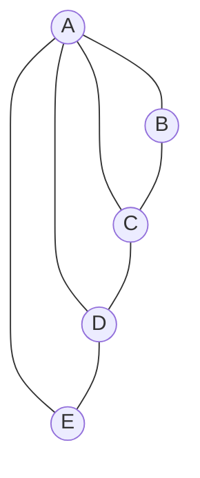
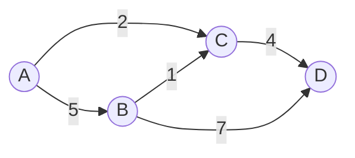

# Séquence 5 — Les graphes (type abstrait de données)

> Source principale : <https://lyotardjulien.forge.apps.education.fr/terminale-specialite-nsi-au-lycee-notre-dame/04_sequence_4/04_sequence_4/>
> Ressource détaillée : <https://lyotardjulien.forge.apps.education.fr/bifurcation-site-coilhac-term/graphes/1_graphes_generalites/>
> Vidéos référencées : parcours en largeur (BFS), parcours en profondeur (DFS).

## TL;DR

- Un **graphe** est un ensemble de **sommets** reliés par des **arêtes** (non orienté) ou des **arcs** (orienté), éventuellement **pondérés**.
- Deux représentations principales : **matrice d'adjacence** (O(n²) en mémoire, O(1) test d'arête) et **liste/dictionnaire d'adjacence** (O(n+m) en mémoire, optimal pour les graphes creux).
- **BFS** (parcours en largeur) avec une **file** : utile pour le **plus court chemin** dans un graphe non pondéré.
- **DFS** (parcours en profondeur) avec une **pile** ou en récursif : utile pour la **détection de cycle** et les **composantes connexes**.
- Complexité des deux parcours : **O(n + m)** (n sommets, m arêtes) avec une liste d'adjacence.

## Plan de la séquence

1. Définitions et vocabulaire (orienté / non orienté, pondéré, connexité).
2. Représentations en machine (matrice d'adjacence, liste d'adjacence).
3. Implémentation Python via une classe `Graphe` reposant sur un dictionnaire.
4. Parcours en largeur (BFS) — file FIFO, applications.
5. Parcours en profondeur (DFS) — récursif et itératif (pile LIFO).
6. Applications : composantes connexes, détection de cycle, plus court chemin.

## Notions clés (définitions précises bac)

- **Graphe** G = (S, A) : couple formé d'un ensemble fini S de **sommets** (ou nœuds) et d'un ensemble A d'**arêtes** (paires non ordonnées) ou d'**arcs** (couples ordonnés).
- **Ordre** d'un graphe : nombre de sommets |S| (souvent noté n).
- **Taille** : nombre d'arêtes |A| (souvent noté m).
- **Degré** d'un sommet (graphe non orienté) : nombre d'arêtes incidentes. Pour un graphe orienté : **degré entrant** + **degré sortant**.
- **Voisinage** d'un sommet s : ensemble des sommets adjacents à s.
- **Chaîne** (non orienté) / **chemin** (orienté) : suite de sommets reliés deux à deux par une arête / un arc. Sa **longueur** est le nombre d'arêtes parcourues.
- **Cycle** : chaîne (chemin pour l'orienté) fermée dont les sommets intermédiaires sont distincts, et de longueur ≥ 1 (≥ 3 pour un graphe simple non orienté).
- **Connexité** : un graphe non orienté est **connexe** s'il existe une chaîne entre toute paire de sommets. Sinon il se décompose en **composantes connexes**.
- **Sous-graphe** : graphe obtenu en sélectionnant un sous-ensemble de sommets et un sous-ensemble d'arêtes incidentes à ces sommets.
- **Graphe pondéré (ou valué)** : chaque arête possède un **poids** numérique (coût, distance, capacité…).
- **Graphe simple** : pas de boucle (arête d'un sommet vers lui-même), pas d'arête multiple entre deux sommets.

## Vocabulaire

| Terme | Définition courte |
|-------|-------------------|
| Sommet (nœud) | Élément du graphe |
| Arête | Lien non orienté entre 2 sommets |
| Arc | Lien orienté de u vers v |
| Ordre n | Nombre de sommets |
| Taille m | Nombre d'arêtes / arcs |
| Degré | Nombre d'arêtes incidentes à un sommet |
| Voisin | Sommet adjacent (relié directement) |
| Chaîne / chemin | Suite de sommets reliés (non orienté / orienté) |
| Longueur | Nombre d'arêtes d'une chaîne |
| Cycle / circuit | Chaîne / chemin fermé |
| Connexe | « D'un seul tenant » |
| Composante connexe | Sous-graphe connexe maximal |
| Pondéré (valué) | Chaque arête possède un poids numérique |
| Matrice d'adjacence | Tableau 2D : M[i][j] = 1 (ou poids) si arête, 0 sinon |
| Liste d'adjacence | Pour chaque sommet, liste de ses voisins |
| Densité | m / n² ; un graphe est creux si m ≪ n² |

## Représentations

### Matrice d'adjacence

Pour un graphe à n sommets numérotés de 0 à n-1, la matrice M est de taille n × n :

- M[i][j] = 1 si l'arête (i, j) existe, 0 sinon (poids w à la place de 1 si pondéré).
- Pour un graphe **non orienté**, la matrice est **symétrique** : M[i][j] = M[j][i].

Avantages : test d'adjacence en **O(1)**, simplicité d'implémentation.
Inconvénients : mémoire **O(n²)** même si peu d'arêtes ; lister les voisins d'un sommet coûte **O(n)**.

### Liste d'adjacence (dictionnaire)

À chaque sommet on associe la liste de ses voisins :

```python
G = {
    'A': ['B', 'C', 'D', 'E'],
    'B': ['A', 'C'],
    'C': ['A', 'B', 'D'],
    'D': ['A', 'C', 'E'],
    'E': ['A', 'D']
}
```

Avantages : mémoire **O(n + m)** (compacte pour les graphes creux), accès aux voisins en **O(1)** (lecture de la liste).
Inconvénients : test d'adjacence en **O(deg(s))** (parcours de la liste).

## Algorithmes & code

### Implémentation d'une classe Graphe

```python
class Graphe:
    """Graphe (non orienté par defaut) implementé avec un dict d'adjacence."""

    def __init__(self, oriente: bool = False) -> None:
        # Cle = sommet, valeur = liste des voisins
        self.adj: dict = {}
        self.oriente = oriente

    def ajouter_sommet(self, s) -> None:
        # On ne fait rien si le sommet existe deja
        if s not in self.adj:
            self.adj[s] = []

    def ajouter_arete(self, u, v) -> None:
        # On cree les sommets si besoin puis on relie u et v
        self.ajouter_sommet(u)
        self.ajouter_sommet(v)
        if v not in self.adj[u]:
            self.adj[u].append(v)
        # Pour un graphe non oriente, on relie aussi v -> u
        if not self.oriente and u not in self.adj[v]:
            self.adj[v].append(u)

    def voisins(self, s) -> list:
        return self.adj.get(s, [])

    def sommets(self) -> list:
        return list(self.adj.keys())

    def ordre(self) -> int:
        return len(self.adj)

    def degre(self, s) -> int:
        return len(self.adj[s])
```

### Parcours en largeur — BFS (Breadth-First Search)

Idée : on explore d'abord les voisins immédiats, puis les voisins des voisins, etc., en utilisant une **file** (FIFO).

Pseudo-code :

```
BFS(G, depart) :
    F <- file vide
    enfiler(F, depart)
    visites <- {depart}
    tant que F n'est pas vide :
        s <- defiler(F)
        traiter(s)
        pour chaque voisin v de s :
            si v n'est pas dans visites :
                ajouter v a visites
                enfiler(F, v)
```

Implémentation Python (avec `collections.deque` pour une file efficace) :

```python
from collections import deque

def parcours_largeur(graphe: Graphe, depart) -> list:
    """Renvoie l'ordre de visite des sommets atteints depuis depart."""
    visites = {depart}                # ensemble des sommets deja vus
    file = deque([depart])            # file FIFO
    ordre_visite = []
    while file:
        s = file.popleft()            # on retire en tete (O(1))
        ordre_visite.append(s)
        for v in graphe.voisins(s):
            if v not in visites:
                visites.add(v)        # on marque AVANT d'enfiler
                file.append(v)        # on enfile en queue
    return ordre_visite
```

**Application classique** : plus court chemin (en nombre d'arêtes) dans un graphe non pondéré.

```python
def plus_court_chemin_bfs(graphe: Graphe, depart, arrivee):
    """Renvoie un plus court chemin (en nb d'aretes) ou None."""
    if depart == arrivee:
        return [depart]
    pere = {depart: None}             # pere[v] = predecesseur de v
    file = deque([depart])
    while file:
        s = file.popleft()
        for v in graphe.voisins(s):
            if v not in pere:
                pere[v] = s
                if v == arrivee:
                    # Reconstruction du chemin en remontant les peres
                    chemin = [v]
                    while pere[chemin[-1]] is not None:
                        chemin.append(pere[chemin[-1]])
                    return list(reversed(chemin))
                file.append(v)
    return None                       # arrivee inaccessible
```

Complexité : **O(n + m)** en temps et O(n) en mémoire supplémentaire.

### Parcours en profondeur — DFS (Depth-First Search)

Idée : on s'enfonce le plus profondément possible avant de revenir en arrière (« backtracking »). Implémentation naturelle avec la **pile d'appels** (récursif) ou une **pile** explicite (LIFO).

#### Version récursive

```python
def dfs_recursif(graphe: Graphe, depart) -> list:
    """Parcours en profondeur recursif : renvoie l'ordre de visite."""
    visites = set()
    ordre_visite = []

    def explorer(s):
        visites.add(s)
        ordre_visite.append(s)
        for v in graphe.voisins(s):
            if v not in visites:
                explorer(v)           # appel recursif

    explorer(depart)
    return ordre_visite
```

#### Version itérative (avec pile explicite)

```python
def dfs_iteratif(graphe: Graphe, depart) -> list:
    visites = set()
    pile = [depart]                   # pile LIFO (list.append / list.pop)
    ordre_visite = []
    while pile:
        s = pile.pop()                # on depile en sommet
        if s not in visites:
            visites.add(s)
            ordre_visite.append(s)
            # On empile les voisins (l'ordre depend de la convention)
            for v in graphe.voisins(s):
                if v not in visites:
                    pile.append(v)
    return ordre_visite
```

Complexité : **O(n + m)** en temps. La récursion utilise O(h) en mémoire (h = profondeur d'exploration).

### Composantes connexes

```python
def composantes_connexes(graphe: Graphe) -> list:
    """Renvoie la liste des composantes connexes (listes de sommets)."""
    visites = set()
    composantes = []
    for s in graphe.sommets():
        if s not in visites:
            # Un BFS depuis s donne toute la composante de s
            composante = parcours_largeur(graphe, s)
            visites.update(composante)
            composantes.append(composante)
    return composantes
```

### Détection de cycle (graphe non orienté)

```python
def contient_cycle(graphe: Graphe) -> bool:
    visites = set()

    def dfs(s, parent):
        visites.add(s)
        for v in graphe.voisins(s):
            if v not in visites:
                if dfs(v, s):
                    return True
            elif v != parent:
                # Sommet deja vu via un autre chemin -> cycle
                return True
        return False

    for s in graphe.sommets():
        if s not in visites and dfs(s, None):
            return True
    return False
```

### Tableau récapitulatif des complexités

| Opération | Matrice d'adjacence | Liste d'adjacence |
|-----------|--------------------|--------------------|
| Espace mémoire | O(n²) | O(n + m) |
| Test d'arête (u,v) | O(1) | O(deg(u)) |
| Lister les voisins | O(n) | O(deg(u)) |
| Ajouter / supprimer une arête | O(1) | O(deg(u)) |
| BFS / DFS | O(n²) | O(n + m) |

## Diagramme Mermaid

Exemple de graphe non orienté à 5 sommets utilisé dans les parcours :



Exemple orienté pondéré :



## Pièges classiques au bac

- Oublier de **marquer un sommet comme visité au moment de l'enfiler** (BFS) : on l'enfile alors plusieurs fois et la complexité explose.
- **Confondre file et pile** : BFS = file (FIFO), DFS itératif = pile (LIFO).
- Confondre **degré** (non orienté) et **degré entrant / sortant** (orienté).
- Dans un graphe **non orienté**, ne pas enregistrer l'arête dans les **deux** sens dans le dictionnaire d'adjacence.
- Confondre **chaîne** (non orienté) et **chemin** (orienté) : à la rédaction, employer le bon mot.
- Croire que BFS donne le plus court chemin **pondéré** : c'est faux, BFS minimise le **nombre d'arêtes**. Pour les graphes pondérés, on utilise Dijkstra (hors programme strict mais évoqué).
- Pour la détection de cycle non orienté, oublier l'argument `parent` et conclure faussement à un cycle dès qu'on retombe sur le sommet d'où l'on vient.
- Confondre l'**ordre** (nb sommets) et la **taille** (nb arêtes).

## Questions types au bac

**Q1.** *Donner deux représentations possibles d'un graphe en machine et préciser leurs complexités spatiales.*
R. La **matrice d'adjacence** (tableau 2D n × n, O(n²)) ; la **liste d'adjacence** sous forme de dictionnaire associant à chaque sommet la liste de ses voisins (O(n + m)). La matrice d'adjacence permet un test d'arête en O(1), la liste est plus compacte pour les graphes creux et permet de lister les voisins en O(deg(s)).

**Q2.** *Quelle structure de données utilise-t-on pour un parcours en largeur ? Pour un parcours en profondeur ? Justifier.*
R. BFS : une **file (FIFO)** car on explore les sommets dans l'ordre où ils ont été découverts (les voisins du départ avant les voisins des voisins). DFS : une **pile (LIFO)** (ou la pile d'appels via la récursion) car on cherche à s'enfoncer le plus profondément possible avant de revenir en arrière.

**Q3.** *Donner la complexité d'un BFS et d'un DFS sur un graphe représenté par liste d'adjacence à n sommets et m arêtes.*
R. Les deux sont en **O(n + m)** : chaque sommet est traité une fois (n) et chaque arête est examinée une fois (ou deux fois pour un non orienté, ce qui reste O(m)).

**Q4.** *Sur le graphe `G = {'A':['B','C'], 'B':['A','D'], 'C':['A','D'], 'D':['B','C','E'], 'E':['D']}`, donner l'ordre de visite d'un BFS depuis A.*
R. A, B, C, D, E (les voisins sont enfilés dans l'ordre des listes ; B et C avant D, puis D avant E).

**Q5.** *Comment utiliser un BFS pour trouver le plus court chemin (en nombre d'arêtes) entre deux sommets ?*
R. On lance un BFS depuis le sommet de départ en mémorisant pour chaque sommet visité son **prédécesseur** (`pere[v] = s`). Lorsqu'on atteint l'arrivée, on **remonte les prédécesseurs** jusqu'au départ, puis on inverse la liste obtenue. La longueur du chemin est minimale car BFS visite les sommets par distance croissante.

**Q6.** *Donner la matrice d'adjacence du graphe non orienté ayant pour liste d'adjacence `{0:[1,2], 1:[0,2], 2:[0,1,3], 3:[2]}`.*
R.
```
   0 1 2 3
0 [0 1 1 0]
1 [1 0 1 0]
2 [1 1 0 1]
3 [0 0 1 0]
```
La matrice est symétrique car le graphe est non orienté.

## Liens

- Page séquence 4 (Lyotard) : <https://lyotardjulien.forge.apps.education.fr/terminale-specialite-nsi-au-lycee-notre-dame/04_sequence_4/04_sequence_4/>
- Cours détaillé graphes (Coilhac/Lassus) : <https://lyotardjulien.forge.apps.education.fr/bifurcation-site-coilhac-term/graphes/1_graphes_generalites/>
- Programme officiel NSI Terminale (BO 2020) : <https://eduscol.education.fr/document/30010/download>
