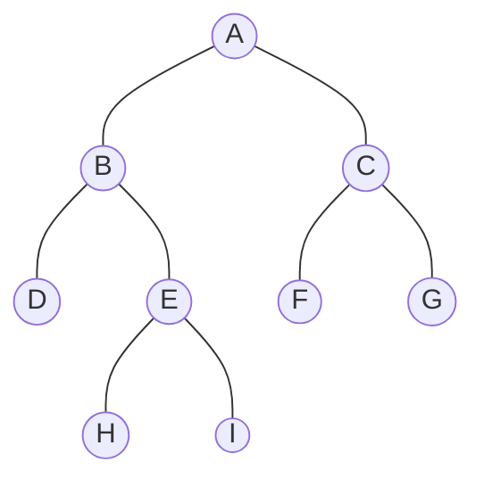
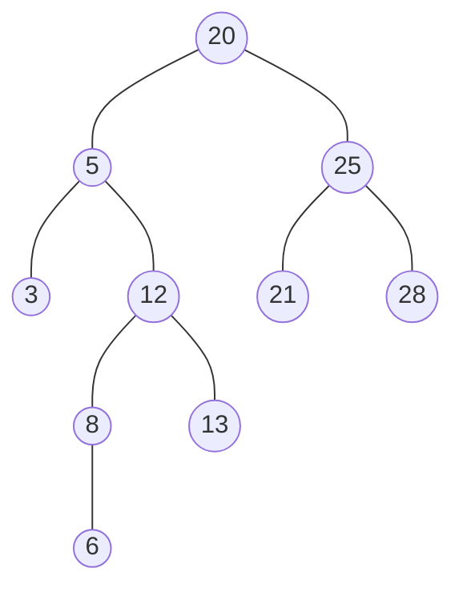

# Séquence 6 — Les arbres (type abstrait de données)

> Source principale : <https://lyotardjulien.forge.apps.education.fr/terminale-specialite-nsi-au-lycee-notre-dame/05_sequence_5/05_sequence_5/>
> Ressource détaillée : <https://lyotardjulien.forge.apps.education.fr/bifurcation-site-coilhac-term/arbres/arbres/>

## TL;DR

- Un **arbre** est une structure hiérarchique de nœuds, avec une **racine** unique, des **fils** et des **feuilles** ; chaque nœud (sauf la racine) a exactement un **père**.
- Un **arbre binaire** est un arbre dont chaque nœud a **au plus 2 fils** (gauche, droit).
- Pour un arbre binaire de hauteur h (convention : racine seule = hauteur 1) : `h ≤ N ≤ 2^h − 1` (N = nombre de nœuds).
- Quatre **parcours** d'arbre binaire : préfixe (NGD), infixe (GND), suffixe (GDN), en largeur (BFS, niveau par niveau).
- Un **arbre binaire de recherche (ABR)** vérifie : pour tout nœud, valeurs du sous-arbre gauche **<** valeur du nœud **<** valeurs du sous-arbre droit. Recherche, insertion et suppression en **O(h)**, soit **O(log n)** si l'arbre est équilibré.

## Plan de la séquence

1. Vocabulaire des arbres généraux.
2. Arbres binaires : définitions, mesures (taille, hauteur, profondeur).
3. Implémentations : classe `Noeud`.
4. Parcours en profondeur (préfixe, infixe, suffixe) et en largeur.
5. Arbre binaire de recherche (ABR) : recherche, insertion.

## Notions clés (définitions précises bac)

- **Arbre** : structure de données hiérarchique constituée de **nœuds** ; un nœud particulier est la **racine** ; tout nœud sauf la racine a exactement un **père**.
- **Fils** d'un nœud : les nœuds directement rattachés en dessous.
- **Frères** : nœuds ayant le même père.
- **Ancêtres** d'un nœud : tous les nœuds rencontrés sur le chemin de la racine au nœud (exclu).
- **Descendants** d'un nœud : tous les nœuds situés dans son sous-arbre (exclu).
- **Feuille** (nœud externe) : nœud sans fils.
- **Nœud interne** : nœud qui n'est pas une feuille.
- **Sous-arbre** enraciné en n : arbre formé de n et de tous ses descendants.
- **Taille** d'un arbre : nombre total de nœuds.
- **Profondeur** d'un nœud : longueur (nombre d'arêtes) du chemin de la racine à ce nœud (la racine est de profondeur 0).
- **Hauteur** d'un arbre : nombre de nœuds du plus long chemin de la racine à une feuille (convention du cours Lyotard : racine seule = hauteur 1 ; arbre vide = hauteur 0). On rencontre aussi la convention « hauteur = profondeur max ».
- **Arbre binaire** : arbre dont chaque nœud a au plus 2 fils (sous-arbre **gauche**, sous-arbre **droit**).
- **Arbre binaire complet** : tous les niveaux sont entièrement remplis (N = 2^h − 1 nœuds).
- **Arbre binaire parfait** (ou « presque complet ») : tous les niveaux sont remplis sauf éventuellement le dernier, qui est rempli de gauche à droite.
- **Arbre binaire de recherche (ABR)** : arbre binaire étiqueté par des éléments comparables tel que pour tout nœud n, toutes les valeurs du sous-arbre gauche sont **strictement inférieures** à n.valeur, et toutes celles du sous-arbre droit sont **strictement supérieures** (ou ≥ selon convention).

## Vocabulaire

| Terme | Définition courte |
|-------|-------------------|
| Racine | Unique nœud sans père |
| Nœud | Élément de l'arbre |
| Feuille | Nœud sans fils |
| Père / fils | Relation hiérarchique parent / enfant |
| Frères | Nœuds de même père |
| Ancêtres | Nœuds sur le chemin racine → nœud |
| Descendants | Nœuds du sous-arbre d'un nœud |
| Sous-arbre | Arbre enraciné en un nœud donné |
| Taille | Nombre de nœuds |
| Profondeur d'un nœud | Distance (en arêtes) à la racine |
| Hauteur de l'arbre | Longueur du plus long chemin racine → feuille |
| Arbre binaire | Au plus 2 fils par nœud |
| ABR | Arbre binaire de recherche (G < N < D) |
| Arité | Nombre maximal de fils par nœud |
| Niveau k | Ensemble des nœuds de profondeur k |

### Propriétés numériques (à connaître)

Pour un arbre binaire de hauteur h (convention « racine seule = 1 ») :
- Nombre de nœuds : `h ≤ N ≤ 2^h − 1`.
- Nombre de feuilles ≤ `2^(h−1)`.
- Hauteur d'un ABR équilibré contenant n clés : `h ≈ log₂(n)`.

## Algorithmes & code

### Implémentation d'un nœud d'arbre binaire

```python
class Noeud:
    """Nœud d'un arbre binaire (valeur, fils gauche, fils droit)."""

    def __init__(self, valeur, gauche=None, droit=None):
        self.valeur = valeur          # etiquette du noeud
        self.gauche = gauche          # sous-arbre gauche (Noeud ou None)
        self.droit = droit            # sous-arbre droit  (Noeud ou None)
```

### Mesures de base (récursives)

```python
def taille(arbre: Noeud) -> int:
    """Nombre total de noeuds d'un arbre binaire."""
    if arbre is None:
        return 0
    return 1 + taille(arbre.gauche) + taille(arbre.droit)


def hauteur(arbre: Noeud) -> int:
    """Hauteur (convention : arbre vide -> 0, racine seule -> 1)."""
    if arbre is None:
        return 0
    return 1 + max(hauteur(arbre.gauche), hauteur(arbre.droit))


def nb_feuilles(arbre: Noeud) -> int:
    if arbre is None:
        return 0
    if arbre.gauche is None and arbre.droit is None:
        return 1
    return nb_feuilles(arbre.gauche) + nb_feuilles(arbre.droit)
```

Complexité : **O(n)** chacune (chaque nœud est visité une seule fois).

### Parcours en profondeur d'un arbre binaire

Trois ordres classiques :

- **Préfixe (NGD)** : noeud, gauche, droit (« RGD »).
- **Infixe (GND)** : gauche, noeud, droit — **donne les valeurs triées** dans un ABR.
- **Suffixe (GDN)** : gauche, droit, noeud (utile pour libérer la mémoire ou évaluer des expressions).

```python
def parcours_prefixe(arbre: Noeud) -> list:
    """Ordre : racine, sous-arbre gauche, sous-arbre droit."""
    if arbre is None:
        return []
    return [arbre.valeur] + parcours_prefixe(arbre.gauche) \
                          + parcours_prefixe(arbre.droit)


def parcours_infixe(arbre: Noeud) -> list:
    """Ordre : sous-arbre gauche, racine, sous-arbre droit."""
    if arbre is None:
        return []
    return parcours_infixe(arbre.gauche) + [arbre.valeur] \
                                         + parcours_infixe(arbre.droit)


def parcours_suffixe(arbre: Noeud) -> list:
    """Ordre : sous-arbre gauche, sous-arbre droit, racine."""
    if arbre is None:
        return []
    return parcours_suffixe(arbre.gauche) + parcours_suffixe(arbre.droit) \
                                          + [arbre.valeur]
```

Complexité : **O(n)** en temps, **O(h)** en mémoire (pile d'appels).

### Parcours en largeur (BFS, niveau par niveau)

```python
from collections import deque

def parcours_largeur(arbre: Noeud) -> list:
    """Visite les noeuds niveau par niveau (gauche -> droite)."""
    if arbre is None:
        return []
    file = deque([arbre])             # file FIFO
    visite = []
    while file:
        n = file.popleft()
        visite.append(n.valeur)
        if n.gauche is not None:
            file.append(n.gauche)
        if n.droit is not None:
            file.append(n.droit)
    return visite
```

### Arbre binaire de recherche (ABR)

#### Recherche

```python
def recherche_abr(arbre: Noeud, x) -> bool:
    """Cherche x dans un ABR (recursif)."""
    if arbre is None:
        return False
    if x == arbre.valeur:
        return True
    if x < arbre.valeur:
        # Tout ce qui est < racine se trouve a gauche
        return recherche_abr(arbre.gauche, x)
    # Sinon, c'est strictement plus grand : on va a droite
    return recherche_abr(arbre.droit, x)
```

Complexité : **O(h)** où h est la hauteur. Pour un arbre **équilibré** : O(log n). Pour un arbre **filiforme** (cas pire) : O(n).

#### Insertion

```python
def inserer_abr(arbre: Noeud, x) -> Noeud:
    """Insere x dans l'ABR et renvoie la nouvelle racine."""
    if arbre is None:
        return Noeud(x)               # nouvelle feuille
    if x < arbre.valeur:
        arbre.gauche = inserer_abr(arbre.gauche, x)
    elif x > arbre.valeur:
        arbre.droit = inserer_abr(arbre.droit, x)
    # Si x == arbre.valeur on ne fait rien (pas de doublon)
    return arbre
```

#### Suppression (cas le plus délicat)

Trois cas :
1. Le nœud à supprimer est une **feuille** → on le remplace par `None`.
2. Il a **un seul fils** → on le remplace par ce fils.
3. Il a **deux fils** → on le remplace par le **plus petit nœud du sous-arbre droit** (ou le plus grand du sous-arbre gauche), puis on supprime ce remplaçant dans le sous-arbre droit.

```python
def min_abr(arbre: Noeud) -> Noeud:
    """Renvoie le noeud de plus petite valeur (le plus a gauche)."""
    while arbre.gauche is not None:
        arbre = arbre.gauche
    return arbre


def supprimer_abr(arbre: Noeud, x) -> Noeud:
    if arbre is None:
        return None
    if x < arbre.valeur:
        arbre.gauche = supprimer_abr(arbre.gauche, x)
    elif x > arbre.valeur:
        arbre.droit = supprimer_abr(arbre.droit, x)
    else:
        # On a trouve le noeud a supprimer
        if arbre.gauche is None:
            return arbre.droit        # cas 1 ou 2 (fils droit ou None)
        if arbre.droit is None:
            return arbre.gauche       # cas 2
        # Cas 3 : deux fils -> on prend le min du sous-arbre droit
        successeur = min_abr(arbre.droit)
        arbre.valeur = successeur.valeur
        arbre.droit = supprimer_abr(arbre.droit, successeur.valeur)
    return arbre
```

Complexité : **O(h)** également.

### Construction d'un ABR à partir d'une liste

```python
def construire_abr(valeurs: list) -> Noeud:
    arbre = None
    for v in valeurs:
        arbre = inserer_abr(arbre, v)
    return arbre

# Exemple
abr = construire_abr([20, 5, 25, 3, 12, 21, 8, 28, 13, 6])
# Le parcours infixe d'un ABR redonne la liste triee
print(parcours_infixe(abr))           # [3, 5, 6, 8, 12, 13, 20, 21, 25, 28]
```

### Récapitulatif de complexités (ABR)

| Opération | ABR équilibré | ABR filiforme |
|-----------|---------------|---------------|
| Recherche | O(log n) | O(n) |
| Insertion | O(log n) | O(n) |
| Suppression | O(log n) | O(n) |
| Parcours (3 ordres + BFS) | O(n) | O(n) |

## Diagramme Mermaid

Arbre binaire général :



Arbre binaire de recherche obtenu en insérant `20, 5, 25, 3, 12, 21, 8, 28, 13, 6` :



## Pièges classiques au bac

- **Conventions de hauteur** : selon les sources, racine seule = hauteur 0 ou hauteur 1. Toujours préciser celle utilisée.
- Confondre **profondeur d'un nœud** et **hauteur de l'arbre**.
- Confondre **arbre binaire complet** (tous les niveaux pleins) et **arbre binaire parfait** (tous pleins sauf le dernier, rempli à gauche).
- En ABR, oublier que la **comparaison** doit être faite avec `<` à gauche et `>` à droite ; insérer un doublon sans le préciser.
- Penser que le **parcours infixe** trie n'importe quel arbre : il ne trie que les **ABR**.
- Pour la suppression dans un ABR avec deux fils : oublier le **successeur** (plus petit du sous-arbre droit) ou prédécesseur.
- Coder une fonction récursive sur arbre sans gérer le cas de base `arbre is None` → `RecursionError` ou `AttributeError`.

## Questions types au bac

**Q1.** *Donner les définitions de la taille, de la profondeur et de la hauteur d'un arbre.*
R. **Taille** : nombre de nœuds. **Profondeur d'un nœud** : longueur (nb d'arêtes) du chemin de la racine à ce nœud (la racine est de profondeur 0). **Hauteur** : longueur du plus long chemin de la racine à une feuille (avec la convention « racine seule = 1 », c'est le nombre de nœuds de la plus longue branche).

**Q2.** *Donner les trois parcours en profondeur d'un arbre binaire et illustrer sur un petit arbre.*
R. **Préfixe (NGD)** : on traite le nœud, puis on parcourt récursivement à gauche, puis à droite. **Infixe (GND)** : gauche, nœud, droit. **Suffixe (GDN)** : gauche, droit, nœud. Sur l'arbre de racine 1 ayant pour fils 2 (avec fils 4, 5) et 3, on obtient : préfixe `1 2 4 5 3`, infixe `4 2 5 1 3`, suffixe `4 5 2 3 1`.

**Q3.** *Pourquoi un parcours infixe d'un ABR donne-t-il les valeurs triées ?*
R. Par induction. La propriété d'ABR garantit que pour tout nœud n, toutes les valeurs à gauche sont < n.valeur et toutes celles à droite sont > n.valeur. Le parcours infixe affiche d'abord toutes les valeurs du sous-arbre gauche (déjà triées par hypothèse), puis n.valeur, puis toutes celles du sous-arbre droit (triées) : on obtient bien une suite croissante.

**Q4.** *Quelle est la complexité d'une recherche dans un ABR ? Sous quelle hypothèse est-elle en O(log n) ?*
R. La recherche est en **O(h)** où h est la hauteur de l'arbre. Elle est en O(log n) si l'arbre est **équilibré** (hauteur ≈ log₂ n). Dans le pire cas, un ABR construit à partir d'une liste déjà triée devient **filiforme** et la recherche tombe à **O(n)**.

**Q5.** *Encadrer le nombre N de nœuds d'un arbre binaire de hauteur h.*
R. `h ≤ N ≤ 2^h − 1`. Borne inférieure atteinte pour un arbre filiforme (chaque niveau a un seul nœud), borne supérieure pour un arbre **complet** (tous les niveaux remplis).

**Q6.** *Insérer dans cet ordre 8, 3, 10, 1, 6, 14, 4, 7 dans un ABR initialement vide. Donner les parcours préfixe et infixe.*
R. ABR obtenu : racine 8, gauche 3 (gauche 1 ; droite 6 (gauche 4 ; droite 7)), droite 10 (droite 14). **Préfixe** : `8 3 1 6 4 7 10 14`. **Infixe** : `1 3 4 6 7 8 10 14` (trié, comme attendu).

## Liens

- Page séquence 5 (Lyotard) : <https://lyotardjulien.forge.apps.education.fr/terminale-specialite-nsi-au-lycee-notre-dame/05_sequence_5/05_sequence_5/>
- Cours détaillé arbres (Coilhac/Lassus) : <https://lyotardjulien.forge.apps.education.fr/bifurcation-site-coilhac-term/arbres/arbres/>
- Programme officiel NSI Terminale : <https://eduscol.education.fr/document/30010/download>
