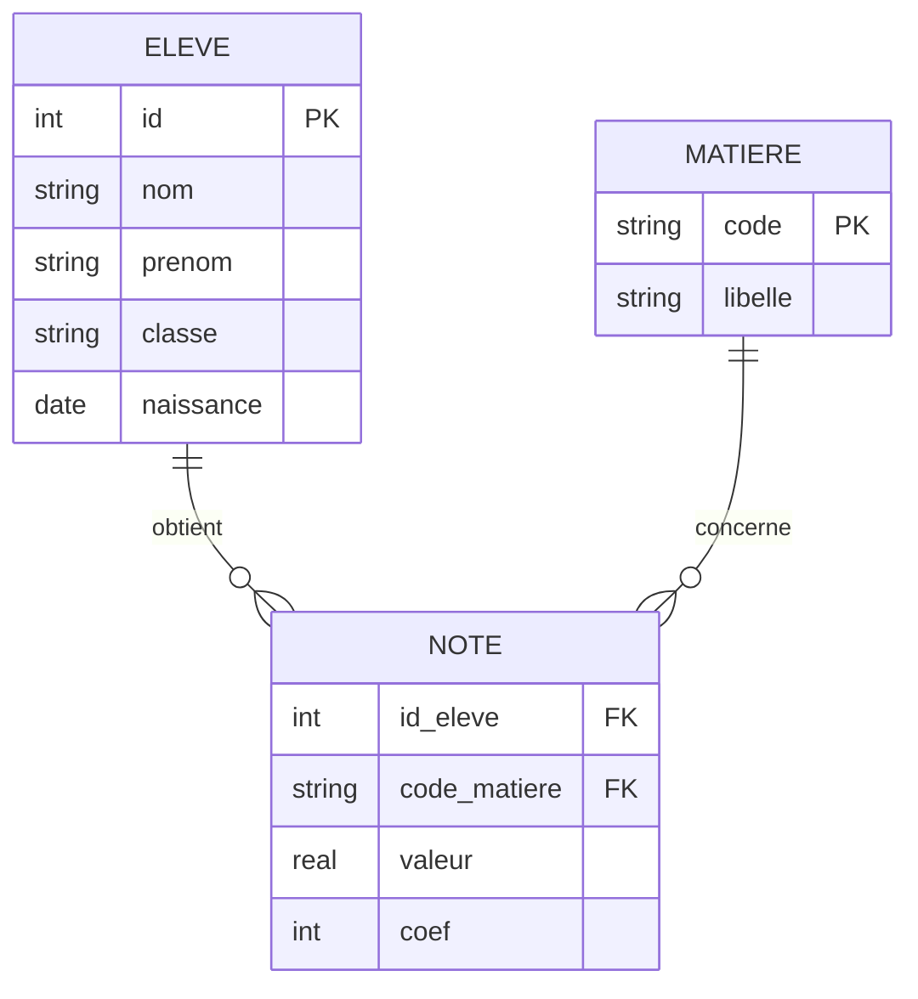

# Séquence 7 — Les bases de données

> Source principale : <https://lyotardjulien.forge.apps.education.fr/terminale-specialite-nsi-au-lycee-notre-dame/06_sequence_6/06_sequence_6/>
> Page SQL bonus (IDE intégré, exercices) : <https://lyotardjulien.forge.apps.education.fr/terminale-specialite-nsi-au-lycee-notre-dame/avec_SQL/exercices_sql/>

!!! warning "Périmètre officiel BO Terminale"
    Le BO Terminale précise littéralement :

    > « Les requêtes SQL d'interrogation **sans utiliser les clauses `GROUP BY` et `HAVING`**. »

    Donc **`GROUP BY` et `HAVING` ne sont pas requis au bac NSI** (ils ne sont pas dans cette fiche). De même, **les transactions et propriétés ACID** ne sont pas au programme et **les sous-requêtes** ne sont pas listées. La fiche couvre strictement le périmètre évaluable : `SELECT FROM WHERE JOIN`, `INSERT`, `UPDATE`, `DELETE`, `DISTINCT`, `ORDER BY`, et les agrégats simples (`COUNT`, `SUM`, `AVG`, `MIN`, `MAX`) appliqués globalement (sans regroupement).

    💡 **C'est néanmoins le chapitre le plus rentable au bac** : SQL apparaît dans **26 sujets sur 28** en 2024-2025.

## TL;DR

- Le **modèle relationnel** organise les données en **relations** (tables) composées d'**attributs** (colonnes) et de **n-uplets** (lignes).
- **Clé primaire** : identifie de façon unique chaque ligne. **Clé étrangère** : référence une clé primaire d'une autre table → garantit l'**intégrité référentielle**.
- **SQL** au programme : `SELECT … FROM … [JOIN …] WHERE … ORDER BY … LIMIT …`, et les commandes `INSERT`, `UPDATE`, `DELETE`. Agrégats simples : `COUNT`, `SUM`, `AVG`, `MIN`, `MAX` (appliqués globalement).
- L'**algèbre relationnelle** (sélection σ, projection π, jointure ⋈) est l'outil formel sous-jacent à SQL — connaître seulement le principe.

## Plan de la séquence

1. Du modèle entité-association au modèle relationnel.
2. Schéma relationnel : tables, attributs, domaines, contraintes.
3. Clés primaires, clés étrangères, intégrité référentielle.
4. SQL : `SELECT` / `INSERT` / `UPDATE` / `DELETE`, jointures.
5. Algèbre relationnelle (notions seulement).

## Notions clés (définitions précises bac)

- **Base de données (BD)** : ensemble structuré et persistant de données, organisé pour permettre des recherches et mises à jour efficaces.
- **SGBD (Système de Gestion de Bases de Données)** : logiciel permettant de créer, manipuler, interroger, sécuriser une base de données (ex. SQLite, MySQL/MariaDB, PostgreSQL).
- **Modèle relationnel** (Codd, 1970) : modèle dans lequel les données sont représentées par des **relations** (tables).
- **Relation / Table** : ensemble de **n-uplets** (= lignes) ayant tous les mêmes **attributs** (= colonnes).
- **Schéma** d'une relation : liste de ses attributs, avec leurs **domaines** (types : INTEGER, TEXT, REAL, DATE, BOOLEAN…).
- **N-uplet (tuple, enregistrement)** : une ligne de la table.
- **Domaine** d'un attribut : ensemble des valeurs autorisées pour cet attribut (type + contraintes).
- **Clé primaire (PRIMARY KEY)** : attribut (ou ensemble d'attributs) qui identifie de façon **unique** chaque n-uplet ; ne doit pas être NULL.
- **Clé étrangère (FOREIGN KEY)** : attribut d'une table dont les valeurs doivent **exister** comme clé primaire dans une autre table → garantit l'**intégrité référentielle**.
- **Contraintes** : règles imposées au schéma : `NOT NULL`, `UNIQUE`, `CHECK(...)`, `DEFAULT …`, `PRIMARY KEY`, `FOREIGN KEY (...) REFERENCES ...`.
- **Anomalie de schéma** : situation où la structure de la base ne respecte pas une contrainte (ex. clé étrangère pointant vers une ligne supprimée).
- **Requête** : interrogation ou mise à jour exprimée en SQL.

## Vocabulaire

| Terme | Définition courte |
|-------|-------------------|
| Relation / Table | Ensemble de n-uplets de même schéma |
| Attribut | Colonne (nom + domaine) |
| Domaine | Type des valeurs autorisées |
| N-uplet (tuple) | Ligne de la table |
| Schéma | Description (attributs + types) d'une table |
| Clé primaire | Identifiant unique d'une ligne |
| Clé étrangère | Référence vers la clé primaire d'une autre table |
| Intégrité référentielle | Toute clé étrangère référence une ligne existante |
| Contrainte | Règle de validation (NOT NULL, UNIQUE, CHECK…) |
| SGBD | Logiciel gérant la base |
| Requête | Instruction SQL |
| Algèbre relationnelle | Opérations formelles sur relations (σ, π, ⋈) |
| SQL | Langage standard d'interrogation |

## Algèbre relationnelle (notion)

L'algèbre relationnelle est le langage formel sous-jacent à SQL. Trois opérations principales suffisent à connaître :

| Opération | Notation | Effet | Équivalent SQL |
|-----------|----------|-------|----------------|
| **Sélection** | σ_condition(R) | Garde les lignes vérifiant la condition | `WHERE` |
| **Projection** | π_attributs(R) | Garde uniquement certaines colonnes | `SELECT` (avec `DISTINCT`) |
| **Jointure** | R ⋈ S | Combine deux tables sur un attribut commun | `JOIN ... ON ...` |

Exemple : sur la table `Eleve(id, nom, classe)`, la requête « nom des élèves de Terminale » s'écrit :

- Algèbre : π_nom(σ_classe='TG1'(Eleve))
- SQL : `SELECT DISTINCT nom FROM Eleve WHERE classe = 'TG1';`

## SQL — syntaxe à maîtriser

### Création de tables (LDD) — *lecture suffisante*

> 💡 Cette section sert à comprendre un schéma `CREATE TABLE` lu dans un sujet ; il n'est pas attendu que tu écrives un `CREATE TABLE` complet à l'écrit.

```sql
-- Table des eleves
CREATE TABLE Eleve (
    id        INTEGER PRIMARY KEY,
    nom       TEXT    NOT NULL,
    prenom    TEXT    NOT NULL,
    classe    TEXT    NOT NULL,
    naissance DATE
);

-- Table des matieres
CREATE TABLE Matiere (
    code   TEXT PRIMARY KEY,
    libelle TEXT NOT NULL
);

-- Table des notes : id_eleve et code_matiere sont des cles etrangeres
CREATE TABLE Note (
    id_eleve     INTEGER NOT NULL,
    code_matiere TEXT    NOT NULL,
    valeur       REAL    CHECK (valeur >= 0 AND valeur <= 20),
    coef         INTEGER DEFAULT 1,
    PRIMARY KEY (id_eleve, code_matiere),
    FOREIGN KEY (id_eleve)     REFERENCES Eleve(id),
    FOREIGN KEY (code_matiere) REFERENCES Matiere(code)
);
```

### Insertion / mise à jour / suppression (LMD)

```sql
INSERT INTO Eleve (id, nom, prenom, classe, naissance)
VALUES (1, 'Durand', 'Alice', 'TG1', '2007-04-12');

INSERT INTO Note VALUES (1, 'NSI', 17.5, 4);

UPDATE Eleve SET classe = 'TG2' WHERE id = 1;

DELETE FROM Note WHERE id_eleve = 1 AND code_matiere = 'NSI';
```

### Interrogation (SELECT)

Forme générale au programme NSI :

```sql
SELECT  [DISTINCT] liste_d_attributs    -- ou *
FROM    table_principale
[JOIN    autre_table ON condition_jointure]
WHERE   condition_de_filtrage
ORDER BY attributs [ASC | DESC]
LIMIT   n;
```

Exemples sur les tables `Eleve` et `Note` :

```sql
-- 1. Liste des eleves de TG1 tries par nom
SELECT nom, prenom
FROM   Eleve
WHERE  classe = 'TG1'
ORDER BY nom ASC;

-- 2. Toutes les notes d'un eleve donne (jointure interne)
SELECT  e.nom, e.prenom, n.code_matiere, n.valeur
FROM    Eleve e
JOIN    Note  n ON n.id_eleve = e.id
WHERE   e.id = 1;

-- 3. Eleves n'ayant aucune note (jointure externe gauche)
SELECT  e.nom, e.prenom
FROM    Eleve e
LEFT JOIN Note n ON n.id_eleve = e.id
WHERE   n.id_eleve IS NULL;

-- 4. Recherche d'une chaine (LIKE et % comme joker)
SELECT * FROM Eleve WHERE nom LIKE 'Du%';

-- 5. Limiter le resultat
SELECT * FROM Eleve ORDER BY id LIMIT 5;

-- 6. Eliminer les doublons
SELECT DISTINCT classe FROM Eleve;
```

### Types de jointures

| Jointure | Effet |
|----------|-------|
| `INNER JOIN` (ou simplement `JOIN`) | Garde uniquement les paires de lignes vérifiant la condition |
| `LEFT JOIN`  | Toutes les lignes de la table de gauche, complétées par NULL si pas de correspondance à droite |

### Fonctions d'agrégation (utilisation globale, sans regroupement)

`COUNT(*)`, `COUNT(col)`, `SUM(col)`, `AVG(col)`, `MIN(col)`, `MAX(col)` — au programme NSI uniquement en utilisation **globale** (sur toute une table ou un sous-ensemble filtré par `WHERE`), **sans `GROUP BY`**.

```sql
-- Nombre total de notes
SELECT COUNT(*) FROM Note;

-- Moyenne d'un eleve donne
SELECT AVG(valeur) AS moyenne FROM Note WHERE id_eleve = 1;

-- Note maximale en NSI
SELECT MAX(valeur) FROM Note WHERE code_matiere = 'NSI';

-- Nombre d'eleves en TG1
SELECT COUNT(*) AS nb_TG1 FROM Eleve WHERE classe = 'TG1';
```

## Algorithme : exemple Python avec sqlite3

```python
import sqlite3

# Connexion (fichier .db cree s'il n'existe pas)
conn = sqlite3.connect("ecole.db")
cur = conn.cursor()

# Activation de l'integrite referentielle (desactivee par defaut en SQLite)
cur.execute("PRAGMA foreign_keys = ON;")

# Creation de la table Eleve
cur.execute("""
    CREATE TABLE IF NOT EXISTS Eleve (
        id     INTEGER PRIMARY KEY,
        nom    TEXT NOT NULL,
        classe TEXT NOT NULL
    );
""")

# Insertion securisee (parametres -> evite l'injection SQL)
cur.execute("INSERT INTO Eleve VALUES (?, ?, ?);", (1, "Durand", "TG1"))

conn.commit()

# Interrogation
cur.execute("SELECT nom FROM Eleve WHERE classe = ?;", ("TG1",))
for ligne in cur.fetchall():
    print(ligne)

conn.close()
```

## Diagramme Mermaid (entité-association simplifié)



## Pièges classiques au bac

- Confondre **clé primaire** (identifiant unique d'une table) et **clé étrangère** (référence vers une autre table).
- Oublier d'écrire `PRAGMA foreign_keys = ON;` en SQLite : par défaut, les contraintes de clé étrangère **ne sont pas vérifiées**.
- Confondre `INNER JOIN` et `LEFT JOIN` : `LEFT JOIN` garde les lignes de gauche **sans** correspondance.
- Confondre **NULL** (valeur inconnue) et `0` ou chaîne vide ; `WHERE x = NULL` est faux, il faut `WHERE x IS NULL`.
- Oublier `DISTINCT` quand on veut éliminer les doublons d'une projection.
- Ne pas paramétrer une requête en Python (`?` ou `:nom`) → risque d'**injection SQL**.
- Confondre `DELETE FROM T;` (vide les lignes mais conserve la table) et `DROP TABLE T;` (supprime la table).
- Utiliser `GROUP BY` ou `HAVING` au bac NSI : ils sont **hors programme** — si on en a besoin, c'est qu'on prend la mauvaise approche.

## Questions types au bac

**Q1.** *Donner la définition d'une clé primaire et d'une clé étrangère. Préciser leurs rôles.*
R. La **clé primaire** est un attribut (ou un ensemble d'attributs) qui identifie de manière **unique** chaque n-uplet d'une table : ses valeurs sont uniques et non NULL. Une **clé étrangère** est un attribut d'une table dont les valeurs doivent correspondre à la clé primaire d'une autre table : elle garantit l'**intégrité référentielle** entre les deux tables.

**Q2.** *Écrire en SQL la requête qui affiche le nom et le prénom de tous les élèves de la classe `'TG1'`, triés par nom.*
R.
```sql
SELECT nom, prenom
FROM   Eleve
WHERE  classe = 'TG1'
ORDER BY nom;
```

**Q3.** *Écrire la requête qui calcule la moyenne d'un élève donné (id = 7) sur toutes ses notes, à partir des tables `Eleve(id, nom, prenom, classe)` et `Note(id_eleve, code_matiere, valeur)`.*
R.
```sql
SELECT AVG(valeur) AS moyenne
FROM   Note
WHERE  id_eleve = 7;
```

**Q4.** *Traduire en algèbre relationnelle la requête : « code des matières dans lesquelles l'élève d'id 7 a obtenu plus de 15 ».*
R. π_code_matiere ( σ_(id_eleve = 7 ∧ valeur > 15) (Note) ).

**Q5.** *Quelle différence entre `INNER JOIN` et `LEFT JOIN` ? Donner un exemple où le résultat diffère.*
R. `INNER JOIN` ne garde que les lignes ayant **une correspondance** dans la table de droite. `LEFT JOIN` garde **toutes** les lignes de la table de gauche, en complétant par `NULL` lorsqu'il n'y a pas de correspondance. Exemple : `Eleve LEFT JOIN Note` permet de lister aussi les élèves **sans aucune note** ; un `INNER JOIN` les masquerait.

**Q6.** *Pourquoi faut-il toujours paramétrer une requête SQL en Python plutôt que de concaténer la valeur dans la chaîne ?*
R. Pour éviter les **injections SQL** : si l'utilisateur saisit `'; DROP TABLE Eleve; --` et qu'on concatène cette valeur, on exécute du SQL malveillant. Avec `cur.execute("... WHERE nom = ?;", (nom,))`, le SGBD échappe automatiquement la valeur.

## Liens

- Page séquence 6 (Lyotard) : <https://lyotardjulien.forge.apps.education.fr/terminale-specialite-nsi-au-lycee-notre-dame/06_sequence_6/06_sequence_6/>
- Page exercices SQL (IDE intégré) : <https://lyotardjulien.forge.apps.education.fr/terminale-specialite-nsi-au-lycee-notre-dame/avec_SQL/exercices_sql/>
- SQL Murder Mystery (TP) : <https://mystery.knightlab.com/>
- SQL Island (TP) : <https://sql-island.informatik.uni-kl.de/>
- Documentation officielle SQLite : <https://sqlite.org/lang.html>
- Programme officiel NSI Terminale : <https://eduscol.education.fr/document/30010/download>
