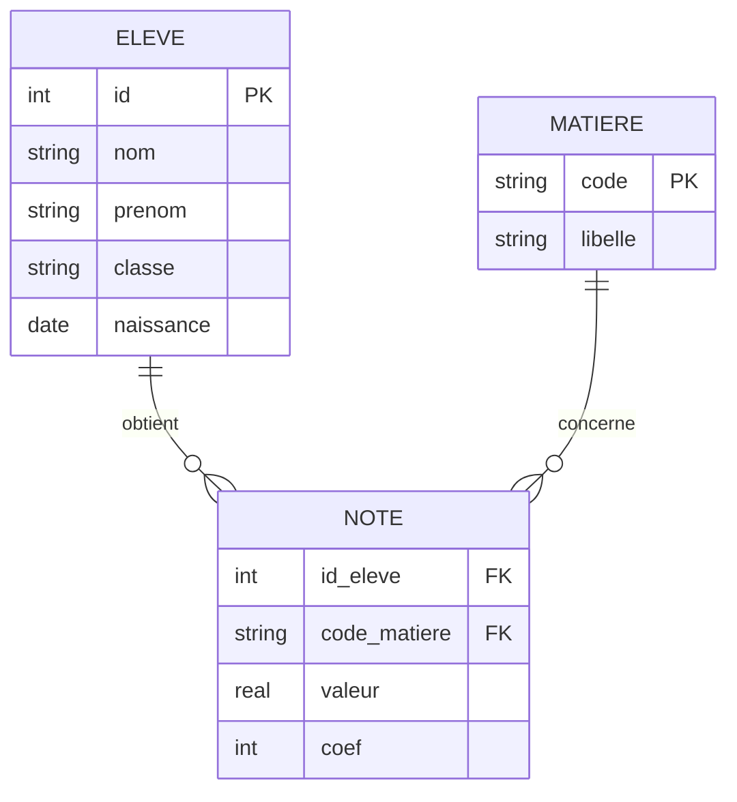

# Séquence 7 — Les bases de données

> Source principale : <https://lyotardjulien.forge.apps.education.fr/terminale-specialite-nsi-au-lycee-notre-dame/06_sequence_6/06_sequence_6/>
> Page SQL bonus (IDE intégré, exercices) : <https://lyotardjulien.forge.apps.education.fr/terminale-specialite-nsi-au-lycee-notre-dame/avec_SQL/exercices_sql/>
> TDs (modèle relationnel) : `BDD_TD1_modele_rel.pdf`, `BDD_TD2_mod_rel_sujet.pdf` (référencés sur la page séquence 6).

## TL;DR

- Le **modèle relationnel** organise les données en **relations** (tables) composées d'**attributs** (colonnes) et de **n-uplets** (lignes).
- **Clé primaire** : identifie de façon unique chaque ligne. **Clé étrangère** : référence une clé primaire d'une autre table → garantit l'**intégrité référentielle**.
- L'**algèbre relationnelle** fournit les opérations fondamentales : **σ** (sélection), **π** (projection), **⋈** (jointure), ∪, ∩, −, ×.
- **SQL** (Structured Query Language) : `CREATE TABLE`, `INSERT`, `UPDATE`, `DELETE`, et surtout `SELECT … FROM … WHERE … GROUP BY … HAVING … ORDER BY … LIMIT …` ; jointures `INNER/LEFT/RIGHT JOIN`.
- Un **SGBD** garantit les propriétés **ACID** des transactions : **A**tomicité, **C**ohérence, **I**solation, **D**urabilité (transactions encadrées par `BEGIN` / `COMMIT` / `ROLLBACK`).

## Plan de la séquence

1. Du modèle entité-association au modèle relationnel.
2. Schéma relationnel : tables, attributs, domaines, contraintes.
3. Clés primaires, clés étrangères, intégrité.
4. Algèbre relationnelle (sélection, projection, jointure, opérations ensemblistes).
5. SQL : LDD (CREATE), LMD (SELECT, INSERT, UPDATE, DELETE), jointures.
6. SGBD, transactions et propriétés ACID.

## Notions clés (définitions précises bac)

- **Base de données (BD)** : ensemble structuré et persistant de données, organisé pour permettre des recherches et mises à jour efficaces.
- **SGBD (Système de Gestion de Bases de Données)** : logiciel permettant de créer, manipuler, interroger, sécuriser une base de données (ex. SQLite, MySQL/MariaDB, PostgreSQL, Oracle).
- **Modèle relationnel** (Codd, 1970) : modèle dans lequel les données sont représentées par des **relations** (tables).
- **Relation / Table** : ensemble de **n-uplets** (= lignes) ayant tous les mêmes **attributs** (= colonnes).
- **Schéma** d'une relation : liste de ses attributs, avec leurs **domaines** (types : INTEGER, TEXT, REAL, DATE, BOOLEAN…).
- **N-uplet (tuple, enregistrement)** : une ligne de la table.
- **Domaine** d'un attribut : ensemble des valeurs autorisées pour cet attribut (type + contraintes).
- **Clé primaire (PRIMARY KEY)** : attribut (ou ensemble d'attributs) qui identifie de façon **unique** chaque n-uplet ; ne doit pas être NULL.
- **Clé étrangère (FOREIGN KEY)** : attribut d'une table dont les valeurs doivent **exister** comme clé primaire dans une autre table → garantit l'**intégrité référentielle**.
- **Contraintes** : règles imposées au schéma : `NOT NULL`, `UNIQUE`, `CHECK(...)`, `DEFAULT …`, `PRIMARY KEY`, `FOREIGN KEY (...) REFERENCES ...`.
- **Requête** : interrogation ou mise à jour exprimée en SQL.
- **Transaction** : suite d'opérations sur la base, atomique, vue comme un tout (`BEGIN ... COMMIT` ou `ROLLBACK`).
- **Propriétés ACID** : garanties offertes par les SGBD relationnels (cf. plus bas).

## Vocabulaire

| Terme | Définition courte |
|-------|-------------------|
| Relation / Table | Ensemble de n-uplets de même schéma |
| Attribut | Colonne (nom + domaine) |
| Domaine | Type des valeurs autorisées |
| N-uplet (tuple) | Ligne de la table |
| Schéma | Description (attributs + types) d'une table |
| Clé primaire | Identifiant unique d'une ligne |
| Clé étrangère | Référence vers la clé primaire d'une autre table |
| Intégrité référentielle | Toute clé étrangère référence une ligne existante |
| Contrainte | Règle de validation (NOT NULL, UNIQUE, CHECK…) |
| SGBD | Logiciel gérant la base |
| Requête | Instruction SQL |
| Transaction | Bloc atomique d'opérations |
| ACID | Atomicité, Cohérence, Isolation, Durabilité |
| Algèbre relationnelle | Opérations formelles sur relations |
| SQL | Langage standard d'interrogation |

## Algèbre relationnelle

L'algèbre relationnelle est un langage formel manipulant des relations. Les opérations principales sont :

| Opération | Notation | Effet | Équivalent SQL |
|-----------|----------|-------|----------------|
| **Sélection** | σ_condition(R) | Garde les lignes vérifiant la condition | `SELECT * FROM R WHERE condition` |
| **Projection** | π_attributs(R) | Garde uniquement certaines colonnes (et supprime les doublons) | `SELECT DISTINCT attributs FROM R` |
| **Renommage** | ρ | Renomme une relation ou un attribut | `AS` |
| **Union** | R ∪ S | Lignes de R ou S (mêmes schémas) | `UNION` |
| **Intersection** | R ∩ S | Lignes communes à R et S | `INTERSECT` |
| **Différence** | R − S | Lignes de R absentes de S | `EXCEPT` |
| **Produit cartésien** | R × S | Toutes les combinaisons | `FROM R, S` |
| **Jointure naturelle** | R ⋈ S | Combinaisons de R et S coïncidant sur les attributs communs | `INNER JOIN ... ON ...` |

Exemple : sur la table `Eleve(id, nom, classe)`, la requête « nom des élèves de Terminale » s'écrit :

- Algèbre : π_nom(σ_classe='TG1'(Eleve))
- SQL : `SELECT DISTINCT nom FROM Eleve WHERE classe = 'TG1';`

## SQL — syntaxe à maîtriser

### Création de tables (LDD)

```sql
-- Table des eleves
CREATE TABLE Eleve (
    id        INTEGER PRIMARY KEY,
    nom       TEXT    NOT NULL,
    prenom    TEXT    NOT NULL,
    classe    TEXT    NOT NULL,
    naissance DATE
);

-- Table des matieres
CREATE TABLE Matiere (
    code   TEXT PRIMARY KEY,
    libelle TEXT NOT NULL
);

-- Table des notes : id_eleve et code_matiere sont des cles etrangeres
CREATE TABLE Note (
    id_eleve     INTEGER NOT NULL,
    code_matiere TEXT    NOT NULL,
    valeur       REAL    CHECK (valeur >= 0 AND valeur <= 20),
    coef         INTEGER DEFAULT 1,
    PRIMARY KEY (id_eleve, code_matiere),
    FOREIGN KEY (id_eleve)     REFERENCES Eleve(id),
    FOREIGN KEY (code_matiere) REFERENCES Matiere(code)
);
```

### Insertion / mise à jour / suppression (LMD)

```sql
INSERT INTO Eleve (id, nom, prenom, classe, naissance)
VALUES (1, 'Durand', 'Alice', 'TG1', '2007-04-12');

INSERT INTO Note VALUES (1, 'NSI', 17.5, 4);

UPDATE Eleve SET classe = 'TG2' WHERE id = 1;

DELETE FROM Note WHERE id_eleve = 1 AND code_matiere = 'NSI';
```

### Interrogation (SELECT)

Forme générale :

```sql
SELECT  liste_d_attributs    -- ou *
FROM    table_principale
[JOIN    autre_table ON condition_jointure]
WHERE   condition_de_filtrage
GROUP BY attributs_de_regroupement
HAVING  condition_sur_les_groupes
ORDER BY attributs [ASC | DESC]
LIMIT   n;
```

Exemples sur les tables `Eleve` et `Note` :

```sql
-- 1. Liste des eleves de TG1 tries par nom
SELECT nom, prenom
FROM   Eleve
WHERE  classe = 'TG1'
ORDER BY nom ASC;

-- 2. Moyenne par eleve (jointure interne)
SELECT  e.nom, e.prenom, AVG(n.valeur) AS moyenne
FROM    Eleve e
JOIN    Note  n ON n.id_eleve = e.id
GROUP BY e.id
ORDER BY moyenne DESC;

-- 3. Eleves dont la moyenne est >= 14 (HAVING : filtre apres GROUP BY)
SELECT  e.nom, AVG(n.valeur) AS moy
FROM    Eleve e
JOIN    Note  n ON n.id_eleve = e.id
GROUP BY e.id
HAVING  AVG(n.valeur) >= 14;

-- 4. Nombre de notes par matiere
SELECT  code_matiere, COUNT(*) AS nb_notes
FROM    Note
GROUP BY code_matiere;

-- 5. Eleves n'ayant aucune note (jointure externe gauche)
SELECT  e.nom, e.prenom
FROM    Eleve e
LEFT JOIN Note n ON n.id_eleve = e.id
WHERE   n.id_eleve IS NULL;

-- 6. Recherche d'une chaine (LIKE et % comme joker)
SELECT * FROM Eleve WHERE nom LIKE 'Du%';

-- 7. Limiter le resultat
SELECT * FROM Eleve ORDER BY id LIMIT 5;
```

### Types de jointures

| Jointure | Effet |
|----------|-------|
| `INNER JOIN` | Garde uniquement les paires de lignes vérifiant la condition |
| `LEFT JOIN`  | Toutes les lignes de la table de gauche, complétées par NULL si pas de correspondance à droite |
| `RIGHT JOIN` | Symétrique du LEFT (non supporté par tous les SGBD, ex. SQLite) |
| `FULL OUTER JOIN` | Toutes les lignes des deux côtés (NULL en cas d'absence) |
| `CROSS JOIN` | Produit cartésien (toutes les combinaisons) |

### Fonctions d'agrégation

`COUNT(*)`, `COUNT(col)`, `SUM(col)`, `AVG(col)`, `MIN(col)`, `MAX(col)` — généralement utilisées avec `GROUP BY`.

## Transactions et propriétés ACID

Une **transaction** est un ensemble d'opérations vu comme une **unité indivisible**. Le SGBD garantit les **propriétés ACID** :

| Lettre | Propriété | Signification |
|--------|-----------|---------------|
| **A** | **Atomicité** | « Tout ou rien » : soit toutes les opérations de la transaction sont appliquées, soit aucune ne l'est. |
| **C** | **Cohérence** | La base passe d'un état cohérent (toutes contraintes respectées) à un autre état cohérent. |
| **I** | **Isolation** | Les transactions concurrentes se déroulent comme si elles étaient exécutées les unes après les autres. |
| **D** | **Durabilité** | Une fois validée (`COMMIT`), la transaction est conservée durablement, même en cas de panne. |

Syntaxe :

```sql
BEGIN TRANSACTION;
    UPDATE Compte SET solde = solde - 100 WHERE id = 1;  -- debit
    UPDATE Compte SET solde = solde + 100 WHERE id = 2;  -- credit
COMMIT;          -- valide les deux operations
-- En cas d'erreur :
-- ROLLBACK;     -- annule toute la transaction
```

## Algorithme : exemple Python avec sqlite3

```python
import sqlite3

# Connexion (fichier .db cree s'il n'existe pas)
conn = sqlite3.connect("ecole.db")
cur = conn.cursor()

# Activation de l'integrite referentielle (desactivee par defaut en SQLite)
cur.execute("PRAGMA foreign_keys = ON;")

# Creation de la table Eleve
cur.execute("""
    CREATE TABLE IF NOT EXISTS Eleve (
        id     INTEGER PRIMARY KEY,
        nom    TEXT NOT NULL,
        classe TEXT NOT NULL
    );
""")

# Insertion securisee (parametres -> evite l'injection SQL)
cur.execute("INSERT INTO Eleve VALUES (?, ?, ?);", (1, "Durand", "TG1"))

conn.commit()                         # equivalent d'un COMMIT

# Interrogation
cur.execute("SELECT nom FROM Eleve WHERE classe = ?;", ("TG1",))
for ligne in cur.fetchall():
    print(ligne)

conn.close()
```

## Diagramme Mermaid (entité-association simplifié)



## Pièges classiques au bac

- Confondre **clé primaire** (identifiant unique d'une table) et **clé étrangère** (référence vers une autre table).
- Oublier d'écrire `PRAGMA foreign_keys = ON;` en SQLite : par défaut, les contraintes de clé étrangère **ne sont pas vérifiées**.
- Confondre `WHERE` (filtre **avant** agrégation, sur les lignes) et `HAVING` (filtre **après** agrégation, sur les groupes).
- Utiliser un agrégat (`AVG`, `COUNT`…) sans `GROUP BY` quand il y a des colonnes non agrégées dans le `SELECT`.
- Croire qu'`INNER JOIN` et `LEFT JOIN` donnent toujours le même résultat : `LEFT JOIN` garde les lignes de gauche **sans** correspondance.
- Dans l'algèbre relationnelle, oublier que la **projection** π élimine les doublons (alors que `SELECT` SQL les garde, sauf `DISTINCT`).
- Oublier `;` à la fin d'une instruction SQL (selon le SGBD, certains la tolèrent).
- Confondre **NULL** (valeur inconnue) et `0` ou chaîne vide ; `WHERE x = NULL` est faux, il faut `WHERE x IS NULL`.
- Ne pas paramétrer une requête en Python (`?` ou `:nom`) → risque d'**injection SQL**.
- Confondre `DELETE FROM T;` (vide les lignes mais conserve la table et les contraintes) et `DROP TABLE T;` (supprime la table).

## Questions types au bac

**Q1.** *Donner la définition d'une clé primaire et d'une clé étrangère. Préciser leurs rôles.*
R. La **clé primaire** est un attribut (ou un ensemble d'attributs) qui identifie de manière **unique** chaque n-uplet d'une table : ses valeurs sont uniques et non NULL. Une **clé étrangère** est un attribut d'une table dont les valeurs doivent correspondre à la clé primaire d'une autre table : elle garantit l'**intégrité référentielle** entre les deux tables.

**Q2.** *Expliquer la signification de l'acronyme ACID dans le contexte des SGBD.*
R. **A**tomicité : une transaction est exécutée entièrement ou pas du tout. **C**ohérence : la base reste dans un état satisfaisant toutes les contraintes. **I**solation : les transactions concurrentes ne s'interfèrent pas (résultat équivalent à une exécution séquentielle). **D**urabilité : une transaction validée par `COMMIT` est conservée même en cas de panne du système.

**Q3.** *Écrire en SQL la requête qui affiche le nom et la moyenne des élèves ayant au moins 12 de moyenne, triés par moyenne décroissante, avec les tables `Eleve(id, nom, prenom, classe)` et `Note(id_eleve, code_matiere, valeur)`.*
R.
```sql
SELECT  e.nom, AVG(n.valeur) AS moyenne
FROM    Eleve e
JOIN    Note  n ON n.id_eleve = e.id
GROUP BY e.id
HAVING  AVG(n.valeur) >= 12
ORDER BY moyenne DESC;
```

**Q4.** *Traduire en algèbre relationnelle la requête : « code des matières dans lesquelles l'élève d'id 7 a obtenu plus de 15 ».*
R. π_code_matiere ( σ_(id_eleve = 7 ∧ valeur > 15) (Note) ).

**Q5.** *Quelle différence entre `INNER JOIN` et `LEFT JOIN` ? Donner un exemple où le résultat diffère.*
R. `INNER JOIN` ne garde que les lignes ayant **une correspondance** dans la table de droite. `LEFT JOIN` garde **toutes** les lignes de la table de gauche, en complétant par `NULL` lorsqu'il n'y a pas de correspondance. Exemple : `Eleve LEFT JOIN Note` permet de lister aussi les élèves **sans aucune note** ; un `INNER JOIN` les masquerait.

**Q6.** *Une transaction bancaire transfère 100 € du compte A vers le compte B. Pourquoi est-il essentiel qu'elle soit atomique ?*
R. Si seule la première opération (débit de A) est appliquée et que la seconde (crédit de B) échoue, la base devient incohérente : 100 € ont disparu. L'atomicité garantit que **soit les deux opérations sont validées (`COMMIT`), soit aucune** (`ROLLBACK`), préservant la cohérence des comptes.

## Liens

- Page séquence 6 (Lyotard) : <https://lyotardjulien.forge.apps.education.fr/terminale-specialite-nsi-au-lycee-notre-dame/06_sequence_6/06_sequence_6/>
- Page exercices SQL (IDE intégré) : <https://lyotardjulien.forge.apps.education.fr/terminale-specialite-nsi-au-lycee-notre-dame/avec_SQL/exercices_sql/>
- SQL Murder Mystery (TP) : <https://mystery.knightlab.com/>
- SQL Island (TP) : <https://sql-island.informatik.uni-kl.de/>
- Documentation officielle SQLite : <https://sqlite.org/lang.html>
- Programme officiel NSI Terminale : <https://eduscol.education.fr/document/30010/download>
