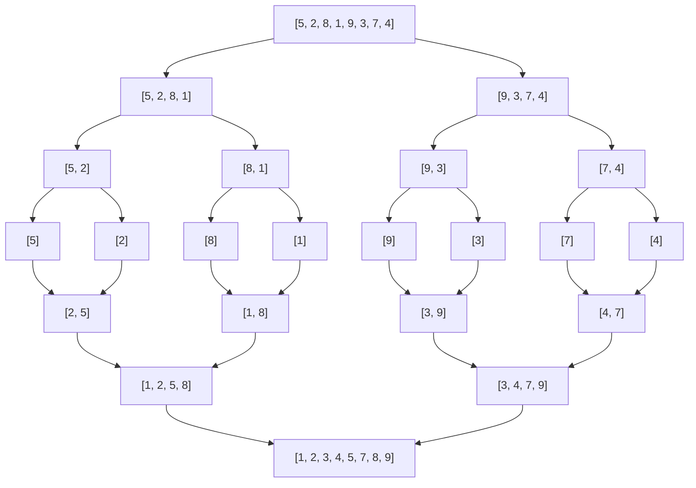
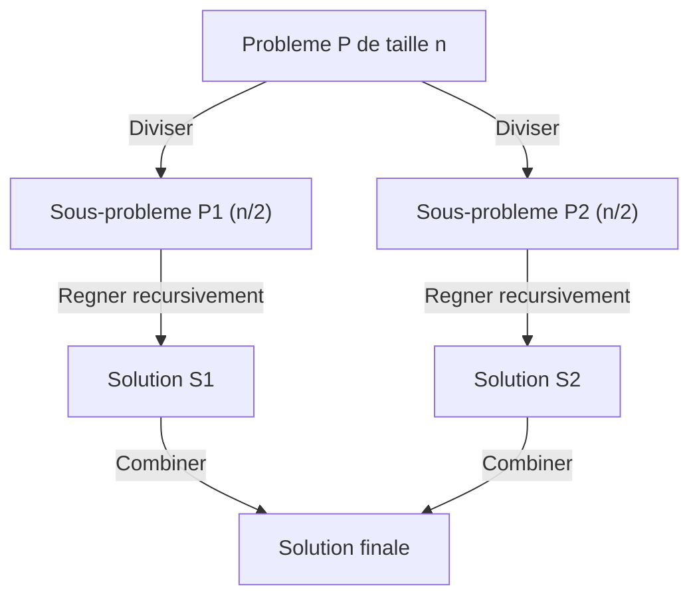

# Séquence 8 — Diviser pour régner

> Source principale : <https://lyotardjulien.forge.apps.education.fr/terminale-specialite-nsi-au-lycee-notre-dame/07_sequence_7/07_sequence_7/>
> Exercices : <https://mcoilhac.forge.apps.education.fr/term/diviser_regner/exos_DR/>
> TP Capytale : algorithmes de tri ; rotation d'une image d'un quart de tour.

## TL;DR

- **Diviser pour régner** = paradigme algorithmique en **3 étapes** : **Diviser** le problème en sous-problèmes plus petits → **Régner** (résoudre récursivement chaque sous-problème) → **Combiner** les solutions partielles en une solution globale.
- Algorithmes phares au programme : **tri fusion** (O(n log n), stable), **tri rapide** (O(n log n) en moyenne, O(n²) au pire), **recherche dichotomique** (O(log n)).
- **Tri fusion vs tri par insertion / sélection** : O(n log n) au lieu de O(n²) → gain énorme dès que n est grand.
- L'analyse repose sur des **récurrences** type T(n) = 2 T(n/2) + O(n) (théorème maître hors programme strict, mais à savoir manipuler).
- Coût mémoire : tri fusion utilise **O(n)** (tableau auxiliaire), tri rapide est **en place** (O(log n) de pile).

## Plan de la séquence

1. Le paradigme « diviser pour régner » : principe en trois temps.
2. Recherche dichotomique récursive (rappel de Première, version diviser pour régner).
3. Tri fusion (merge sort) : algorithme, code, complexité, stabilité.
4. Tri rapide (quicksort) : pivot, partition, cas pire.
5. Comparaison avec les tris quadratiques (sélection, insertion).

## Notions clés (définitions précises bac)

- **Diviser pour régner** : technique de résolution récursive d'un problème en le découpant en sous-problèmes structurellement identiques, plus petits, dont on combine les solutions. Trois étapes : **Diviser**, **Régner** (résolution récursive), **Combiner**.
- **Récurrence** d'un algorithme : équation reliant le temps de calcul T(n) sur une entrée de taille n au temps sur des entrées plus petites. Exemple : T(n) = 2·T(n/2) + O(n) → T(n) = O(n log n).
- **Tri stable** : tri qui conserve l'ordre relatif initial des éléments ayant la même clé.
- **Tri en place** : tri qui n'utilise qu'une mémoire auxiliaire en O(1) ou O(log n) (la pile).
- **Pivot** (tri rapide) : élément choisi pour partitionner le tableau (gauche : ≤ pivot, droite : > pivot).
- **Recherche dichotomique** : recherche d'une valeur dans un tableau **trié** en divisant l'intervalle de recherche en deux à chaque étape.

## Vocabulaire

| Terme | Définition courte |
|-------|-------------------|
| Diviser pour régner | Paradigme : diviser, régner, combiner |
| Récursivité | Fonction qui s'appelle elle-même |
| Cas de base | Cas non récursif d'arrêt |
| Récurrence | Relation T(n) = a·T(n/b) + f(n) |
| Tri stable | Préserve l'ordre des clés égales |
| Tri en place | Mémoire auxiliaire O(1) ou O(log n) |
| Fusion | Combiner deux listes triées en une seule triée |
| Partition | Réorganiser autour d'un pivot |
| Pivot | Élément de référence du quicksort |
| Dichotomie | Division en deux moitiés (recherche dans un tableau trié) |

## Algorithmes & code

### 1. Recherche dichotomique récursive

Hypothèse : le tableau `t` est **trié par ordre croissant**.

Pseudo-code :
```
dichotomie(t, x, g, d) :
    si g > d : renvoyer -1            # intervalle vide -> non trouve
    m <- (g + d) // 2
    si t[m] == x : renvoyer m
    si t[m] > x : renvoyer dichotomie(t, x, g, m-1)
    sinon       : renvoyer dichotomie(t, x, m+1, d)
```

```python
def dichotomie(t: list, x, gauche: int, droite: int) -> int:
    """Renvoie un indice i tel que t[i] == x, ou -1 si absent.
    Pre : t est trie par ordre croissant.
    """
    if gauche > droite:
        return -1                     # intervalle vide
    milieu = (gauche + droite) // 2
    if t[milieu] == x:
        return milieu                 # trouve
    if t[milieu] > x:
        # x est forcement dans la moitie gauche
        return dichotomie(t, x, gauche, milieu - 1)
    # Sinon x est dans la moitie droite
    return dichotomie(t, x, milieu + 1, droite)


def recherche(t: list, x) -> int:
    return dichotomie(t, x, 0, len(t) - 1)
```

Récurrence : T(n) = T(n/2) + O(1) → **T(n) = O(log n)**.

### 2. Tri fusion (merge sort)

**Principe** :
1. **Diviser** le tableau en deux moitiés ;
2. **Régner** : trier chaque moitié récursivement ;
3. **Combiner** (fusionner) les deux moitiés triées en un tableau trié.

#### Fonction de fusion

```python
def fusionner(g: list, d: list) -> list:
    """Fusionne deux listes deja triees en une liste triee."""
    resultat = []
    i = j = 0
    # On parcourt les deux listes en parallele
    while i < len(g) and j < len(d):
        if g[i] <= d[j]:              # <= => tri stable
            resultat.append(g[i])
            i += 1
        else:
            resultat.append(d[j])
            j += 1
    # On ajoute le reste (au plus une des deux listes est non vide)
    resultat.extend(g[i:])
    resultat.extend(d[j:])
    return resultat
```

#### Tri fusion principal

```python
def tri_fusion(t: list) -> list:
    """Tri fusion : renvoie une nouvelle liste triee."""
    n = len(t)
    if n <= 1:
        return t[:]                   # cas de base : 0 ou 1 element
    # Diviser : on coupe au milieu
    milieu = n // 2
    gauche = tri_fusion(t[:milieu])   # regner a gauche
    droite = tri_fusion(t[milieu:])   # regner a droite
    # Combiner : fusion des deux moities triees
    return fusionner(gauche, droite)


# Exemple d'utilisation
print(tri_fusion([5, 2, 8, 1, 9, 3, 7, 4, 6]))
# -> [1, 2, 3, 4, 5, 6, 7, 8, 9]
```

**Complexité** : T(n) = 2·T(n/2) + O(n) → **T(n) = O(n log n)** dans **tous les cas** (pire, moyen, meilleur).
**Mémoire** : O(n) (tableau auxiliaire à la fusion).
**Stable** : oui (le `<=` dans `fusionner` préserve l'ordre des éléments égaux).
**En place** : non (sauf implémentation avancée).

### 3. Tri rapide (quicksort)

**Principe** :
1. **Diviser** : choisir un **pivot**, **partitionner** le tableau en deux parties (≤ pivot ; > pivot).
2. **Régner** : trier récursivement les deux parties.
3. **Combiner** : rien à faire (la concaténation est déjà triée).

```python
def tri_rapide(t: list) -> list:
    """Tri rapide (quicksort) : renvoie une nouvelle liste triee."""
    if len(t) <= 1:
        return t[:]
    pivot = t[0]                      # choix simple : 1er element
    # Partitionnement
    petits  = [x for x in t[1:] if x <= pivot]
    grands  = [x for x in t[1:] if x  > pivot]
    # Concatenation des sous-listes triees + pivot au milieu
    return tri_rapide(petits) + [pivot] + tri_rapide(grands)
```

**Complexité** :
- En **moyenne** : T(n) = 2·T(n/2) + O(n) → **O(n log n)**.
- Au **pire** (pivot toujours mal choisi : tableau déjà trié et pivot = premier élément) : T(n) = T(n−1) + O(n) → **O(n²)**.

**Mémoire** : O(log n) en moyenne (pile), O(n) au pire.
**En place** : possible avec une partition de Hoare/Lomuto (non utilisée ici pour la lisibilité).
**Stable** : non en général.

### 4. Comparaison avec les tris quadratiques

| Algorithme | Complexité moyenne | Pire cas | Mémoire | Stable | En place |
|------------|-------------------|----------|---------|--------|----------|
| Tri par sélection | O(n²) | O(n²) | O(1) | non | oui |
| Tri par insertion | O(n²) | O(n²) | O(1) | oui | oui |
| **Tri fusion** | **O(n log n)** | **O(n log n)** | O(n) | **oui** | non |
| **Tri rapide** | **O(n log n)** | O(n²) | O(log n) | non | oui (variante) |

**À retenir** : pour n grand, le tri fusion et le tri rapide sont **massivement** plus rapides que les tris quadratiques. Pour n = 10⁶ : ≈ 20·10⁶ opérations contre 10¹² → 50 000 fois plus rapide.

### 5. Récapitulatif des récurrences

| Algorithme | Récurrence | Solution |
|------------|------------|----------|
| Recherche dichotomique | T(n) = T(n/2) + O(1) | O(log n) |
| Tri fusion | T(n) = 2·T(n/2) + O(n) | O(n log n) |
| Tri rapide (moyenne) | T(n) = 2·T(n/2) + O(n) | O(n log n) |
| Tri rapide (pire) | T(n) = T(n−1) + O(n) | O(n²) |

## Diagramme Mermaid

Arbre d'appels du tri fusion sur `[5, 2, 8, 1, 9, 3, 7, 4]` :



Les flèches descendantes représentent les **divisions** ; les flèches montantes (de bas en haut) symbolisent les **fusions** successives.

Schéma général du paradigme :



## Pièges classiques au bac

- Oublier le **cas de base** d'une récursion → boucle infinie ou `RecursionError`.
- Pour le **tri fusion**, oublier de **fusionner** les deux moitiés (ne renvoyer que `gauche + droite` non fusionné).
- Pour la **recherche dichotomique**, oublier la **précondition** : tableau **trié**. Sans ça, l'algorithme renvoie n'importe quoi.
- Confondre la **complexité moyenne** O(n log n) et la **complexité dans le pire des cas** O(n²) du tri rapide.
- Confondre **diviser pour régner** et **récursivité** : toute fonction récursive n'est pas du diviser pour régner (ex. factorielle).
- Confondre **stable** et **en place** : un tri peut être l'un, l'autre, les deux ou aucun.
- Pour le tri fusion en Python, créer trop de listes intermédiaires (`t[:milieu]`) : la complexité reste O(n log n) en théorie mais le facteur constant grandit ; pour le bac, l'écriture lisible est privilégiée.
- Erreur d'**indices** dans la dichotomie : `(gauche + droite) // 2` doit utiliser la **division entière** ; condition d'arrêt `gauche > droite` (pas `>=`).

## Questions types au bac

**Q1.** *Décrire en français les trois étapes du paradigme « diviser pour régner ». Donner deux exemples au programme.*
R. **Diviser** le problème en sous-problèmes plus petits de même nature ; **régner** en résolvant chaque sous-problème (par récursivité, ou directement si le sous-problème est de taille suffisamment petite — cas de base) ; **combiner** les solutions partielles pour obtenir la solution du problème initial. Exemples : tri fusion (diviser le tableau en deux, trier chaque moitié, fusionner) ; recherche dichotomique (couper l'intervalle en deux et chercher dans la bonne moitié).

**Q2.** *Donner la complexité du tri fusion et la justifier.*
R. La fonction de fusion de deux listes de taille totale n est en O(n). On a donc T(n) = 2·T(n/2) + O(n). On résout cette récurrence : à chaque niveau de récursion, le travail total est O(n) (la somme des fusions à un niveau donné), et il y a log₂ n niveaux. Donc **T(n) = O(n log n)**, dans tous les cas (pire, moyen, meilleur).

**Q3.** *Pourquoi la recherche dichotomique est-elle en O(log n) ?*
R. À chaque appel récursif, la taille de l'intervalle de recherche est **divisée par 2**. Au bout de k étapes, il reste au plus n / 2^k éléments. La recherche s'arrête quand l'intervalle est vide ou que l'élément est trouvé : k est de l'ordre de log₂ n. Donc le nombre d'itérations (ou de comparaisons) est en **O(log n)**.

**Q4.** *Quels sont les avantages et inconvénients du tri rapide par rapport au tri fusion ?*
R. **Avantages** du tri rapide : il est en place (O(log n) de mémoire au lieu de O(n)) et a un excellent comportement en moyenne en pratique (constantes faibles). **Inconvénients** : il n'est pas stable et sa complexité dans le **pire des cas** est en **O(n²)** (lorsque le pivot est mal choisi, par exemple toujours le minimum ou le maximum). Le tri fusion garantit O(n log n) dans tous les cas et est **stable**, mais utilise O(n) de mémoire.

**Q5.** *Pour quelle entrée le tri rapide est-il particulièrement inefficace si l'on choisit le premier élément comme pivot ?*
R. Lorsque le tableau est **déjà trié** (croissant ou décroissant). Dans ce cas, le pivot est toujours le minimum (ou le maximum) : la partition produit une partie vide et une partie de taille n−1. La récurrence devient T(n) = T(n−1) + O(n), de solution **O(n²)**. C'est le pire cas. Pour s'en prémunir, on choisit un pivot aléatoire, le médian de trois éléments, etc.

## Liens

- Page séquence 7 (Lyotard) : <https://lyotardjulien.forge.apps.education.fr/terminale-specialite-nsi-au-lycee-notre-dame/07_sequence_7/07_sequence_7/>
- Exercices DR (Coilhac) : <https://mcoilhac.forge.apps.education.fr/term/diviser_regner/exos_DR/>
- TP Capytale tris : <https://capytale2.ac-paris.fr/web/c/88f5-6942760>
- TP Capytale rotation d'image : <https://capytale2.ac-paris.fr/web/c/84a2-8342210>
- Programme officiel NSI Terminale : <https://eduscol.education.fr/document/30010/download>
