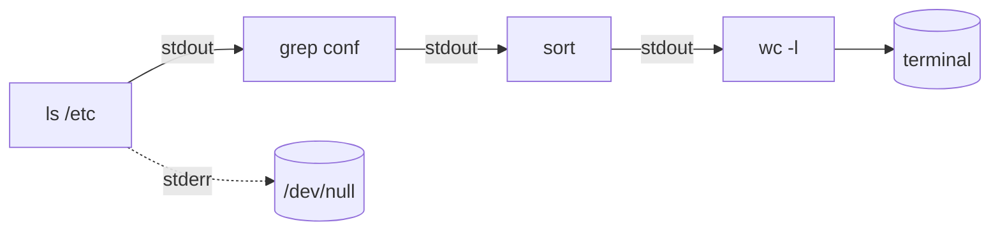

# Séquence 9 — Linux & système de fichiers

> **Source principale** : <https://lyotardjulien.forge.apps.education.fr/terminale-specialite-nsi-au-lycee-notre-dame/09_sequence_9/09_sequence_9/>
> **Ressource** : <https://lyotardjulien.forge.apps.education.fr/bifurcation-site-coilhac-term/Linux/1_generalites/>
> **Crédit** : David Roche, <https://pixees.fr/informatiquelycee/n_site/nsi_prem_os_intro.html>

---

## TL;DR

- **Linux** est un **noyau** libre créé par **Linus Torvalds** en 1991, clone d'**UNIX** (propriétaire). On l'utilise via des **distributions** (Ubuntu, Debian, Fedora, Mint…).
- Une distribution = **noyau** + **shell** + utilitaires GNU + interface graphique éventuelle.
- Le **shell** (bash, zsh, sh) est un **interpréteur de commandes** qui dialogue avec le noyau.
- L'**arborescence** Linux part d'une **racine unique `/`**. Tout est fichier (même les périphériques sous `/dev`).
- On distingue **chemin absolu** (`/home/user/fic.txt`, commence par `/`) et **chemin relatif** (`docs/fic.txt`, depuis le répertoire courant).
- Les **droits** (rwx) s'appliquent à 3 catégories : **propriétaire / groupe / autres**. Notation **octale** : `chmod 755 script.sh`.
- Les **redirections** (`>`, `>>`, `<`, `2>`, `|`) permettent de chaîner les commandes — philosophie UNIX : « petits outils qui font une chose et la font bien ».
- **macOS** est un UNIX propriétaire ; **Windows** est propriétaire et n'est pas un UNIX.

---

## Plan de la séquence

1. UNIX, Linux, distributions : libre vs propriétaire.
2. Architecture d'un OS : noyau, shell, applications.
3. Arborescence des fichiers Linux et chemins.
4. Commandes essentielles (navigation, fichiers, recherche, texte, processus, réseau).
5. Permissions : notation `rwx`, notation octale, `chmod`, `chown`.
6. Redirections et pipes.
7. Variables d'environnement, `$PATH`, `export`.
8. Scripts shell (bash) : variables, `if`, `for`.
9. Éditeurs en console : `nano`, `vi/vim`.

---

## Notions clés

### 1. UNIX, Linux, distributions

- **UNIX** (1969, Bell Labs) : OS multi-utilisateurs, multitâches, **propriétaire**.
- **Linux** (1991, Torvalds) : **noyau libre**, clone d'UNIX écrit *from scratch*. Sous **licence GPL**.
- **Logiciel libre** : 4 libertés (utiliser, étudier, modifier, redistribuer). Libre ≠ gratuit.
- **Distribution Linux** : noyau Linux + outils GNU + gestionnaire de paquets + bureau (GNOME, KDE…). Exemples : **Debian, Ubuntu, Mint, Fedora, Arch, Gentoo**.
- **macOS** = UNIX propriétaire (BSD). **Android** utilise un noyau Linux modifié.

### 2. Architecture d'un OS Linux

```
+-----------------------------------------------+
|        Applications (Firefox, LibreOffice)    |
+-----------------------------------------------+
|        Shell (bash, zsh)  +  GUI              |
+-----------------------------------------------+
|        Bibliothèques (libc, GNU coreutils)    |
+-----------------------------------------------+
|        Noyau (Linux kernel)                   |
+-----------------------------------------------+
|        Matériel (CPU, RAM, disques, réseau)   |
+-----------------------------------------------+
```

### 3. Arborescence Linux (FHS, Filesystem Hierarchy Standard)

| Répertoire | Rôle |
|------------|------|
| `/` | racine de tout le système |
| `/bin` | exécutables binaires essentiels (`ls`, `cp`, `bash`) |
| `/sbin` | binaires système (admin) |
| `/etc` | fichiers de configuration (texte) |
| `/home` | répertoires personnels des utilisateurs (`/home/alice`) |
| `/root` | répertoire personnel du super-utilisateur |
| `/tmp` | fichiers temporaires (vidé au reboot) |
| `/usr` | programmes utilisateur installés (`/usr/bin`, `/usr/lib`) |
| `/var` | données variables : logs (`/var/log`), bases, files |
| `/dev` | fichiers de périphériques (`/dev/sda`, `/dev/null`) |
| `/proc` | pseudo-FS reflétant l'état du noyau et des processus |
| `/sys` | informations sur le matériel |
| `/mnt`, `/media` | points de montage (USB, CD…) |
| `/boot` | noyau Linux et chargeur de démarrage |
| `/opt` | logiciels tiers optionnels |

### 4. Chemins

- **Absolu** : commence par `/`. Ex : `/home/user/projet/main.py`.
- **Relatif** : depuis le répertoire courant. Ex : `projet/main.py`.
- **Symboles** :
  - `.` = répertoire courant
  - `..` = répertoire parent
  - `~` = répertoire personnel de l'utilisateur courant (`/home/user`)
  - `/` (en début) = racine
- Exemple : `cd ../../etc` remonte de 2 niveaux puis entre dans `etc`.

### 5. Permissions

Affichage avec `ls -l` :

```
-rwxr-xr-x 1 user group 1234 Apr 22 10:00 script.sh
```

Décomposition des 10 caractères :

| Position | Signification |
|----------|---------------|
| 1 | type : `-` fichier, `d` répertoire, `l` lien symbolique |
| 2-4 | droits du **propriétaire** (user) |
| 5-7 | droits du **groupe** |
| 8-10 | droits des **autres** |

Chaque triplet : `r` lecture (read), `w` écriture (write), `x` exécution (execute).

**Notation octale** : chaque triplet → un chiffre 0-7.

| Octal | Binaire | rwx |
|-------|---------|-----|
| 0 | 000 | --- |
| 1 | 001 | --x |
| 2 | 010 | -w- |
| 3 | 011 | -wx |
| 4 | 100 | r-- |
| 5 | 101 | r-x |
| 6 | 110 | rw- |
| 7 | 111 | rwx |

Exemples courants :

| Octal | Permissions | Usage typique |
|-------|-------------|---------------|
| `755` | `rwxr-xr-x` | script ou exécutable |
| `644` | `rw-r--r--` | fichier de données / config |
| `700` | `rwx------` | fichier privé |
| `777` | `rwxrwxrwx` | tout monde tout droit (à éviter) |
| `600` | `rw-------` | clé SSH privée |

### 6. Redirections

| Symbole | Effet |
|---------|-------|
| `>` | redirige **stdout** vers un fichier (écrase) |
| `>>` | redirige stdout, **ajoute** à la fin |
| `<` | lit **stdin** depuis un fichier |
| `2>` | redirige **stderr** |
| `2>&1` | fusionne stderr dans stdout |
| `&>` | redirige stdout + stderr |
| `|` | pipe : sortie de la 1ʳᵉ commande → entrée de la 2ᵉ |

### 7. Variables d'environnement

- Définition : `VAR="valeur"` (locale au shell).
- Exportation : `export VAR="valeur"` (transmise aux sous-processus).
- Lecture : `$VAR` ou `${VAR}`.
- `$PATH` : liste des dossiers où le shell cherche les commandes (séparés par `:`).
- `$HOME` : répertoire personnel. `$USER` : nom d'utilisateur. `$PWD` : répertoire courant.
- Lister : `env` ou `printenv`.

### 8. Scripts shell

Un fichier texte commençant par un **shebang** `#!/bin/bash`, rendu exécutable avec `chmod +x`.

---

## Vocabulaire (table)

| Terme | Définition courte |
|-------|-------------------|
| Noyau (kernel) | Cœur de l'OS, gère mémoire, processus, E/S |
| Shell | Interpréteur de commandes (bash, zsh, sh, dash) |
| Distribution | OS construit autour d'un noyau Linux |
| Terminal / console | Émulateur permettant d'interagir avec le shell |
| TTY | TeleTYpewriter, périphérique terminal |
| Prompt | Invite du shell (`user@host:~$`) |
| Root | Super-utilisateur, UID 0, tous les droits |
| sudo | « SuperUser DO », exécuter une commande en tant que root |
| Inode | Structure décrivant un fichier (taille, droits, blocs) |
| Lien dur | Deuxième nom pour un même inode |
| Lien symbolique (symlink) | Raccourci pointant vers un autre chemin (`ln -s`) |
| Chemin absolu | Commence par `/` |
| Chemin relatif | Depuis le répertoire courant |
| Pipe `|` | Connecte stdout d'une commande à stdin d'une autre |
| Wildcard / glob | `*`, `?`, `[abc]` pour les motifs de noms de fichiers |
| Variable d'env | Paire nom=valeur disponible pour les processus |
| Shebang | Première ligne `#!/bin/bash` indiquant l'interpréteur |
| Demon (daemon) | Processus système en arrière-plan (souvent suffixe `d` : `sshd`) |

---

## Commandes / algorithmes (avec exemples concrets)

### Navigation

| Commande | Rôle | Exemple |
|----------|------|---------|
| `pwd` | affiche le répertoire courant | `pwd` → `/home/user` |
| `ls` | liste le contenu | `ls -la` (tous + détails) |
| `ls -lh` | tailles humaines (Ko, Mo) | |
| `cd` | change de répertoire | `cd /etc` ; `cd ..` ; `cd ~` |
| `tree` | affiche l'arborescence | `tree -L 2` (2 niveaux) |

### Manipulation de fichiers

| Commande | Rôle | Exemple |
|----------|------|---------|
| `touch` | crée un fichier vide / met à jour la date | `touch notes.txt` |
| `mkdir` | crée un dossier | `mkdir -p a/b/c` (parents inclus) |
| `cp` | copie | `cp -r dossier/ sauvegarde/` |
| `mv` | déplace ou renomme | `mv old.txt new.txt` |
| `rm` | supprime | `rm -rf dossier/` (récursif + force, **DANGEREUX**) |
| `ln -s` | lien symbolique | `ln -s /var/log/syslog log` |
| `cat` | affiche tout le fichier | `cat /etc/hostname` |
| `less` | pagination interactive | `less /var/log/syslog` |
| `head` | premières lignes | `head -n 20 fichier` |
| `tail` | dernières lignes | `tail -f fichier.log` (suit en direct) |

### Recherche

| Commande | Rôle | Exemple |
|----------|------|---------|
| `grep` | cherche un motif dans un texte | `grep -r "TODO" src/` |
| `grep -i` | insensible à la casse | |
| `grep -n` | affiche les numéros de ligne | |
| `find` | recherche dans l'arborescence | `find / -name "*.py" -size +1M` |
| `locate` | recherche rapide via base indexée | `locate config` (à jour avec `updatedb`) |
| `which` | localise une commande dans `$PATH` | `which python3` |
| `whereis` | binaire + manuel + sources | `whereis ls` |

### Permissions

| Commande | Rôle | Exemple |
|----------|------|---------|
| `chmod` | modifie les droits | `chmod 755 script.sh` ; `chmod u+x script.sh` |
| `chown` | change le propriétaire | `chown alice:dev fichier` |
| `umask` | masque par défaut | `umask 022` |
| `sudo` | exécution privilégiée | `sudo apt update` |

Notation symbolique pour `chmod` :

```
chmod u+x f     # ajoute exécution au propriétaire
chmod g-w f     # retire l'écriture au groupe
chmod o=r f     # définit autres = lecture seule
chmod a+r f     # tous (a = all) en lecture
```

### Processus

| Commande | Rôle | Exemple |
|----------|------|---------|
| `ps aux` | liste tous les processus | |
| `top` / `htop` | moniteur dynamique | |
| `kill` | envoie un signal | `kill -9 1234` |
| `pgrep` / `pkill` | par nom | `pkill firefox` |
| `&` | lancer en arrière-plan | `./tache &` |
| `jobs` | jobs du shell | |
| `fg %1` | retour avant-plan | |
| `bg %1` | continuer en arrière-plan | |
| `nohup` | survie après fermeture du shell | `nohup ./serveur &` |

### Manipulation de texte

| Commande | Rôle | Exemple |
|----------|------|---------|
| `wc` | comptage (lignes/mots/octets) | `wc -l fichier.txt` |
| `sort` | trie | `sort -n` (numérique) ; `sort -r` (reverse) |
| `uniq` | dédoublonne (lignes adjacentes) | `sort f | uniq -c` |
| `cut` | extrait des colonnes | `cut -d: -f1 /etc/passwd` |
| `tr` | translitère | `tr a-z A-Z < f` |
| `sed` | édition de flux | `sed 's/foo/bar/g' f` |
| `awk` | langage de traitement | `awk '{print $1, $3}' f` |
| `tee` | duplique stdout | `cmd | tee log.txt` |

### Système

| Commande | Rôle | Exemple |
|----------|------|---------|
| `man` | manuel d'une commande | `man ls` (q pour quitter) |
| `whoami` | utilisateur courant | |
| `id` | UID, GID, groupes | |
| `uname -a` | infos noyau | |
| `df -h` | espace disque par partition | |
| `du -sh` | taille d'un dossier | `du -sh /var/log` |
| `free -h` | mémoire RAM | |
| `date` | date/heure courante | |
| `history` | historique des commandes | |

### Réseau

| Commande | Rôle | Exemple |
|----------|------|---------|
| `ping` | test de joignabilité ICMP | `ping -c 4 google.fr` |
| `ifconfig` / `ip a` | interfaces réseau | `ip addr show` |
| `traceroute` | route vers une destination | `traceroute 1.1.1.1` |
| `ssh` | connexion sécurisée distante | `ssh user@serveur` |
| `scp` | copie sécurisée distante | `scp f.txt user@srv:/tmp/` |
| `wget` | téléchargement HTTP | `wget https://...` |
| `curl` | client HTTP polyvalent | `curl -I https://...` |
| `nslookup` / `dig` | requêtes DNS | `dig google.fr` |
| `netstat` / `ss` | ports / connexions | `ss -tuln` |

### Redirections — exemples

```bash
ls > liste.txt              # écrase liste.txt avec la sortie
ls >> liste.txt             # ajoute à la fin
sort < donnees.txt          # lit l'entrée depuis le fichier
make 2> erreurs.log         # capture seulement les erreurs
make > out.log 2>&1         # capture sortie + erreurs ensemble
ls /etc | wc -l             # nombre de fichiers dans /etc
ps aux | grep python | wc -l
cat /etc/passwd | cut -d: -f1 | sort | uniq
```

### Variables et $PATH

```bash
NOM="Alice"
echo "Bonjour $NOM"

echo $PATH                  # /usr/local/bin:/usr/bin:/bin:...
export PATH="$PATH:$HOME/bin"   # ajoute ~/bin
which mon_script            # vérifie qu'il est trouvable
```

### Script bash basique

```bash
#!/bin/bash
# usage : ./compte.sh dossier
DIR=${1:-.}                 # 1er argument, défaut "."
if [ -d "$DIR" ]; then
    echo "Fichiers .py dans $DIR :"
    for f in "$DIR"/*.py; do
        echo " - $f ($(wc -l < "$f") lignes)"
    done
else
    echo "Erreur : $DIR n'est pas un dossier" >&2
    exit 1
fi
```

Rendre exécutable et lancer :

```bash
chmod +x compte.sh
./compte.sh src/
```

### Éditeurs en console

**nano** (simple, débutant) :

| Raccourci | Action |
|-----------|--------|
| `Ctrl+O` | enregistrer |
| `Ctrl+X` | quitter |
| `Ctrl+W` | rechercher |
| `Ctrl+K` | couper la ligne |

**vi / vim** (puissant, deux modes) :

| Action | Commande |
|--------|----------|
| passer en mode insertion | `i` |
| revenir en mode normal | `Échap` |
| enregistrer | `:w` |
| quitter | `:q` |
| enregistrer + quitter | `:wq` ou `ZZ` |
| quitter sans enregistrer | `:q!` |
| supprimer une ligne | `dd` |
| copier / coller | `yy` / `p` |
| rechercher | `/motif` |
| annuler | `u` |

---

## Diagramme Mermaid — Arborescence Linux

```mermaid
graph TD
    R[/] --> bin[/bin]
    R --> etc[/etc]
    R --> home[/home]
    R --> usr[/usr]
    R --> var[/var]
    R --> tmp[/tmp]
    R --> dev[/dev]
    R --> proc[/proc]
    R --> root_dir[/root]
    R --> boot[/boot]
    home --> alice[/home/alice]
    home --> bob[/home/bob]
    alice --> docs[Documents/]
    alice --> projets[projets/]
    usr --> usr_bin[/usr/bin]
    usr --> usr_lib[/usr/lib]
    var --> log[/var/log]
```

## Diagramme Mermaid — Pipe et redirections



---

## Pièges classiques au bac

1. **Confondre Linux et Ubuntu** : Linux = noyau, Ubuntu = distribution.
2. **Confondre libre et gratuit** : libre = 4 libertés (GPL), gratuit = prix nul. Du libre peut être payant.
3. **Oublier que `/` est unique** : Linux n'a pas de `C:\`, `D:\`. Tout est sous `/`.
4. **`rm -rf /`** : supprime tout. À ne **jamais** faire.
5. **Confondre `>` et `>>`** : `>` écrase, `>>` ajoute.
6. **Oublier les guillemets** sur les chemins avec espaces : `cd "Mon dossier"`.
7. **Penser que `chmod 777` est sûr** : non, c'est tout ouvrir à tout le monde.
8. **Mauvaise lecture des droits `ls -l`** : la 1ʳᵉ lettre est le **type**, pas un droit.
9. **Confondre `.` et `..`** : `.` = ici, `..` = parent.
10. **Croire que `$PATH` contient les fichiers** : il contient des **dossiers** où chercher des exécutables.
11. **Oublier le shebang** dans un script : sans `#!/bin/bash`, le script peut être interprété par le mauvais shell.
12. **Confondre `ifconfig` et `ipconfig`** : `ifconfig` (Linux/macOS) vs `ipconfig` (Windows).

---

## Questions types

1. **Donner** la différence entre noyau, shell et distribution.
2. **Citer 3 distributions Linux** et un usage typique de chacune.
3. **Décrire** le rôle de `/etc`, `/home`, `/var/log`, `/tmp`, `/usr/bin`.
4. **Convertir** `rwxr-x---` en notation octale. *(Réponse : 750)*
5. **Convertir** `644` en notation rwx. *(Réponse : `rw-r--r--`)*
6. **Écrire la commande** qui affiche les 10 derniers messages du fichier `/var/log/syslog`. *(`tail -n 10 /var/log/syslog`)*
7. **Écrire le pipe** comptant les utilisateurs définis dans `/etc/passwd`. *(`cut -d: -f1 /etc/passwd | wc -l`)*
8. **Écrire le chemin relatif** de `/home/alice/docs/cv.pdf` depuis `/home/alice/projets/`. *(Réponse : `../docs/cv.pdf`)*
9. **Que fait** `chmod +x script.sh` ? Que se passe-t-il sans cette commande quand on lance `./script.sh` ?
10. **Expliquer** à quoi sert le shebang `#!/bin/bash`.
11. **Différence** entre `>`, `>>`, `2>` et `|`.
12. **Donner** la commande pour lancer `serveur` en arrière-plan tout en redirigeant la sortie dans `serveur.log`.

---

## Liens

- Cours principal : <https://lyotardjulien.forge.apps.education.fr/terminale-specialite-nsi-au-lycee-notre-dame/09_sequence_9/09_sequence_9/>
- Cours détaillé : <https://lyotardjulien.forge.apps.education.fr/bifurcation-site-coilhac-term/Linux/1_generalites/>
- Mémento commandes (David Roche) : <https://pixees.fr/informatiquelycee/n_site/nsi_prem_os_intro.html>
- Manuel en ligne : `man <commande>` ou <https://man7.org/linux/man-pages/>
- Tutoriel interactif : <https://overthewire.org/wargames/bandit/> (jeu de niveau Linux)
