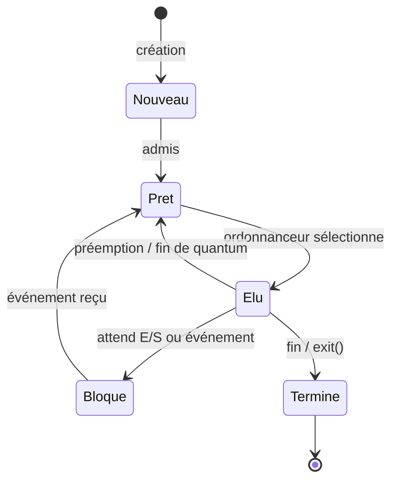
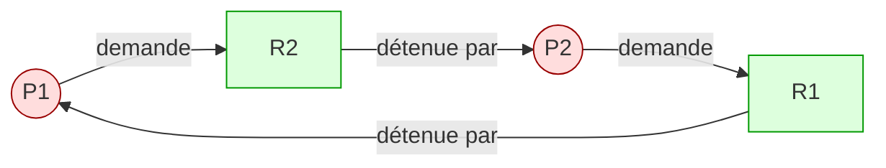

# Séquence 9 — Processus & Système d'exploitation

> **Source principale** : <https://lyotardjulien.forge.apps.education.fr/terminale-specialite-nsi-au-lycee-notre-dame/08_sequence_8/08_sequence_8/>
> **Ressources liées** : <https://lyotardjulien.forge.apps.education.fr/bifurcation-site-coilhac-term/processus/1_processus/>

!!! info "Périmètre officiel BO Terminale"
    Le BO Terminale demande spécifiquement : **création de processus**, **ordonnancement**, **mise en évidence de l'interblocage (deadlock)**. Le détail des primitives de synchronisation (sémaphores, mutex), la communication inter-processus, le `fork()` en C et le multiprocessing Python sont **hors programme NSI** — on s'en tient au mécanisme conceptuel.

---

## TL;DR

- Un **système d'exploitation (OS)** fait le pont entre le matériel (CPU, mémoire, périphériques) et les applications. Ses 3 rôles centraux : **gestion de la mémoire**, **ordonnancement** des processus, **gestion des accès aux ressources**.
- Un **processus** est une **instance d'un programme en cours d'exécution** (≠ programme = fichier sur disque).
- Un processus traverse 5 états : **nouveau → prêt → élu → bloqué → terminé**. L'**ordonnanceur** (scheduler) décide qui obtient le CPU.
- Identification : **PID** (Process IDentifier), **PPID** (parent), table des processus, contexte d'exécution.
- **Interblocage** (deadlock) : situation où plusieurs processus s'attendent mutuellement indéfiniment ; les **4 conditions de Coffman** doivent être réunies.
- Analogie : programme = partition, processus = musicien, processeur = instrument.

---

## Plan de la séquence

1. Le système d'exploitation : définition, rôles (mémoire, ordonnancement, ressources).
2. Programme vs processus.
3. États d'un processus + transitions (diagramme).
4. Identification : PID, PPID, table des processus, contexte.
5. Création de processus (mécanisme).
6. Concurrence et ressources critiques (notion).
7. Interblocages : conditions de Coffman, graphe d'allocation.
8. Outils d'observation : `ps`, `top`, gestionnaire de tâches.

---

## Notions clés

### 1. Système d'exploitation (OS)

Ensemble de programmes qui :

- charge les programmes depuis la mémoire de masse vers la RAM,
- crée et ordonnance les processus,
- gère les ressources (CPU, mémoire, fichiers, périphériques),
- traite les **interruptions** matérielles et les **entrées-sorties**,
- assure la sécurité (droits d'accès, isolement mémoire).

**Exemples** : Windows, macOS, Ubuntu, Debian, Android, iOS.

### 2. Mémoire virtuelle

Chaque processus dispose d'un **espace d'adressage virtuel** isolé. L'OS traduit les adresses virtuelles en adresses physiques. Cela évite qu'un processus n'écrase la mémoire d'un autre.

### 3. Programme vs processus

| Programme | Processus |
|-----------|-----------|
| Fichier exécutable sur disque | Instance en exécution en mémoire |
| Statique (suite d'octets) | Dynamique (état, registres, pile) |
| Existe une seule fois | Le même programme peut être lancé N fois → N processus distincts |

> Lancer **deux fois Firefox** crée **deux processus** différents avec deux PID différents, deux espaces mémoire séparés.

> Note rapide : un **thread** est un fil d'exécution interne à un processus, partageant sa mémoire. La distinction n'est pas un attendu du bac NSI.

### 4. États d'un processus

| État | Signification |
|------|---------------|
| **nouveau** | processus créé, en cours d'initialisation |
| **prêt** (ready) | en attente du CPU, prêt à s'exécuter |
| **élu** (running) | utilise le CPU, exécute ses instructions |
| **bloqué** (waiting) | attend un événement (E/S, donnée réseau, frappe clavier) |
| **terminé** | exécution achevée, ressources à libérer |

> Attention : un processus **« en attente »** = **prêt** (attend le CPU). Un processus **« bloqué »** = attend un **événement extérieur**.

### 5. Identification

- **PID** : entier unique attribué à chaque processus par l'OS.
- **PPID** : PID du processus **parent** (celui qui a créé l'enfant).
- **Contexte** : registres CPU, compteur ordinal, pile, état mémoire — sauvegardé lors d'un changement de contexte (commutation).
- **Table des processus** : structure du noyau qui liste tous les processus actifs.

### 6. Ordonnanceur (scheduler)

Le CPU mono-cœur ne fait qu'**une instruction à la fois**. L'ordonnanceur partage le temps CPU entre les processus prêts (illusion de simultanéité = **multitâche** ou **time-sharing**).

Principes : on alterne rapidement entre les processus prêts via une **commutation de contexte**. Le détail des politiques (FIFO, Round Robin, priorités) n'est pas un attendu du bac.

### 7. Création de processus

Lorsqu'un processus crée un autre processus (par exemple, ouvrir un programme depuis le shell, ou un programme qui lance un sous-programme), l'OS :

1. Alloue un nouveau PID,
2. Recopie ou initialise un espace mémoire pour l'enfant,
3. Inscrit le PPID de l'enfant = PID du parent,
4. Place l'enfant dans l'état **prêt**.

Sous Unix, l'appel système qui réalise cela est `fork()` (mécanisme — la syntaxe C précise est hors programme NSI).

### 8. Ressources critiques (notion)

Une **section critique** est un morceau de code qui accède à une **ressource partagée** (fichier, variable, imprimante). Si plusieurs processus y accèdent en même temps **sans coordination**, on peut obtenir des incohérences (par exemple : deux processus qui débitent en même temps un compte bancaire).

L'OS fournit des mécanismes pour assurer un accès **exclusif** à la ressource, mais le détail (sémaphores, mutex) **n'est pas au programme NSI**.

### 9. Interblocage (deadlock)

Situation où **plusieurs processus s'attendent mutuellement** indéfiniment. C'est le seul aspect explicitement listé au BO.

**Conditions de Coffman** (les 4 réunies = deadlock) :

1. **Exclusion mutuelle** : la ressource ne peut être utilisée que par un processus à la fois.
2. **Occupation et attente** : un processus garde des ressources tout en en attendant d'autres.
3. **Non-préemption** : on ne peut pas retirer de force une ressource à un processus.
4. **Attente circulaire** : il existe une **chaîne circulaire** P1→P2→…→Pn→P1 où chaque Pi attend une ressource détenue par Pi+1.

Représentation : **graphe d'allocation** (sommets = processus + ressources, arcs = demande / possession). Un **cycle** dans ce graphe ⇒ deadlock.

---

## Vocabulaire (table)

| Terme | Définition courte |
|-------|-------------------|
| OS / Système d'exploitation | Logiciel qui pilote le matériel et fait tourner les applications |
| Noyau (kernel) | Cœur de l'OS, mode privilégié, gère mémoire, processus, E/S |
| Processus | Instance d'un programme en cours d'exécution |
| PID | Process IDentifier, entier unique |
| PPID | PID du processus parent |
| Contexte | Ensemble des registres et données nécessaires pour reprendre un processus |
| Ordonnanceur | Module de l'OS qui choisit le prochain processus à exécuter |
| Multitâche | Exécution apparemment simultanée de plusieurs processus |
| Préemption | L'OS retire le CPU à un processus pour le donner à un autre |
| Commutation de contexte | Sauvegarde de l'état d'un processus + restauration d'un autre |
| Mémoire virtuelle | Espace d'adressage propre à chaque processus |
| Section critique | Code accédant à une ressource partagée |
| Interblocage / Deadlock | Blocage mutuel de processus en attente circulaire |
| Famine (starvation) | Un processus prêt n'obtient jamais le CPU |

---

## Outils d'observation (Linux)

```bash
ps                # processus du terminal courant
ps aux            # tous les processus, format BSD
top               # affichage dynamique, rafraîchi toutes les 3 s
pstree            # arborescence parent → enfants
```

Tuer un processus :

```bash
kill 1234         # envoie SIGTERM, demande poliment l'arrêt
kill -9 1234      # envoie SIGKILL, arrêt immédiat non interceptable
```

---

## Diagramme Mermaid — États d'un processus



## Diagramme Mermaid — Graphe d'allocation (deadlock)



> Le cycle **P1 → R2 → P2 → R1 → P1** révèle un interblocage : P1 attend R2 que P2 détient, P2 attend R1 que P1 détient.

---

## Pièges classiques au bac

1. **Confondre programme et processus** : un programme est un fichier ; un processus est une instance en exécution. Le même programme peut donner N processus.
2. **Dire « le CPU exécute plusieurs processus en même temps »** sur un mono-cœur : faux. Il alterne très vite (illusion de simultanéité). Vrai parallélisme ⇒ multi-cœurs.
3. **Confondre « en attente » (= prêt)** et **« bloqué » (= attend un événement)**. Un processus prêt veut le CPU ; un bloqué attend une E/S.
4. **Croire qu'un processus passe directement de bloqué à élu** : non, il repasse par **prêt**.
5. **Penser qu'un seul deadlock = 1 condition de Coffman** : il en faut **les 4** simultanément.
6. **Confondre famine et interblocage** : famine = un processus n'a jamais le CPU mais le système avance ; deadlock = plus rien n'avance.
7. **Oublier le rôle de l'OS** : ce n'est pas qu'une interface graphique, c'est avant tout un gestionnaire de ressources.

---

## Questions types

1. **Définir** : programme, processus. Donner deux différences entre les deux.
2. **Citer et expliquer** les 5 états d'un processus. Tracer le diagramme de transitions.
3. **À quoi sert un PID ? un PPID ?**
4. **Décrire** le rôle de l'ordonnanceur. Qu'est-ce qu'une commutation de contexte ?
5. **Donner les 4 conditions de Coffman** pour un interblocage.
6. **Sur un graphe d'allocation donné**, repérer le ou les cycles et conclure sur l'existence d'un deadlock.
7. **Différence** entre concurrence et parallélisme. Un mono-cœur fait-il du parallélisme ?
8. **Citer** trois rôles de l'OS et un mécanisme garantissant l'isolation mémoire entre processus.

---

## Liens

- Cours principal : <https://lyotardjulien.forge.apps.education.fr/terminale-specialite-nsi-au-lycee-notre-dame/08_sequence_8/08_sequence_8/>
- Cours détaillé processus : <https://lyotardjulien.forge.apps.education.fr/bifurcation-site-coilhac-term/processus/1_processus/>
- Programme officiel BO 2020 (Terminale NSI) — bloc « Architectures matérielles, systèmes d'exploitation et réseaux ».
