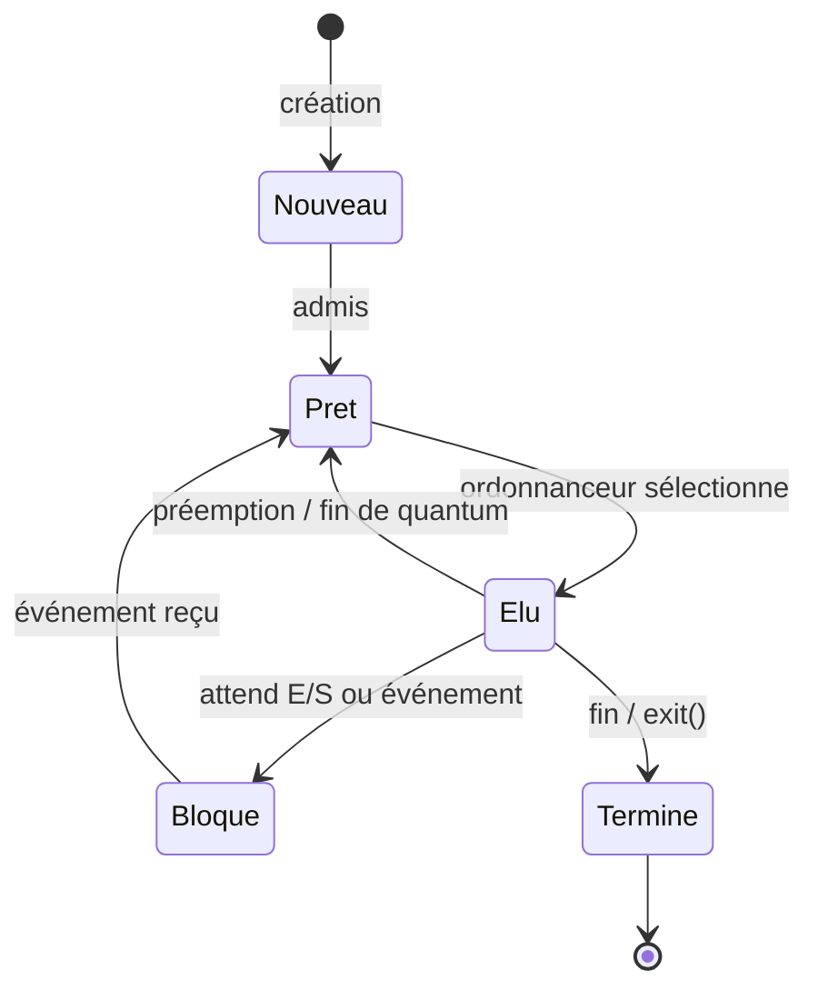
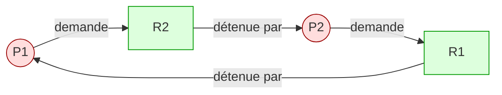

# Séquence 9 — Processus & Système d'exploitation

> **Source principale** : <https://lyotardjulien.forge.apps.education.fr/terminale-specialite-nsi-au-lycee-notre-dame/08_sequence_8/08_sequence_8/>
> **Ressources liées** : <https://lyotardjulien.forge.apps.education.fr/bifurcation-site-coilhac-term/processus/1_processus/>
> **TP Capytale** : type BAC + exécution concurrente (`ce6f-8909250`, `dad4-9006874`)

---

## TL;DR

- Un **système d'exploitation (OS)** fait le pont entre le matériel (CPU, mémoire, périphériques) et les applications. Ses 3 rôles centraux : **gestion de la mémoire**, **ordonnancement** des processus, **gestion des accès aux ressources**.
- Un **processus** est une **instance d'un programme en cours d'exécution** (≠ programme = fichier sur disque).
- Un processus traverse 5 états : **nouveau → prêt → élu → bloqué → terminé**. L'**ordonnanceur** (scheduler) décide qui obtient le CPU.
- Identification : **PID** (Process IDentifier), **PPID** (parent), table des processus, contexte d'exécution (registres, pile, mémoire virtuelle).
- Création Unix : `fork()` duplique le processus appelant → 1 parent + 1 enfant.
- **Communication inter-processus (IPC)** : pipes (`|`), signaux (`SIGTERM`, `SIGKILL`), sémaphores, mémoire partagée.
- **Exclusion mutuelle** sur ressources critiques → **sémaphores**.
- **Interblocage** (deadlock) si les **4 conditions de Coffman** sont réunies (exclusion mutuelle, occupation+attente, non-préemption, attente circulaire).
- Analogie : programme = partition, processus = musicien, processeur = instrument.

---

## Plan de la séquence

1. Le système d'exploitation : définition, rôles (mémoire, ordonnancement, ressources).
2. Programme vs processus, processus vs thread.
3. États d'un processus + transitions (diagramme).
4. Identification : PID, PPID, table des processus, contexte.
5. Création de processus : `fork()` Unix.
6. Communication inter-processus : pipes, signaux, sémaphores.
7. Concurrence et exclusion mutuelle, ressources critiques.
8. Interblocages : conditions de Coffman, graphe d'allocation.
9. Outils d'observation : `ps`, `top`, gestionnaire de tâches.

---

## Notions clés

### 1. Système d'exploitation (OS)

Ensemble de programmes qui :

- charge les programmes depuis la mémoire de masse vers la RAM,
- crée et ordonnance les processus,
- gère les ressources (CPU, mémoire, fichiers, périphériques),
- traite les **interruptions** matérielles et les **entrées-sorties**,
- assure la sécurité (droits d'accès, isolement mémoire).

**Exemples** : Windows, macOS, Ubuntu, Debian, Android, iOS. Attention : **Linux** n'est pas un OS au sens strict mais un **noyau** (kernel) ; les OS qui l'utilisent (Ubuntu, Fedora…) sont des **distributions**.

### 2. Mémoire virtuelle

Chaque processus dispose d'un **espace d'adressage virtuel** isolé. L'OS traduit les adresses virtuelles en adresses physiques. Cela évite qu'un processus n'écrase la mémoire d'un autre.

### 3. Programme vs processus

| Programme | Processus |
|-----------|-----------|
| Fichier exécutable sur disque | Instance en exécution en mémoire |
| Statique (suite d'octets) | Dynamique (état, registres, pile) |
| Existe une seule fois | Le même programme peut être lancé N fois → N processus distincts |

> Lancer **deux fois Firefox** crée **deux processus** différents avec deux PID différents, deux espaces mémoire séparés.

### 4. Processus vs thread

- **Processus** : espace mémoire **propre**, isolé. Lourd à créer.
- **Thread** (fil d'exécution) : appartient à un processus, partage **la même mémoire** que les autres threads du processus. Léger.
- Plusieurs threads peuvent s'exécuter en parallèle dans un processus multithread.

### 5. États d'un processus

| État | Signification |
|------|---------------|
| **nouveau** | processus créé, en cours d'initialisation |
| **prêt** (ready) | en attente du CPU, prêt à s'exécuter |
| **élu** (running) | utilise le CPU, exécute ses instructions |
| **bloqué** (waiting) | attend un événement (E/S, donnée réseau, frappe clavier) |
| **terminé** | exécution achevée, ressources à libérer (zombie possible) |

> Attention : un processus **« en attente »** = **prêt** (attend le CPU). Un processus **« bloqué »** = attend un **événement extérieur**.

### 6. Identification

- **PID** : entier unique attribué à chaque processus par l'OS.
- **PPID** : PID du processus **parent** (celui qui a créé l'enfant).
- **Contexte** : registres CPU, compteur ordinal, pile, état mémoire — sauvegardé lors d'un changement de contexte (commutation).
- **Table des processus** : structure du noyau qui liste tous les processus actifs avec leurs PCB (Process Control Block).

### 7. Ordonnanceur (scheduler)

Le CPU mono-cœur ne fait qu'**une instruction à la fois**. L'ordonnanceur partage le temps CPU entre les processus prêts (illusion de simultanéité = **multitâche** ou **time-sharing**).

Algorithmes classiques : **FIFO**, **Round Robin** (tourniquet, quantum de temps), **priorités**, **SJF** (Shortest Job First).

### 8. fork()

L'appel système `fork()` crée un **processus enfant** copie conforme du parent. Il renvoie :

- **0** dans l'enfant,
- le **PID de l'enfant** dans le parent,
- **-1** en cas d'erreur.

### 9. Communication inter-processus (IPC)

- **Pipes** (tubes) : flux d'octets unidirectionnel `cmd1 | cmd2`.
- **Signaux** : entiers asynchrones (`SIGINT` Ctrl-C, `SIGTERM` 15, `SIGKILL` 9).
- **Sémaphores** : compteurs partagés pour synchroniser l'accès à une ressource.
- **Mémoire partagée**, **sockets**, **files de messages**.

### 10. Ressources critiques & exclusion mutuelle

Une **section critique** est un morceau de code qui accède à une **ressource partagée** (fichier, variable, imprimante). Pour éviter les **incohérences**, il faut garantir l'**exclusion mutuelle** : **un seul** processus à la fois.

Outil le plus connu : le **sémaphore** (Dijkstra). Opérations atomiques :

- `P()` (puis-je entrer ?) décrémente le compteur, bloque si négatif,
- `V()` (j'ai fini) incrémente, réveille un attendant.

Cas particulier : **mutex** = sémaphore binaire (0 ou 1).

### 11. Interblocage (deadlock)

Situation où **plusieurs processus s'attendent mutuellement** indéfiniment.

**Conditions de Coffman** (les 4 réunies = deadlock) :

1. **Exclusion mutuelle** : la ressource ne peut être utilisée que par un processus à la fois.
2. **Occupation et attente** (hold and wait) : un processus garde des ressources tout en en attendant d'autres.
3. **Non-préemption** : on ne peut pas retirer de force une ressource à un processus.
4. **Attente circulaire** : il existe une **chaîne circulaire** P1→P2→…→Pn→P1 où chaque Pi attend une ressource détenue par Pi+1.

Représentation : **graphe d'allocation** (sommets = processus + ressources, arcs = demande / possession). Un **cycle** dans ce graphe ⇒ deadlock potentiel.

---

## Vocabulaire (table)

| Terme | Définition courte |
|-------|-------------------|
| OS / Système d'exploitation | Logiciel qui pilote le matériel et fait tourner les applications |
| Noyau (kernel) | Cœur de l'OS, mode privilégié, gère mémoire, processus, E/S |
| Distribution | OS construit autour d'un noyau (ex : Ubuntu = Linux + GNU + Gnome) |
| Processus | Instance d'un programme en cours d'exécution |
| Thread | Fil d'exécution léger partageant la mémoire du processus |
| PID | Process IDentifier, entier unique |
| PPID | PID du processus parent |
| PCB | Process Control Block, structure noyau qui décrit un processus |
| Contexte | Ensemble des registres et données nécessaires pour reprendre un processus |
| Ordonnanceur | Module de l'OS qui choisit le prochain processus à exécuter |
| Quantum | Tranche de temps CPU allouée à un processus (Round Robin) |
| Multitâche | Exécution apparemment simultanée de plusieurs processus |
| Préemption | L'OS retire le CPU à un processus pour le donner à un autre |
| Commutation de contexte | Sauvegarde de l'état d'un processus + restauration d'un autre |
| Mémoire virtuelle | Espace d'adressage propre à chaque processus |
| Zombie | Processus terminé dont les infos n'ont pas encore été récupérées par le parent |
| Daemon | Processus système tournant en arrière-plan |
| fork() | Appel système Unix qui duplique le processus appelant |
| Signal | Message asynchrone envoyé à un processus (SIGTERM, SIGKILL...) |
| Pipe | Tube de communication unidirectionnel entre processus |
| Sémaphore | Compteur partagé pour synchroniser l'accès à une ressource |
| Mutex | Sémaphore binaire (0/1) garantissant l'exclusion mutuelle |
| Section critique | Code accédant à une ressource partagée |
| Interblocage / Deadlock | Blocage mutuel de processus en attente circulaire |
| Famine (starvation) | Un processus prêt n'obtient jamais le CPU |

---

## Commandes / algorithmes (avec exemples concrets)

### Observation des processus (Linux)

```bash
ps                # processus du terminal courant
ps aux            # tous les processus, format BSD (USER, PID, %CPU, %MEM, COMMAND)
ps -ef            # tous les processus, format System V (UID, PID, PPID, ...)
top               # affichage dynamique, rafraîchi toutes les 3 s
htop              # version améliorée et colorée
pstree            # arborescence parent → enfants
pgrep firefox     # PID des processus dont le nom contient firefox
```

### Tuer un processus

```bash
kill 1234         # envoie SIGTERM (15) au PID 1234, demande poliment l'arrêt
kill -9 1234      # envoie SIGKILL (9), arrêt immédiat non interceptable
killall firefox   # tue tous les processus nommés firefox
```

### Job control (avant-plan / arrière-plan)

```bash
./long_calcul &   # lance en arrière-plan
jobs              # liste les jobs du shell
fg %1             # ramène le job 1 en avant-plan
bg %1             # relance le job 1 en arrière-plan
Ctrl+Z            # suspend le job courant
Ctrl+C            # envoie SIGINT au job courant
```

### Création de processus en C : fork()

```c
#include <stdio.h>
#include <unistd.h>
#include <sys/wait.h>

int main() {
    pid_t pid = fork();          // duplique le processus
    if (pid == 0) {
        printf("Enfant : PID=%d, PPID=%d\n", getpid(), getppid());
    } else if (pid > 0) {
        printf("Parent : mon PID=%d, enfant=%d\n", getpid(), pid);
        wait(NULL);              // attend la fin de l'enfant
    } else {
        perror("fork");
    }
    return 0;
}
```

### Multiprocessing en Python (équivalent)

```python
from multiprocessing import Process
import os

def tache(n):
    print(f"Processus {os.getpid()} (parent {os.getppid()}) traite {n}")

if __name__ == "__main__":
    procs = [Process(target=tache, args=(i,)) for i in range(3)]
    for p in procs: p.start()
    for p in procs: p.join()
```

### Sémaphore (pseudo-code)

```text
sem = Sémaphore(initial = 1)   # mutex

Processus A :                  Processus B :
  sem.P()        # entre         sem.P()
  # section critique             # section critique
  sem.V()        # sort          sem.V()
```

---

## Diagramme Mermaid — États d'un processus



## Diagramme Mermaid — Graphe d'allocation (deadlock)



> Le cycle **P1 → R2 → P2 → R1 → P1** révèle un interblocage : P1 attend R2 que P2 détient, P2 attend R1 que P1 détient.

---

## Pièges classiques au bac

1. **Confondre programme et processus** : un programme est un fichier ; un processus est une instance en exécution. Le même programme peut donner N processus.
2. **Dire « le CPU exécute plusieurs processus en même temps »** sur un mono-cœur : faux. Il alterne très vite (illusion de simultanéité). Vrai parallélisme ⇒ multi-cœurs.
3. **Confondre « en attente » (= prêt)** et **« bloqué » (= attend un événement)**. Un processus prêt veut le CPU ; un bloqué attend une E/S.
4. **Croire qu'un processus passe directement de bloqué à élu** : non, il repasse par **prêt**.
5. **Oublier que `fork()` retourne deux fois** : 0 chez l'enfant, PID enfant chez le parent.
6. **Penser qu'un seul deadlock = 1 condition de Coffman** : il en faut **les 4** simultanément.
7. **Confondre famine et interblocage** : famine = un processus n'a jamais le CPU mais le système avance ; deadlock = plus rien n'avance.
8. **Confondre signal et exception** : un signal est asynchrone et envoyé par un autre processus / le noyau.
9. **Sémaphore ≠ verrou matériel** : c'est un mécanisme logiciel géré par l'OS.
10. **Oublier le rôle de l'OS** : ce n'est pas qu'une interface graphique, c'est avant tout un gestionnaire de ressources.

---

## Questions types

1. **Définir** : programme, processus, thread. Donner deux différences entre processus et thread.
2. **Citer et expliquer** les 5 états d'un processus. Tracer le diagramme de transitions.
3. **À quoi sert un PID ? un PPID ?** Que vaut le PPID si le parent meurt avant l'enfant ?
4. **Décrire** le rôle de l'ordonnanceur. Qu'est-ce qu'une commutation de contexte ?
5. **Expliquer** ce que fait `fork()`. Combien de processus existent après 2 `fork()` consécutifs ? *(Réponse : 4)*
6. **Donner les 4 conditions de Coffman** pour un interblocage. Comment briser l'attente circulaire ?
7. **Sur le graphe d'allocation suivant**, repérer le ou les cycles et conclure sur l'existence d'un deadlock.
8. **Différence** entre concurrence et parallélisme. Un mono-cœur fait-il du parallélisme ?
9. **Que se passe-t-il** si deux processus écrivent dans le même fichier sans exclusion mutuelle ?
10. **Citer** trois rôles de l'OS et un mécanisme garantissant l'isolation mémoire entre processus.

---

## Liens

- Cours principal : <https://lyotardjulien.forge.apps.education.fr/terminale-specialite-nsi-au-lycee-notre-dame/08_sequence_8/08_sequence_8/>
- Cours détaillé processus : <https://lyotardjulien.forge.apps.education.fr/bifurcation-site-coilhac-term/processus/1_processus/>
- TP Capytale (type BAC) : <https://capytale2.ac-paris.fr/web/c/ce6f-8909250>
- TP Capytale (concurrence) : <https://capytale2.ac-paris.fr/web/c/dad4-9006874>
- Programme officiel BO 2020 (Terminale NSI) — bloc « Architectures matérielles, systèmes d'exploitation et réseaux ».
