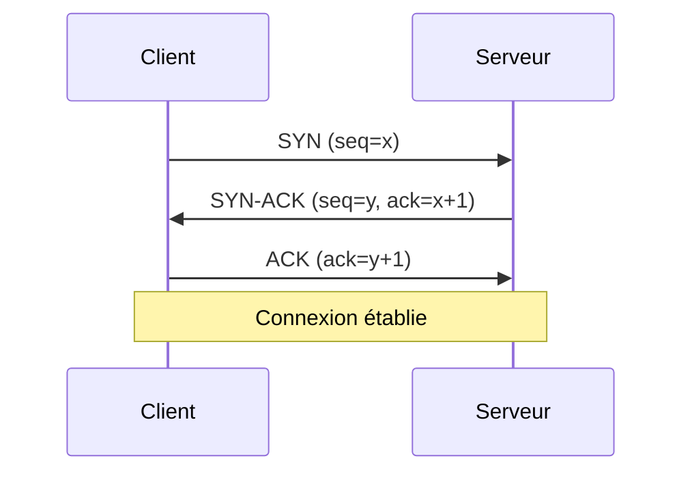
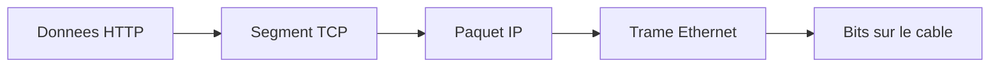
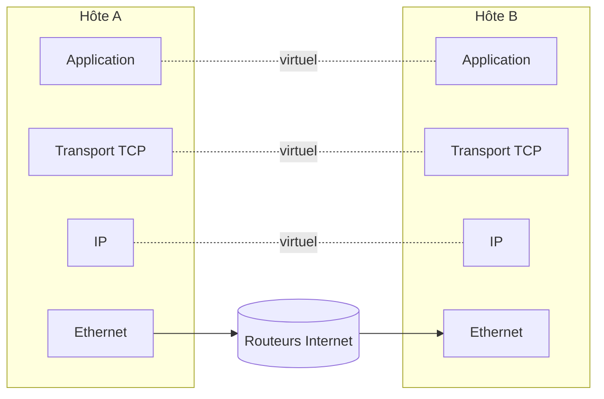

# Séquence 11 — Les Réseaux

> Source : <https://lyotardjulien.forge.apps.education.fr/terminale-specialite-nsi-au-lycee-notre-dame/10_sequence_10/10_sequence_10/>

---

## TL;DR

- Deux modèles en couches : **OSI (7)** théorique, **TCP/IP (4)** utilisé en pratique.
- **Adressage IPv4** : 32 bits, 4 octets pointés. CIDR `IP/préfixe`. Plages privées : `10/8`,
  `172.16/12`, `192.168/16`.
- **TCP** = connecté, fiable (handshake 3 voies). **UDP** = non connecté, rapide.
- **Encapsulation** : Données → segment TCP → paquet IP → trame Ethernet → bits.
- Protocoles applicatifs à connaître : **HTTP/HTTPS (80/443)**, **DNS (53)**, **SMTP (25)**,
  **SSH (22)**, **FTP (21)**, **DHCP (67/68)**.

---

## Plan de la séquence

1. Pourquoi des réseaux et un modèle en couches.
2. Modèle OSI vs TCP/IP.
3. Adressage IPv4, masque, CIDR, sous-réseaux.
4. IPv6 (notion).
5. Couche transport : TCP, UDP, ports.
6. Protocoles applicatifs.
7. Encapsulation et désencapsulation.
8. Routage.
9. NAT et sécurité.

---

## Notions clés

### Pourquoi des couches ?

Décomposer un problème complexe (transmettre une page web à travers le monde) en problèmes
plus simples. Chaque couche **n** ne dialogue qu'avec la couche **n** distante, en utilisant
les services de la couche **n-1** locale.

### Modèle OSI vs TCP/IP

| OSI (7) | TCP/IP (4) | Unité de données |
|---------|-----------|------------------|
| 7 Application | Application | Donnée |
| 6 Présentation | Application | Donnée |
| 5 Session | Application | Donnée |
| 4 Transport | Transport | Segment (TCP) / Datagramme (UDP) |
| 3 Réseau | Internet | Paquet |
| 2 Liaison | Accès réseau | Trame |
| 1 Physique | Accès réseau | Bit |

### Adressage IPv4

Adresse IPv4 = **32 bits = 4 octets** (chacun de 0 à 255), notation décimale pointée.
Exemple : `192.168.1.42`.

#### CIDR (Classless Inter-Domain Routing)

Notation `IP/préfixe` où le préfixe est le nombre de bits du **masque** valant 1.

Exemple : `192.168.1.42/24` → masque `255.255.255.0`, soit 24 bits réseau et 8 bits hôtes.

#### Calcul d'adresse réseau et de broadcast

```
IP        : 192.168.1.42/24 = 11000000 . 10101000 . 00000001 . 00101010
Masque    :                   11111111 . 11111111 . 11111111 . 00000000
ET binaire (réseau) :         11000000 . 10101000 . 00000001 . 00000000
                              = 192.168.1.0
Broadcast (bits hôtes à 1) :  11000000 . 10101000 . 00000001 . 11111111
                              = 192.168.1.255
Nombre d'hôtes utilisables : 2^(32 - préfixe) - 2 = 2^8 - 2 = 254
```

#### Plages d'adresses privées (RFC 1918)

| Classe | Plage |
|--------|-------|
| A | `10.0.0.0/8` (10.0.0.0 → 10.255.255.255) |
| B | `172.16.0.0/12` (172.16.0.0 → 172.31.255.255) |
| C | `192.168.0.0/16` (192.168.0.0 → 192.168.255.255) |

Adresses spéciales :
- `127.0.0.1` : **loopback** (machine locale).
- `0.0.0.0` : adresse de toutes les interfaces.
- `255.255.255.255` : broadcast général.

### IPv6 (notion)

- **128 bits** au lieu de 32 → ≈ 3,4 × 10³⁸ adresses.
- Notation **hexadécimale** par groupes de 16 bits, séparés par `:`.
- Exemple : `2001:db8::1`.

### Couche transport : TCP vs UDP

| Critère | TCP | UDP |
|---------|-----|-----|
| Mode | Connecté | Non connecté |
| Fiabilité | Oui (ACK, retransmission) | Non |
| Ordonnancement | Oui | Non |
| Contrôle de flux/congestion | Oui | Non |
| En-tête | 20 octets minimum | 8 octets |
| Vitesse | Plus lent | Plus rapide |
| Usage | HTTP, SSH, mail | DNS, jeux, VoIP, streaming |

### Handshake TCP (3 voies)



### Ports

Un port est un entier sur **16 bits** (0–65 535), identifiant un service sur une machine.

| Port | Protocole |
|------|-----------|
| 20/21 | FTP |
| 22 | SSH |
| 23 | Telnet |
| 25 | SMTP |
| 53 | DNS |
| 67/68 | DHCP |
| 80 | HTTP |
| 110 | POP3 |
| 143 | IMAP |
| 443 | HTTPS |
| 3306 | MySQL |

### Protocoles applicatifs

- **HTTP / HTTPS** : web. HTTPS = HTTP **chiffré par TLS**.
- **DNS** : traduit `www.example.com` ↔ `93.184.216.34`.
- **SMTP / POP3 / IMAP** : envoi / récupération de courriels.
- **FTP / SFTP** : transfert de fichiers.
- **SSH** : connexion sécurisée à distance.
- **DHCP** : attribue automatiquement une IP au démarrage.

### Encapsulation



Chaque couche **ajoute son en-tête** (header) à la donnée reçue de la couche supérieure.
À la réception, on **désencapsule** dans l'autre sens.

### Routage

- Chaque routeur a une **table de routage** : `(préfixe destination → interface ou next-hop)`.
- Un paquet IP est transmis de routeur en routeur jusqu'à destination.
- `traceroute` (ou `tracert` sous Windows) affiche le chemin.

```
$ traceroute www.example.com
1  192.168.1.1   1 ms
2  10.0.0.1      4 ms
3  ...
```

### NAT (Network Address Translation)

Technique permettant à plusieurs machines d'un réseau privé de partager **une seule IP publique**.
Le routeur NAT remplace l'IP source privée par sa propre IP publique (et conserve une table pour
le retour). Permis par les ports.

### Sécurité réseau

- **Pare-feu (firewall)** : filtre le trafic selon des règles (autoriser/refuser par port, IP).
- **TLS / SSL** : chiffrement de bout en bout au-dessus de TCP (utilisé par HTTPS).
- **VPN** : tunnel chiffré entre deux réseaux.

---

## Vocabulaire

| Terme | Définition |
|-------|------------|
| Adresse IP | Identifiant numérique d'une machine sur un réseau IP. |
| Adresse MAC | Adresse physique unique de la carte réseau (48 bits). |
| ARP | Protocole qui associe IP ↔ MAC sur un LAN. |
| Bande passante | Quantité d'information transmise par unité de temps. |
| Broadcast | Diffusion à toutes les machines du sous-réseau. |
| CIDR | Notation `IP/préfixe`. |
| Datagramme | Unité UDP. |
| DHCP | Attribution dynamique d'IP. |
| DNS | Annuaire nom de domaine ↔ IP. |
| Encapsulation | Ajout d'en-tête de couche. |
| Ethernet | Norme de couche liaison la plus utilisée en LAN. |
| Firewall | Pare-feu. |
| FTP | File Transfer Protocol. |
| HTTP | Hypertext Transfer Protocol. |
| HTTPS | HTTP + TLS. |
| IP | Internet Protocol (couche 3). |
| Latence | Délai de transmission. |
| MAC | Couche 2 ; ou adresse physique. |
| Masque | 32 bits indiquant la partie réseau de l'IP. |
| NAT | Translation d'adresses. |
| OSI | Modèle théorique en 7 couches. |
| Paquet | Unité IP. |
| Pare-feu | Filtre de trafic. |
| Port | Entier 16 bits identifiant un service. |
| Protocole | Règles régissant la communication. |
| Routeur | Équipement qui aiguille les paquets entre réseaux. |
| Routage | Choix de la route. |
| Sous-réseau | Subdivision d'un réseau IP. |
| SSH | Secure SHell. |
| TCP | Transmission Control Protocol (fiable). |
| TLS | Transport Layer Security. |
| Trame | Unité Ethernet. |
| UDP | User Datagram Protocol (non fiable). |
| URL | Identifiant unique d'une ressource web. |

---

## Algorithmes / commandes utiles

### Calcul d'appartenance à un sous-réseau (Python)

```python
def adresse_reseau(ip, prefixe):
    """Renvoie l'adresse réseau d'une IP avec un préfixe CIDR.

    ip : str au format "a.b.c.d".
    prefixe : entier entre 0 et 32.
    """
    octets = [int(o) for o in ip.split(".")]
    ip_int = sum(octet << (24 - 8 * i) for i, octet in enumerate(octets))
    masque = (0xFFFFFFFF << (32 - prefixe)) & 0xFFFFFFFF
    reseau_int = ip_int & masque
    return ".".join(str((reseau_int >> (24 - 8 * i)) & 0xFF) for i in range(4))


print(adresse_reseau("192.168.1.42", 24))   # 192.168.1.0
print(adresse_reseau("10.20.30.40", 16))    # 10.20.0.0
```

### Commandes Linux réseau utiles

| Commande | Rôle |
|----------|------|
| `ip a` (ou `ifconfig`) | Affiche les interfaces et leurs IP |
| `ip route` | Table de routage |
| `ping <hôte>` | Test de connectivité (ICMP) |
| `traceroute <hôte>` | Trace le chemin |
| `nslookup <nom>` ou `dig` | Résolution DNS |
| `ss -tulnp` (ou `netstat -tulnp`) | Sockets ouverts en écoute |
| `curl <url>` | Récupère une page web |
| `ssh user@host` | Connexion SSH |
| `scp src user@host:dest` | Copie sécurisée |

---

## Diagramme — Modèles OSI / TCP-IP

Voir [`diagrammes/modele_osi_tcpip.md`](../diagrammes/modele_osi_tcpip.md).



---

## Pièges classiques au bac

- **Confondre OSI et TCP/IP** : OSI = 7 couches théoriques, TCP/IP = 4 couches en pratique.
- **Confondre IP et MAC** : MAC = identité matérielle (LAN), IP = identité logique (Internet).
- **Confondre HTTP et HTTPS** : HTTPS = HTTP + TLS chiffré.
- **Calcul du masque** : ne pas oublier de soustraire 2 (réseau + broadcast) pour le nb d'hôtes
  utilisables.
- **TCP vs UDP** : DNS utilise UDP (rapide), web utilise TCP (fiable).
- **Confondre routeur et switch** : le switch travaille en couche 2 (MAC), le routeur en
  couche 3 (IP).
- **Loopback** : `127.0.0.1` est toujours la machine locale, jamais le réseau.

---

## Questions types au bac

**Q1.** *Combien d'hôtes utilisables un réseau `/26` peut-il contenir ?*
> 2^(32-26) − 2 = 64 − 2 = **62**.

**Q2.** *Quelle est la différence entre TCP et UDP ?*
> TCP : connecté, fiable, ordonné. UDP : non connecté, non fiable, plus rapide.

**Q3.** *Donner l'adresse réseau de `172.20.5.130/22`.*
>
> ```
> 172.20.5.130 = 10101100 . 00010100 . 00000101 . 10000010
> Masque /22  : 11111111 . 11111111 . 11111100 . 00000000
> ET           : 10101100 . 00010100 . 00000100 . 00000000
>             = 172.20.4.0
> ```

**Q4.** *Quel protocole permet d'attribuer automatiquement une IP à un nouvel hôte ?*
> DHCP.

**Q5.** *Quel est le port standard d'HTTPS ?*
> 443.

**Q6.** *Citer les 3 étapes du handshake TCP.*
> SYN → SYN-ACK → ACK.

**Q7.** *Que signifie « encapsulation » dans le contexte des réseaux ?*
> L'ajout, à chaque couche, d'un en-tête contenant ses informations propres avant transmission.

---

## Liens

- Cours en ligne : <https://lyotardjulien.forge.apps.education.fr/terminale-specialite-nsi-au-lycee-notre-dame/10_sequence_10/10_sequence_10/>
- Voir aussi : [`diagrammes/modele_osi_tcpip.md`](../diagrammes/modele_osi_tcpip.md)
- Voir aussi : [`14_cryptographie.md`](14_cryptographie.md) (TLS dans HTTPS)
- Voir aussi : [`10_linux.md`](10_linux.md) (commandes réseau)
