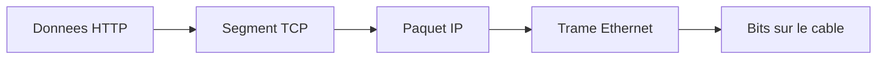
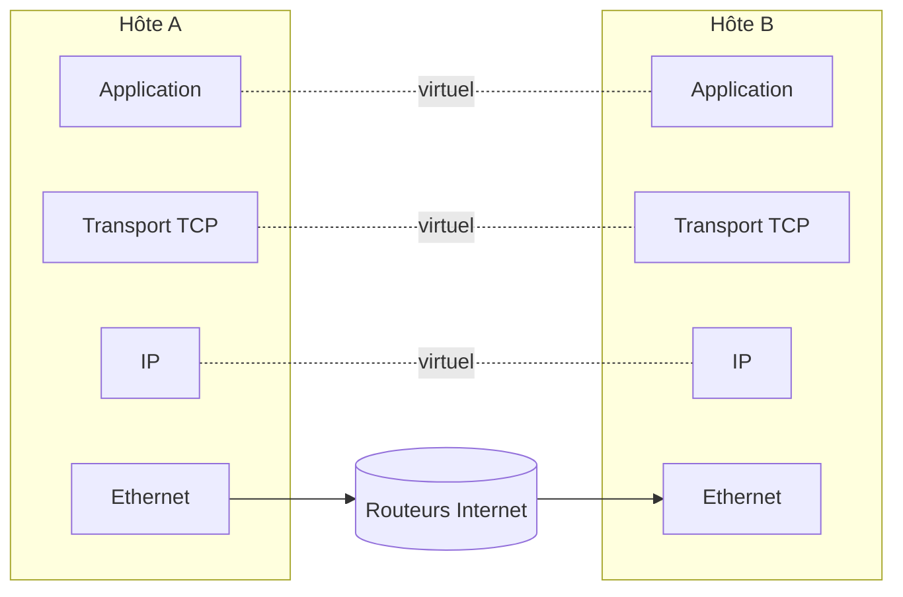

# Séquence 11 — Les Réseaux

> Source : <https://lyotardjulien.forge.apps.education.fr/terminale-specialite-nsi-au-lycee-notre-dame/10_sequence_10/10_sequence_10/>

!!! info "Périmètre officiel BO"
    Le **BO Première** couvre la transmission par paquets, l'encapsulation, TCP/IP au niveau « principe » et les constituants d'un réseau local.

    Le **BO Terminale** ajoute uniquement les **protocoles de routage** : **RIP** (à sauts) et **OSPF** (à coût), liés aux algorithmes de plus court chemin sur graphe.

    **Hors programme NSI** : OSI détaillé en 7 couches (à connaître au niveau du nom seulement), IPv6, handshake TCP en 3 voies, **NAT**, DNS détaillé, sécurité réseau (firewall, VPN).

---

## TL;DR

- Deux modèles en couches : **OSI** = modèle théorique 7 couches, **TCP/IP** = 4 couches en pratique.
- **Adressage IPv4** : 32 bits, 4 octets pointés. CIDR `IP/préfixe`. Plages privées : `10/8`, `172.16/12`, `192.168/16`.
- **Encapsulation** : Données → segment TCP → paquet IP → trame Ethernet → bits.
- **TCP** = connecté, fiable. **UDP** = non connecté, rapide.
- **Routage** : un paquet IP voyage de routeur en routeur via les **tables de routage**. Deux protocoles au programme Terminale : **RIP** (à sauts) et **OSPF** (à coût).

---

## Plan de la séquence

1. Pourquoi des réseaux et un modèle en couches.
2. Modèles OSI et TCP/IP (vue d'ensemble).
3. Adressage IPv4, masque, CIDR, sous-réseaux.
4. Couche transport : TCP vs UDP, ports principaux.
5. Encapsulation et désencapsulation.
6. Routage : table de routage, RIP, OSPF (programme Terminale).

---

## Notions clés

### Pourquoi des couches ?

Décomposer un problème complexe (transmettre une page web à travers le monde) en problèmes plus simples. Chaque couche **n** ne dialogue qu'avec la couche **n** distante, en utilisant les services de la couche **n−1** locale.

### Modèles OSI vs TCP/IP

À retenir : **OSI** est un modèle théorique en **7 couches** ; **TCP/IP** est le modèle pratique utilisé sur Internet, en **4 couches**. Pas besoin de mémoriser les 7 couches OSI une par une.

| TCP/IP (4) | Unité de données | Exemples |
|-----------|------------------|----------|
| **Application** | Donnée | HTTP, HTTPS, DNS, SSH |
| **Transport** | Segment (TCP) / Datagramme (UDP) | TCP, UDP |
| **Internet** | Paquet | IP |
| **Accès réseau** | Trame / Bit | Ethernet, Wi-Fi |

### Adressage IPv4

Adresse IPv4 = **32 bits = 4 octets** (chacun de 0 à 255), notation décimale pointée.
Exemple : `192.168.1.42`.

> **IPv6** : 128 bits, notation hexadécimale (`2001:db8::1`). Pas un attendu du bac NSI.

#### CIDR (Classless Inter-Domain Routing)

Notation `IP/préfixe` où le préfixe est le nombre de bits du **masque** valant 1.

Exemple : `192.168.1.42/24` → masque `255.255.255.0`, soit 24 bits réseau et 8 bits hôtes.

#### Calcul d'adresse réseau et de broadcast

```
IP        : 192.168.1.42/24 = 11000000 . 10101000 . 00000001 . 00101010
Masque    :                   11111111 . 11111111 . 11111111 . 00000000
ET binaire (réseau) :         11000000 . 10101000 . 00000001 . 00000000
                              = 192.168.1.0
Broadcast (bits hôtes à 1) :  11000000 . 10101000 . 00000001 . 11111111
                              = 192.168.1.255
Nombre d'hôtes utilisables : 2^(32 - préfixe) - 2 = 2^8 - 2 = 254
```

#### Plages d'adresses privées (RFC 1918)

| Classe | Plage |
|--------|-------|
| A | `10.0.0.0/8` (10.0.0.0 → 10.255.255.255) |
| B | `172.16.0.0/12` (172.16.0.0 → 172.31.255.255) |
| C | `192.168.0.0/16` (192.168.0.0 → 192.168.255.255) |

Adresses spéciales :
- `127.0.0.1` : **loopback** (machine locale).
- `255.255.255.255` : broadcast général.

### Couche transport : TCP vs UDP

| Critère | TCP | UDP |
|---------|-----|-----|
| Mode | Connecté | Non connecté |
| Fiabilité | Oui (ACK, retransmission) | Non |
| Ordonnancement | Oui | Non |
| Vitesse | Plus lent | Plus rapide |
| Usage | HTTP, SSH, mail | DNS, jeux, VoIP, streaming |

### Ports principaux

Un port est un entier sur **16 bits** (0–65 535), identifiant un service sur une machine.

| Port | Protocole |
|------|-----------|
| 22 | SSH |
| 53 | DNS |
| 80 | HTTP |
| 443 | HTTPS |

### Encapsulation



Chaque couche **ajoute son en-tête** (header) à la donnée reçue de la couche supérieure. À la réception, on **désencapsule** dans l'autre sens.

### Routage (programme Terminale)

Chaque routeur a une **table de routage** : pour chaque préfixe de destination, l'interface ou le prochain routeur (« next-hop ») à utiliser. Un paquet IP est transmis de routeur en routeur jusqu'à destination.

#### RIP (Routing Information Protocol) — métrique : nombre de sauts

- Chaque routeur connaît la distance (en **nombre de routeurs traversés**) vers chaque destination.
- Choix du **plus court chemin en nombre de sauts**.
- Limite : ne tient pas compte de la **bande passante** ni de la **latence** d'un lien.
- Algorithme : Bellman-Ford (les routeurs s'échangent leurs tables).
- Limite à **15 sauts maximum**.

#### OSPF (Open Shortest Path First) — métrique : coût

- Chaque lien a un **coût** (basé typiquement sur la bande passante : un lien plus rapide a un coût plus faible).
- Choix du chemin de **coût total minimal**.
- Algorithme : Dijkstra (chaque routeur a une vue complète du réseau).
- Plus performant que RIP pour les grands réseaux.

#### Lien avec les algorithmes de graphes

Le routage est une **application directe** du calcul de plus court chemin sur graphe :

- RIP ↔ BFS (poids unitaires : nombre de sauts).
- OSPF ↔ Dijkstra (poids quelconques : coûts).

**Exemple de table de routage simplifiée** :

| Destination | Masque | Next-hop | Interface | Coût (OSPF) |
|-------------|--------|----------|-----------|-------------|
| `192.168.1.0/24` | /24 | direct | eth0 | 1 |
| `10.0.0.0/8` | /8 | `192.168.1.254` | eth0 | 5 |
| `0.0.0.0/0` (par défaut) | /0 | `192.168.1.254` | eth0 | — |

---

## Vocabulaire

| Terme | Définition |
|-------|------------|
| Adresse IP | Identifiant numérique d'une machine sur un réseau IP |
| Adresse MAC | Adresse physique unique de la carte réseau (48 bits) |
| Bande passante | Quantité d'information transmise par unité de temps |
| Broadcast | Diffusion à toutes les machines du sous-réseau |
| CIDR | Notation `IP/préfixe` |
| DHCP | Protocole d'attribution dynamique d'IP |
| DNS | Annuaire nom de domaine ↔ IP |
| Encapsulation | Ajout d'en-tête à chaque couche |
| Ethernet | Norme de couche liaison la plus utilisée en LAN |
| HTTP | Hypertext Transfer Protocol |
| HTTPS | HTTP + TLS chiffré |
| IP | Internet Protocol (couche 3) |
| MAC | Couche 2 ; ou adresse physique |
| Masque | 32 bits indiquant la partie réseau de l'IP |
| OSI | Modèle théorique en 7 couches |
| OSPF | Open Shortest Path First (routage à coût) |
| Paquet | Unité IP |
| Port | Entier 16 bits identifiant un service |
| Protocole | Règles régissant la communication |
| RIP | Routing Information Protocol (routage à sauts) |
| Routeur | Équipement qui aiguille les paquets entre réseaux |
| Routage | Choix de la route à suivre |
| Sous-réseau | Subdivision d'un réseau IP |
| TCP | Transmission Control Protocol (fiable) |
| Trame | Unité Ethernet |
| UDP | User Datagram Protocol (non fiable) |
| URL | Identifiant unique d'une ressource web |

---

## Algorithmes / commandes utiles

### Calcul d'appartenance à un sous-réseau (Python)

```python
def adresse_reseau(ip, prefixe):
    """Renvoie l'adresse réseau d'une IP avec un préfixe CIDR.

    ip : str au format "a.b.c.d".
    prefixe : entier entre 0 et 32.
    """
    octets = [int(o) for o in ip.split(".")]
    ip_int = sum(octet << (24 - 8 * i) for i, octet in enumerate(octets))
    masque = (0xFFFFFFFF << (32 - prefixe)) & 0xFFFFFFFF
    reseau_int = ip_int & masque
    return ".".join(str((reseau_int >> (24 - 8 * i)) & 0xFF) for i in range(4))


print(adresse_reseau("192.168.1.42", 24))   # 192.168.1.0
print(adresse_reseau("10.20.30.40", 16))    # 10.20.0.0
```

### Commandes Linux réseau utiles

| Commande | Rôle |
|----------|------|
| `ip a` (ou `ifconfig`) | Affiche les interfaces et leurs IP |
| `ip route` | Table de routage |
| `ping <hôte>` | Test de connectivité (ICMP) |
| `traceroute <hôte>` | Trace le chemin |

---

## Diagramme — TCP/IP

Voir [`diagrammes/modele_osi_tcpip.md`](../diagrammes/modele_osi_tcpip.md).



---

## Pièges classiques au bac

- **Confondre OSI et TCP/IP** : OSI = 7 couches théoriques, TCP/IP = 4 couches en pratique. On utilise TCP/IP.
- **Confondre IP et MAC** : MAC = identité matérielle (LAN), IP = identité logique (Internet).
- **Confondre HTTP et HTTPS** : HTTPS = HTTP + TLS chiffré.
- **Calcul du masque** : ne pas oublier de soustraire 2 (réseau + broadcast) pour le nb d'hôtes utilisables.
- **TCP vs UDP** : DNS utilise UDP (rapide), web utilise TCP (fiable).
- **Confondre routeur et switch** : le switch travaille en couche 2 (MAC), le routeur en couche 3 (IP).
- **Confondre RIP et OSPF** : RIP compte les **sauts** (Bellman-Ford), OSPF utilise des **coûts** (Dijkstra).
- **Loopback** : `127.0.0.1` est toujours la machine locale, jamais le réseau.

---

## Questions types au bac

**Q1.** *Combien d'hôtes utilisables un réseau `/26` peut-il contenir ?*
> 2^(32−26) − 2 = 64 − 2 = **62**.

**Q2.** *Quelle est la différence entre TCP et UDP ?*
> TCP : connecté, fiable, ordonné. UDP : non connecté, non fiable, plus rapide.

**Q3.** *Donner l'adresse réseau de `172.20.5.130/22`.*
>
> ```
> 172.20.5.130 = 10101100 . 00010100 . 00000101 . 10000010
> Masque /22  : 11111111 . 11111111 . 11111100 . 00000000
> ET           : 10101100 . 00010100 . 00000100 . 00000000
>             = 172.20.4.0
> ```

**Q4.** *Quels sont les ports standards de SSH, DNS, HTTP et HTTPS ?*
> SSH : 22. DNS : 53. HTTP : 80. HTTPS : 443.

**Q5.** *Que signifie « encapsulation » dans le contexte des réseaux ?*
> L'ajout, à chaque couche, d'un en-tête contenant ses informations propres avant transmission. À la réception, l'opération inverse (« désencapsulation ») retire les en-têtes couche par couche.

**Q6.** *Citer les deux protocoles de routage au programme NSI Terminale et préciser leur métrique.*
> **RIP** : métrique = nombre de sauts (routeurs traversés). **OSPF** : métrique = coût (souvent dérivé de la bande passante des liens).

**Q7.** *Sur un réseau modélisé comme un graphe pondéré, quel algorithme permet de calculer la table de routage OSPF ?*
> L'algorithme de **Dijkstra** (plus court chemin avec poids quelconques positifs). Pour RIP, on utilise plutôt **Bellman-Ford** (ou un BFS si tous les sauts ont un coût unitaire).

---

## Liens

- Cours en ligne : <https://lyotardjulien.forge.apps.education.fr/terminale-specialite-nsi-au-lycee-notre-dame/10_sequence_10/10_sequence_10/>
- Voir aussi : [`diagrammes/modele_osi_tcpip.md`](../diagrammes/modele_osi_tcpip.md)
- Voir aussi : [`14_cryptographie.md`](14_cryptographie.md) (TLS dans HTTPS)
- Voir aussi : [`05_graphes.md`](05_graphes.md) (algorithmes de plus court chemin)
- Voir aussi : [`10_linux.md`](10_linux.md) (commandes réseau)
