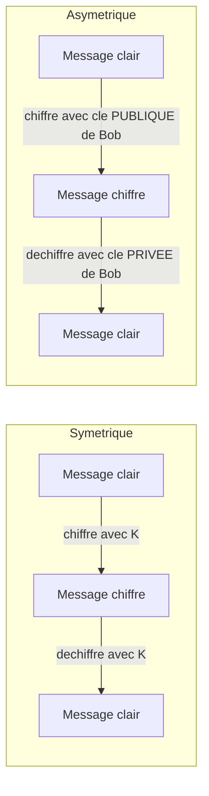

# Séquence 14 — Cryptographie

> Source : <https://lyotardjulien.forge.apps.education.fr/terminale-specialite-nsi-au-lycee-notre-dame/40_sequence_40/40_sequence_40/>

!!! warning "Périmètre officiel BO Terminale — fiche allégée"
    Le BO Terminale dit littéralement :

    > « Distinguer le chiffrement **symétrique** (clef partagée) et **asymétrique** (avec clef privée et clef publique). Comprendre l'échange d'une clef symétrique grâce à un protocole asymétrique pour chiffrer une communication entre un client et un serveur (**HTTPS**). Aucune connaissance précise du principe de négociation SSL n'est exigible. »

    C'est tout ce qui est exigible. **Hors programme NSI** : algorithme RSA en détail (calcul modulaire, fonction d'Euler), signature électronique, fonctions de hachage, chiffrement de César et Vigenère détaillés. La note **MENE2227884N (2022)** exclut la cryptographie de l'écrit, mais 8 sujets 2024-2025 la touchent — donc on en garde l'essentiel : vocabulaire, distinction sym/asym, HTTPS, et le **masque jetable XOR** (qui apparaît dans Métropole 2025 j2).

---

## TL;DR

- **Chiffrer** ≠ **coder** : chiffrer rend illisible (avec une clé), coder représente (ASCII, UTF-8).
- **Symétrique** = même clé pour chiffrer/déchiffrer (rapide, ex : AES).
- **Asymétrique** = paire (clé **publique** pour chiffrer, clé **privée** pour déchiffrer ; ex : RSA).
- **HTTPS** = échange d'une clé symétrique via un protocole asymétrique, puis communication chiffrée symétriquement.
- **Sécurité parfaite (Shannon)** → **masque jetable** : XOR avec une clé aléatoire de même taille, utilisée une seule fois.

---

## Plan de la séquence

1. Vocabulaire fondamental.
2. Chiffrement symétrique vs asymétrique.
3. Principe d'HTTPS (échange de clé).
4. Masque jetable XOR (sécurité parfaite de Shannon).

---

## Notions clés

### Vocabulaire fondamental

- **Texte clair** (plain text) : message lisible.
- **Texte chiffré** (cipher text) : message illisible obtenu après chiffrement.
- **Clé** : information secrète permettant de chiffrer/déchiffrer.
- **Chiffrer** : appliquer un algorithme avec une clé pour rendre un message illisible.
- **Déchiffrer** : retrouver le clair **avec** la clé.
- **Décrypter** : retrouver le clair **sans connaître** la clé (= cryptanalyser).
- **Codage** ≠ **chiffrement** : représentation des données (ASCII, UTF-8) sans secret.

### Symétrique vs asymétrique

| Critère | Symétrique | Asymétrique |
|---------|------------|-------------|
| Clé(s) | **Une seule**, partagée entre les correspondants | **Paire** : clé publique + clé privée |
| Vitesse | Rapide | Lent |
| Problème | Comment partager la clé sans qu'elle soit interceptée ? | Calculs lourds, peu adapté à de gros volumes |
| Exemples | AES, masque jetable XOR | RSA |



### Principe d'HTTPS (à connaître)

HTTPS combine les deux pour profiter du meilleur des deux mondes :

1. Le client demande la **clé publique** du serveur (envoyée par le serveur dans son certificat).
2. Le client choisit une **clé symétrique** aléatoire (la « clé de session »).
3. Le client chiffre cette clé de session avec la **clé publique** du serveur, et l'envoie.
4. Seul le serveur, avec sa **clé privée**, peut la déchiffrer.
5. À partir de là, client et serveur partagent la même clé symétrique et chiffrent leurs échanges avec elle (rapide).

> Le BO précise : « Aucune connaissance précise du principe de négociation SSL n'est exigible. » → on s'arrête à ce niveau de détail.

### Masque jetable XOR (sécurité parfaite de Shannon)

Un chiffrement est **parfaitement sûr** ssi la clé est :

- **aléatoire**,
- **de même longueur** que le message,
- **utilisée une seule fois** (jetable).

C'est le **masque jetable** (one-time pad). En pratique on l'implémente avec un **XOR** bit à bit entre le message et la clé.

**Pourquoi XOR ?** Parce que `(m XOR k) XOR k = m` : le XOR est sa propre inverse.

```python
import os

def xor_chiffrer(message_octets, cle_octets):
    """Chiffrement XOR octet par octet.
    Si la cle est aleatoire et de meme longueur que le message,
    et utilisee une seule fois, c'est le masque jetable (Shannon)."""
    return bytes(m ^ k for m, k in zip(message_octets, cle_octets))


# Exemple
message = "Bonjour".encode('utf-8')
cle = os.urandom(len(message))     # cle aleatoire de meme taille
chiffre = xor_chiffrer(message, cle)
print(chiffre.hex())
print(xor_chiffrer(chiffre, cle).decode('utf-8'))   # 'Bonjour'
```

---

## Vocabulaire (table)

| Terme | Définition |
|-------|------------|
| Texte clair | Message lisible avant chiffrement |
| Texte chiffré | Message illisible après chiffrement |
| Clé | Donnée secrète paramétrant le chiffrement |
| Chiffrement | Rendre un message illisible |
| Déchiffrement | Récupérer le clair avec la clé |
| Décrypter | Retrouver le clair sans connaître la clé |
| Symétrique | Une seule clé partagée |
| Asymétrique | Paire (clé publique, clé privée) |
| Clé publique | Diffusée à tous, sert à chiffrer |
| Clé privée | Secrète, sert à déchiffrer |
| HTTPS | HTTP + chiffrement TLS (échange asym + comm sym) |
| Masque jetable | Chiffrement XOR avec clé aléatoire de même longueur, à usage unique |
| AES | Exemple de chiffrement symétrique moderne |
| RSA | Exemple de chiffrement asymétrique |

---

## Pièges classiques au bac

- **Confondre coder, encoder, chiffrer**.
  - Coder : représenter (ASCII, UTF-8).
  - Encoder : transformer le format (Base64).
  - Chiffrer : rendre secret (avec clé).
- **Décrypter ≠ déchiffrer**. Décrypter = casser sans clé. Déchiffrer = avec clé.
- **Clé publique pour chiffrer, clé privée pour déchiffrer** : ne pas inverser.
- **One-time pad** : sécurité parfaite uniquement si clé aléatoire **et** unique **et** même taille que le message.
- Confondre **HTTPS** (HTTP chiffré) et **HTTP** (en clair).

---

## Questions types au bac

**Q1.** *Quelle est la différence entre cryptographie symétrique et asymétrique ?*
> Symétrique : une seule clé partagée entre l'émetteur et le récepteur. Asymétrique : paire (clé publique pour chiffrer, clé privée pour déchiffrer).

**Q2.** *Pourquoi HTTPS combine-t-il chiffrement asymétrique et symétrique ?*
> L'asymétrique permet de **partager** une clé symétrique sans qu'elle soit interceptée (seul le serveur, avec sa clé privée, peut la déchiffrer). Une fois la clé symétrique partagée, on l'utilise pour chiffrer les échanges, car le symétrique est **beaucoup plus rapide** que l'asymétrique.

**Q3.** *Quelle est la condition pour qu'un chiffrement par XOR soit parfaitement sûr (au sens de Shannon) ?*
> La clé doit être **aléatoire**, **de même longueur** que le message, et **utilisée une seule fois** (masque jetable / one-time pad).

**Q4.** *Différence entre coder un message en UTF-8 et le chiffrer avec AES ?*
> UTF-8 est un **codage** : représentation lisible de caractères en octets, sans secret. AES est un **chiffrement** : transformation paramétrée par une **clé** secrète qui rend le message illisible sans la clé.

**Q5.** *Avec un chiffrement asymétrique, Alice veut envoyer un message confidentiel à Bob. Quelle clé utilise-t-elle pour chiffrer ?*
> La **clé publique** de Bob. Seule la clé privée de Bob (qu'il garde secrète) peut alors déchiffrer.

---

## Liens

- Cours en ligne : <https://lyotardjulien.forge.apps.education.fr/terminale-specialite-nsi-au-lycee-notre-dame/40_sequence_40/40_sequence_40/>
- Voir aussi : [`11_reseaux.md`](11_reseaux.md) (HTTPS = HTTP + TLS)
- Voir aussi : [`memos/memo_vocabulaire.md`](../memos/memo_vocabulaire.md)
