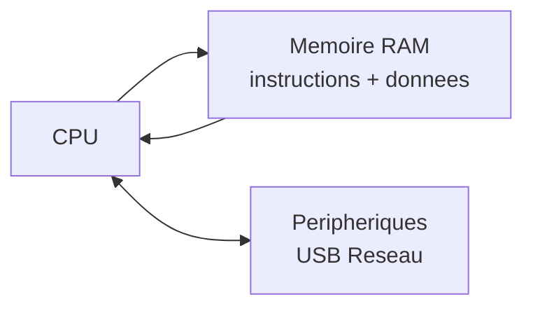
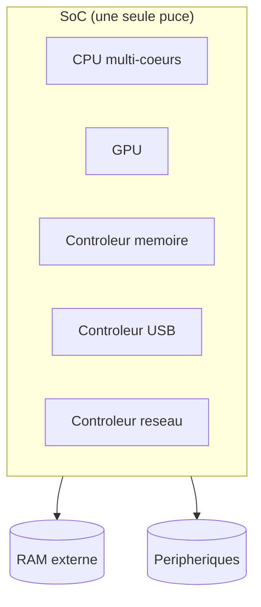

# Séquence 15 — Architecture & System on Chip (SoC)

> Source : <https://lyotardjulien.forge.apps.education.fr/terminale-specialite-nsi-au-lycee-notre-dame/50_sequence_50/50_sequence_50/>

!!! warning "Périmètre officiel BO Terminale — fiche très allégée"
    Le BO Terminale dit littéralement et **uniquement** :

    > « **Identifier les principaux composants sur un schéma de circuit** et les **avantages de leur intégration** en termes de **vitesse** et de **consommation**. »

    C'est tout. **0 sujet sur 84** en 2024-2025 ne traite ce thème. Cette fiche est volontairement réduite à l'essentiel : ce qu'est un SoC, le schéma à savoir reconnaître, et les avantages.

    Hors programme NSI Terminale : architecture de Harvard, ALU/registres détaillés, pipeline, hiérarchie cache L1/L2/L3, bus de données/adresses, GPU, GPIO en détail, systèmes embarqués/IoT en détail.

---

## TL;DR

- Un **SoC (System on Chip)** intègre **CPU, mémoire, contrôleurs et périphériques** sur une **seule puce** (au lieu de plusieurs composants distincts sur une carte mère).
- Avantages de l'intégration : **plus compact**, **plus rapide** (les communications internes à la puce sont plus courtes que sur un bus de carte mère) et **moins gourmand en énergie**.
- L'**architecture de von Neumann** (1945) est la base : CPU + mémoire unique (instructions et données) reliés par des **bus**.
- Exemples concrets de SoC : **Raspberry Pi** (Broadcom), **smartphones** (Apple A-series, Snapdragon).

---

## Plan de la séquence

1. Architecture de von Neumann (rappel court).
2. Notion de SoC.
3. Avantages de l'intégration : vitesse et consommation.

---

## Notions clés

### Architecture de von Neumann (en bref)

Architecture (1945) où :

- **CPU**, **mémoire** et **périphériques d'entrée/sortie** sont reliés par des **bus**.
- Une **mémoire unique** stocke à la fois **instructions et données**.

C'est l'architecture standard de la quasi-totalité des ordinateurs modernes.

### SoC (System on Chip)

Un SoC est un **circuit intégré** qui regroupe sur **une seule puce** ce qui était auparavant réparti sur une carte mère :

- CPU (souvent multi-cœurs),
- mémoire (parfois),
- contrôleurs (USB, réseau, audio, caméra…),
- éventuellement GPU, modem, etc.

**Avantages** (les 3 à savoir citer) :

1. **Compact** : tient dans un smartphone, une montre, une tablette.
2. **Plus rapide** : les communications internes à la puce sont plus courtes que sur des bus externes → moins de latence.
3. **Moins gourmand en énergie** : la consommation diminue, ce qui prolonge l'autonomie sur batterie.

---

## Vocabulaire

| Terme | Définition |
|-------|------------|
| CPU | Processeur central |
| RAM | Mémoire vive volatile (perdue à l'extinction) |
| ROM | Mémoire morte (non volatile) |
| Bus | Ensemble de fils transportant données / adresses / signaux de contrôle |
| SoC | System on Chip — circuit intégré regroupant plusieurs fonctions |
| von Neumann | Architecture à mémoire unique partagée instructions/données |
| Périphériques | Dispositifs d'entrée/sortie (clavier, écran, USB, réseau) |

---

## Schéma d'un ordinateur (von Neumann simplifié)

## Schéma d'un SoC (composants intégrés sur une seule puce)

---

## Pièges classiques au bac

- **Confondre RAM (volatile) et ROM/Flash (non volatile)**.
- **Confondre architecture matérielle et système d'exploitation**. Le SoC c'est le **matériel** ; l'OS c'est le logiciel qui tourne dessus.
- **Oublier que la RAM est volatile** → toutes les données sont perdues à l'extinction.

---

## Questions types au bac

**Q1.** *Qu'est-ce qu'un SoC ?*
> Un circuit intégré qui regroupe sur **une seule puce** plusieurs composants (CPU, mémoire, contrôleurs, parfois GPU et modem) qui étaient auparavant répartis sur une carte mère.

**Q2.** *Citer deux avantages de l'intégration des composants en un SoC.*
> Compacité (tient dans un smartphone), gain de **vitesse** (communications internes plus courtes), réduction de la **consommation énergétique** (autonomie prolongée).

**Q3.** *Décrire en deux phrases l'architecture de von Neumann.*
> CPU, mémoire et périphériques sont reliés par des **bus**. La mémoire **unique** contient à la fois les **instructions** et les **données** du programme.

**Q4.** *Donner deux exemples d'appareils contenant un SoC.*
> Smartphone, Raspberry Pi, tablette, montre connectée.

---

## Liens

- Cours en ligne : <https://lyotardjulien.forge.apps.education.fr/terminale-specialite-nsi-au-lycee-notre-dame/50_sequence_50/50_sequence_50/>
- Voir aussi : [`09_processus.md`](09_processus.md) (le système d'exploitation pilote ce matériel)
- Voir aussi : [`10_linux.md`](10_linux.md) (Raspberry Pi tourne sous Linux)
