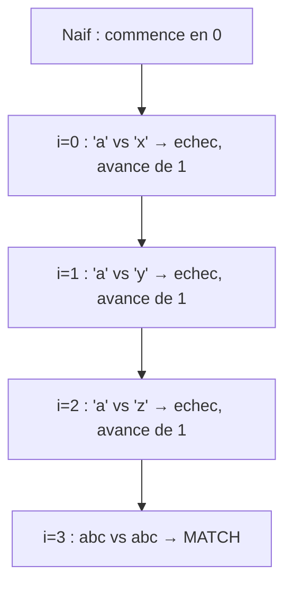
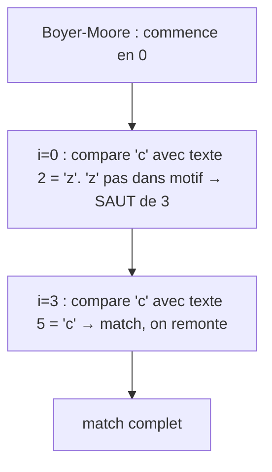

# Séquence 16 — Recherche textuelle

> Source : <https://lyotardjulien.forge.apps.education.fr/terminale-specialite-nsi-au-lycee-notre-dame/60_sequence_60/60_sequence_60/>

!!! warning "Périmètre officiel BO Terminale — fiche allégée"
    Le BO Terminale dit littéralement :

    > « **Algorithme de Boyer-Moore** pour la recherche d'un motif dans un texte. […] **L'étude du coût, difficile, ne peut être exigée.** L'algorithme de Boyer-Moore sera présenté et son **efficacité sera mise en évidence**. »

    Donc dans le programme : **algorithme naïf** + **présentation de Boyer-Moore** (sans étude de coût). La note **MENE2227884N (2022)** exclut même cette section de l'écrit. **1 seul sujet sur 28** en 2024-2025 traite la recherche textuelle.

    **Hors programme NSI** : KMP (Knuth-Morris-Pratt), expressions régulières (regex). Cette fiche se limite donc à l'algorithme naïf et à la présentation de Boyer-Moore.

---

## TL;DR

- Problème : trouver toutes les occurrences d'un **motif M** (longueur `m`) dans un **texte T** (longueur `n`).
- **Algorithme naïf** : compare le motif à chaque position du texte. Complexité O(n × m).
- **Boyer-Moore (BM)** : compare le motif **de droite à gauche** et utilise la **règle du mauvais caractère** pour faire des **sauts** plutôt que d'avancer position par position. **Beaucoup plus efficace** en pratique (souvent sous-linéaire en moyenne).
- L'étude formelle du coût de Boyer-Moore n'est **pas exigible** au bac.

---

## Plan de la séquence

1. Définition du problème.
2. Algorithme naïf (force brute).
3. Algorithme de Boyer-Moore (présentation + efficacité).

---

## Notions clés

### Le problème

Étant donné :

- un **texte** `T = t₀ t₁ … t_{n-1}` (longueur `n`),
- un **motif** `M = m₀ m₁ … m_{m-1}` (longueur `m`),

renvoyer la **liste des positions** `i` de `T` à partir desquelles `M` apparaît dans `T`.

### Pourquoi optimiser

- Un texte peut faire des **gigaoctets** (génome humain, archives web).
- L'algo naïf O(n × m) devient vite trop lent.
- Boyer-Moore, en exploitant la structure du motif, peut **sauter** de gros blocs du texte → bien plus rapide en pratique.

---

## Vocabulaire

| Terme | Définition |
|-------|------------|
| Motif | Séquence à chercher dans le texte |
| Texte | Séquence dans laquelle on cherche |
| Occurrence | Position `i` de `T` où le motif se trouve |
| Comparaison | Test `T[i+j] == M[j]` |
| Décalage (shift) | Quantité dont on déplace le motif vers la droite |
| Mauvais caractère | Caractère du texte ne correspondant pas au motif |

---

## Algorithmes & code

### 1. Algorithme naïf (brute force)

```python
def recherche_naive(motif, texte):
    """Renvoie la liste des positions de `motif` dans `texte` (algorithme naïf).

    Pour chaque position i de 0 a n - m, on compare motif et texte[i:i+m]
    caractere par caractere. En cas de difference, on avance de 1.

    Complexité : O((n - m + 1) * m) ≈ O(n * m).
    """
    n, m = len(texte), len(motif)
    positions = []
    for i in range(n - m + 1):
        # On compare motif et texte[i:i+m] caractère par caractère
        j = 0
        while j < m and texte[i + j] == motif[j]:
            j += 1
        if j == m:                # toutes les comparaisons OK
            positions.append(i)
    return positions


# Exemple
print(recherche_naive("abc", "abcabcabc"))  # [0, 3, 6]
```

### 2. Algorithme de Boyer-Moore (présentation)

#### Idée fondamentale

Boyer-Moore (BM) introduit deux innovations majeures par rapport à l'algorithme naïf :

1. **Comparaison de droite à gauche** : on commence par comparer le **dernier** caractère du motif avec le caractère du texte correspondant, puis on remonte vers la gauche.
2. **Règle du mauvais caractère** : en cas de désaccord à la position `j` du motif sur un caractère `c` du texte, on **décale le motif** de manière à aligner :
   - soit la dernière occurrence de `c` dans le motif (à gauche de la position `j`),
   - soit le motif complet **après** `c` si `c` n'apparaît pas dans le motif.

→ Quand le caractère du texte n'est pas du tout dans le motif, on saute **m positions d'un coup** au lieu d'une seule.

#### Exemple intuitif

Cherchons `"NIVEAU"` dans `"VIVE_LE_BAC_NIVEAU_2026"` :

```
position 0 : V I V E _ L E _ B A C _ N I V E A U _ 2 0 2 6
             N I V E A U
             ↑                     ← on compare en partant de la droite : 'L' (texte) ≠ 'U' (motif)
```

À la position 0, on compare le dernier caractère du motif `'U'` avec `texte[5] = 'L'`. `'L'` n'apparaît **pas du tout** dans le motif `"NIVEAU"`, donc on peut **sauter 6 positions d'un coup** (toute la longueur du motif).

```
position 6 : V I V E _ L E _ B A C _ N I V E A U _ 2 0 2 6
                         N I V E A U
                                    ↑   ← compare 'U' (motif) avec '_' (texte) : echec, '_' pas dans motif → saut
```

Et ainsi de suite. **L'algorithme naïf** aurait fait n×m comparaisons ; BM en fait beaucoup moins en sautant des blocs entiers.

#### Pseudo-code simplifié

```text
fonction boyer_moore(motif, texte) :
    construire derniere_occurrence[c] pour chaque caractere c
        (= position la plus a droite de c dans le motif, -1 si absent)
    i ← 0                                      # position de depart de la fenetre
    tant que i ≤ n - m :
        j ← m - 1                              # on compare DE LA DROITE
        tant que j ≥ 0 et motif[j] = texte[i+j] :
            j ← j - 1
        si j < 0 :                             # tout le motif a matche
            ajouter i au resultat
            i ← i + 1                          # on avance d'une position
        sinon :
            c ← texte[i+j]                      # caractere fautif
            saut ← max(1, j - derniere_occurrence[c])
            i ← i + saut                        # on saute potentiellement m positions
```

> 💡 Le code complet de BM est plus subtil (avec aussi la **règle du bon suffixe**) ; le BO ne demande **pas** de l'écrire, mais de **comprendre l'idée** et d'expliquer pourquoi BM est efficace.

#### Efficacité

- **Pire cas théorique** : O(n × m) (rarement atteint en pratique).
- **En pratique** : BM est souvent **plus rapide que linéaire en moyenne** sur des alphabets grands (texte naturel, ADN), car il saute de gros blocs.
- C'est l'algorithme utilisé par `grep` et de nombreux outils de recherche textuelle.

> Note : « **L'étude du coût, difficile, ne peut être exigée** » (BO). Pas besoin de démontrer la complexité, seulement de **comprendre pourquoi BM est efficace**.

---

## Diagramme — Comparaison naïf vs Boyer-Moore

Recherche de `"abc"` dans `"xyzabc"` :





→ BM fait **2 étapes** contre 4 pour l'algorithme naïf ici. Sur des textes longs avec un alphabet large, l'écart devient énorme.

---

## Pièges classiques au bac

- **Compter les occurrences chevauchantes ou non** : `"aaa"` dans `"aaaa"` → 2 chevauchantes (positions 0, 1).
- **Algo naïf complexité O(n × m), pas O(n + m)** : ne pas confondre.
- **Indices d'arrivée** : la fenêtre de comparaison va de `i` à `i + m − 1`.
- **Boyer-Moore compare de DROITE à GAUCHE** : c'est l'astuce centrale, ne pas l'oublier.
- **Le saut peut être de m positions** quand le caractère du texte n'est pas dans le motif.

---

## Questions types au bac

**Q1.** *Quelle est la complexité de l'algorithme naïf de recherche d'un motif de longueur m dans un texte de longueur n ?*
> O(n × m).

**Q2.** *Donner les deux idées clés de l'algorithme de Boyer-Moore.*
> (1) Comparer le motif au texte **de droite à gauche** ; (2) en cas d'échec, utiliser la **règle du mauvais caractère** pour décaler le motif de plusieurs positions à la fois (potentiellement de toute la longueur du motif si le caractère du texte n'apparaît pas dans le motif).

**Q3.** *Pourquoi Boyer-Moore est-il efficace en pratique ?*
> Parce qu'il **saute** de gros blocs du texte (parfois la longueur entière du motif) au lieu d'avancer position par position. Sur des alphabets grands (texte naturel, ADN), de nombreux caractères du texte n'apparaissent pas dans le motif, ce qui permet des sauts maximaux.

**Q4.** *Combien d'occurrences de `"ab"` dans `"ababab"` ?*
> 3 (positions 0, 2, 4).

**Q5.** *Sur la recherche de `"NIVEAU"` dans `"VIVE_LE_BAC"`, expliquer ce que fait Boyer-Moore à la première étape.*
> Il aligne le motif sur les positions 0-5 et compare le **dernier** caractère du motif (`'U'`) avec `texte[5] = 'L'`. Comme `'L'` n'apparaît **pas du tout** dans le motif `"NIVEAU"`, il peut décaler le motif de toute sa longueur (6 positions) sans rien manquer.

---

## Liens

- Cours en ligne : <https://lyotardjulien.forge.apps.education.fr/terminale-specialite-nsi-au-lycee-notre-dame/60_sequence_60/60_sequence_60/>
- Voir aussi : [`memos/memo_complexites.md`](../memos/memo_complexites.md)
