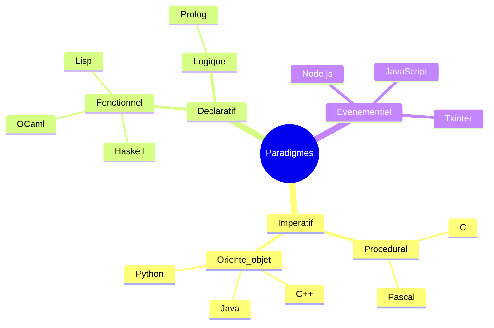
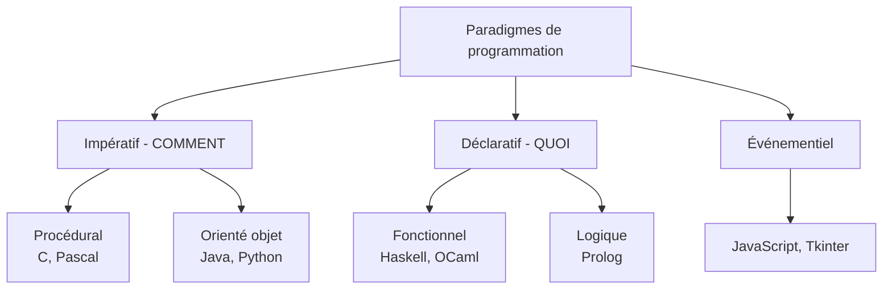

# Séquence 17 — Paradigmes de programmation

> Source : https://lyotardjulien.forge.apps.education.fr/terminale-specialite-nsi-au-lycee-notre-dame/70_sequence_70/70_sequence_70/
>
> Note : la page source est quasi-vide (gabarit JS sans contenu pré-rendu). Cette fiche est rédigée à partir du programme officiel NSI Terminale (BO).

## TL;DR

Un **paradigme** est un style de programmation qui structure la manière d'écrire le code. On distingue quatre grandes familles : **impératif** (procédural et orienté objet), **déclaratif** (fonctionnel et logique), et **événementiel**. Python est **multi-paradigme** : il permet de programmer dans tous ces styles, ce qui en fait un excellent terrain d'entraînement pour les comparer. Au bac, il faut savoir **identifier**, **comparer** et **illustrer** ces paradigmes avec un même problème (par ex. somme d'une liste).

## Plan

1. Définition d'un paradigme
2. Paradigme impératif (procédural, orienté objet)
3. Paradigme déclaratif (fonctionnel, logique)
4. Paradigme événementiel
5. Comparaison sur un exemple commun
6. Avantages / inconvénients
7. Python, langage multi-paradigme

## Notions clés

### Définition

Un **paradigme de programmation** est une approche, une philosophie, un cadre conceptuel qui structure la façon dont on écrit un programme. Ce n'est pas un langage : un même langage peut supporter plusieurs paradigmes (Python, Scala, OCaml...), et un paradigme peut être appliqué dans plusieurs langages.

Deux grandes familles s'opposent :

- **Impératif** : on décrit **COMMENT** obtenir le résultat, par une suite d'instructions modifiant l'état de la mémoire.
- **Déclaratif** : on décrit **CE QU'on veut** obtenir, sans préciser les étapes ; le moteur d'exécution s'en charge.

### Paradigme impératif

Le programme est une suite d'instructions qui modifient l'**état** (variables, mémoire). Les concepts centraux sont l'**affectation** (`x = 3`), la **séquence**, les **structures de contrôle** (`if`, `while`, `for`) et les **fonctions/procédures**.

#### Sous-paradigme procédural

Langages : **C, Pascal, Fortran**. Le programme est découpé en **fonctions** et **procédures** (sous-programmes). On regroupe les données dans des **structures** (`struct` en C). Pas de notion de classe ni d'objet.

```python
# Style procédural en Python
def aire_rectangle(largeur, hauteur):
    return largeur * hauteur

def perimetre_rectangle(largeur, hauteur):
    return 2 * (largeur + hauteur)

l, h = 3, 5
print(aire_rectangle(l, h))
print(perimetre_rectangle(l, h))
```

#### Sous-paradigme orienté objet (POO)

Langages : **Java, C++, Python, C#**. Les données et les fonctions qui les manipulent sont regroupées dans des **classes**. Quatre piliers :

- **Encapsulation** : on masque les détails internes (attributs privés, accès via méthodes).
- **Héritage** : une classe fille reprend et enrichit une classe mère.
- **Polymorphisme** : une même méthode peut avoir plusieurs comportements selon la classe.
- **Abstraction** : on manipule des objets via leur interface, pas leur implémentation.

```python
class Rectangle:
    def __init__(self, largeur, hauteur):
        self.largeur = largeur
        self.hauteur = hauteur

    def aire(self):
        return self.largeur * self.hauteur

    def perimetre(self):
        return 2 * (self.largeur + self.hauteur)

r = Rectangle(3, 5)
print(r.aire())
```

### Paradigme déclaratif

On décrit **ce que l'on veut**, sans préciser comment l'obtenir. Le moteur (interpréteur, compilateur, solveur) s'occupe de l'algorithme.

#### Sous-paradigme fonctionnel

Langages : **Haskell, OCaml, Lisp, Scheme, Erlang**. Idées clés :

- **Fonctions pures** : pour les mêmes entrées, mêmes sorties ; aucun **effet de bord** (ne modifie pas l'état global, n'affiche rien, ne lit pas de fichier).
- **Immuabilité** : les valeurs ne sont jamais modifiées ; on en crée de nouvelles.
- **Fonctions de première classe** : une fonction est une valeur comme une autre (passable en argument, renvoyable).
- **Fonctions d'ordre supérieur** : `map`, `filter`, `reduce`.
- **Récursion** : remplace l'itération.

```python
# Style fonctionnel en Python
from functools import reduce

L = [1, 2, 3, 4, 5]

# map : appliquer une fonction à chaque élément
carres = list(map(lambda x: x*x, L))   # [1, 4, 9, 16, 25]

# filter : garder selon un prédicat
pairs = list(filter(lambda x: x % 2 == 0, L))  # [2, 4]

# reduce : réduire à une seule valeur
somme = reduce(lambda a, b: a + b, L, 0)  # 15
```

#### Sous-paradigme logique

Langage emblématique : **Prolog**. On décrit un domaine par des **faits** et des **règles**, puis on pose des **requêtes** ; le moteur d'inférence cherche les solutions.

```prolog
% Faits
parent(marie, julie).
parent(julie, paul).

% Règle
grandparent(X, Z) :- parent(X, Y), parent(Y, Z).

% Requête
?- grandparent(marie, paul).
% true.
```

### Paradigme événementiel

Le programme **réagit à des événements** (clic souris, frappe clavier, message réseau, timer). On enregistre des **gestionnaires d'événements** (callbacks) et le programme attend dans une **boucle d'événements**.

Très utilisé pour : interfaces graphiques (Tkinter, Qt), JavaScript dans le navigateur, jeux vidéo, serveurs asynchrones (Node.js).

```python
import tkinter as tk

def on_click():
    label.config(text="Bouton cliqué !")

fenetre = tk.Tk()
label = tk.Label(fenetre, text="Pas encore cliqué")
label.pack()
bouton = tk.Button(fenetre, text="Cliquez", command=on_click)
bouton.pack()
fenetre.mainloop()  # boucle d'événements
```

### Comparaison sur un exemple : somme d'une liste

| Style | Code Python |
|-------|-------------|
| Impératif (boucle) | `s = 0`<br>`for x in L: s += x` |
| Fonctionnel (reduce) | `reduce(lambda a,b: a+b, L, 0)` |
| Fonctionnel (built-in) | `sum(L)` |
| Récursif | `def som(L): return 0 if L==[] else L[0]+som(L[1:])` |
| Compréhension (transformation seule) | `[x*2 for x in L]` (transforme, ne réduit pas) |

### Avantages / inconvénients

| Paradigme | Avantages | Inconvénients |
|-----------|-----------|---------------|
| Procédural | Simple, performant, proche de la machine | Code peu réutilisable, données éparpillées |
| Orienté objet | Modularité, réutilisation, modélisation du réel | Complexité, verbosité |
| Fonctionnel | Code court, parallélisable, peu de bugs (immuabilité) | Courbe d'apprentissage, parfois moins performant |
| Logique | Très expressif pour la déduction | Niche, lent, difficile à déboguer |
| Événementiel | Indispensable pour l'interactif | Logique éclatée (callback hell) |

### Python, multi-paradigme

Python permet :
- du **procédural** (fonctions simples) ;
- de l'**orienté objet** (`class`) ;
- du **fonctionnel** (`lambda`, `map`, `filter`, `reduce`, compréhensions, immuabilité partielle des tuples) ;
- de l'**événementiel** (Tkinter, asyncio).

Le bon programmeur choisit le paradigme adapté au problème.

## Vocabulaire (table)

| Terme | Définition |
|-------|------------|
| Paradigme | Style structurant la conception d'un programme |
| Impératif | On décrit la suite d'instructions à exécuter |
| Déclaratif | On décrit le résultat voulu sans le « comment » |
| Procédural | Programme = enchaînement de procédures/fonctions |
| Orienté objet | Programme = objets contenant données + méthodes |
| Fonctionnel | Programme = composition de fonctions pures |
| Logique | Programme = faits + règles, moteur d'inférence |
| Événementiel | Programme réagit à des événements asynchrones |
| Effet de bord | Modification d'un état hors de la fonction (variable globale, I/O) |
| Fonction pure | Pas d'effet de bord, sortie déterminée par les entrées |
| Immuabilité | Une valeur ne peut pas être modifiée après création |
| Fonction d'ordre supérieur | Fonction qui prend ou renvoie une fonction |
| Lambda | Fonction anonyme (sans nom) |
| Encapsulation | Cacher les détails internes d'un objet |
| Héritage | Classe fille qui réutilise une classe mère |
| Polymorphisme | Même nom de méthode, comportements différents |

## Code / exemples Python

### 1. Quatre styles pour le même problème : carrés des nombres pairs

```python
L = [1, 2, 3, 4, 5, 6, 7, 8, 9, 10]

# Impératif
res = []
for x in L:
    if x % 2 == 0:
        res.append(x * x)

# Compréhension de liste (déclaratif)
res = [x * x for x in L if x % 2 == 0]

# Fonctionnel pur
res = list(map(lambda x: x*x, filter(lambda x: x % 2 == 0, L)))

# Récursif
def carres_pairs(L):
    if L == []:
        return []
    elif L[0] % 2 == 0:
        return [L[0] * L[0]] + carres_pairs(L[1:])
    else:
        return carres_pairs(L[1:])
```

### 2. Fonction pure vs impure

```python
# Impure : modifie une variable globale
total = 0
def ajoute(x):
    global total
    total += x   # effet de bord

# Pure : ne modifie rien d'extérieur
def ajoute_pur(total, x):
    return total + x
```

### 3. Fonction d'ordre supérieur

```python
def appliquer_deux_fois(f, x):
    return f(f(x))

print(appliquer_deux_fois(lambda n: n + 3, 10))  # 16
```

### 4. POO : encapsulation et héritage

```python
class Animal:
    def __init__(self, nom):
        self.nom = nom
    def crie(self):
        return "..."

class Chien(Animal):       # héritage
    def crie(self):        # polymorphisme
        return "Wouf !"

class Chat(Animal):
    def crie(self):
        return "Miaou !"

for a in [Chien("Rex"), Chat("Felix")]:
    print(a.nom, a.crie())
```

### 5. Style fonctionnel : `reduce` pour le maximum

```python
from functools import reduce
L = [3, 7, 2, 9, 4]
maxi = reduce(lambda a, b: a if a > b else b, L)
print(maxi)  # 9
```

## Diagramme Mermaid





## Pièges au bac

- **Confondre langage et paradigme** : Python n'est pas « un langage objet », c'est un langage multi-paradigme.
- **Croire qu'une compréhension de liste est fonctionnelle** : c'est un sucre syntaxique pratique, mais elle peut être vue comme du fonctionnel ou du déclaratif selon le contexte. Au bac, dire « expression déclarative » est sûr.
- **Oublier l'immuabilité** : en fonctionnel pur on ne fait pas `L.append(...)`, on construit une nouvelle liste.
- **Effet de bord = uniquement `print` ?** Non : modifier une variable globale, écrire dans un fichier, modifier un argument mutable... tout cela est un effet de bord.
- **POO ≠ classes seulement** : il faut aussi savoir parler d'encapsulation, héritage, polymorphisme.
- **Ne pas confondre récursivité et paradigme fonctionnel** : on peut faire de la récursivité en impératif. Mais le fonctionnel privilégie la récursion à la boucle.

## Questions types

1. **Définissez ce qu'est un paradigme de programmation.**
2. **Quelle est la différence entre paradigme impératif et déclaratif ?**
3. **Citez les quatre piliers de la POO.**
4. **Qu'est-ce qu'une fonction pure ? Donnez un exemple et un contre-exemple.**
5. **Réécrivez en style fonctionnel le code suivant** (boucle calculant la somme des carrés).
6. **Pourquoi dit-on que Python est multi-paradigme ?**
7. **Donnez un avantage du paradigme fonctionnel pour la parallélisation.**
8. **Qu'appelle-t-on une fonction d'ordre supérieur ? Donnez un exemple Python.**
9. **Citez un langage logique et expliquez son principe.**
10. **Dans une interface graphique, quel paradigme est employé ? Pourquoi ?**

## Liens

- Programme officiel NSI Terminale (BO 2019)
- Documentation Python : `functools`, `itertools`
- Fiches associées : `01_python_remise_en_route.md`, `02_recursivite.md`
- Source initiale : https://lyotardjulien.forge.apps.education.fr/terminale-specialite-nsi-au-lycee-notre-dame/70_sequence_70/70_sequence_70/
