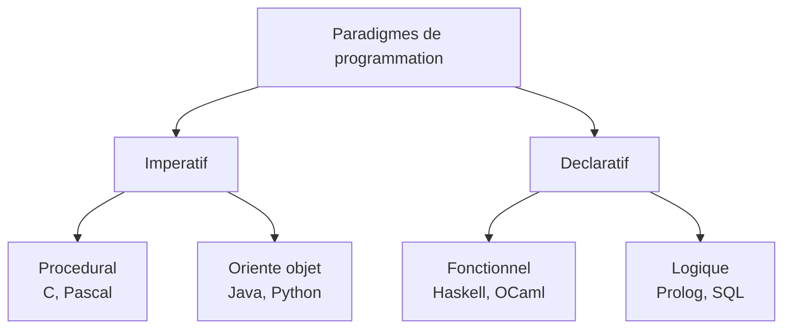

# Séquence 17 — Paradigmes de programmation

> Source : https://lyotardjulien.forge.apps.education.fr/terminale-specialite-nsi-au-lycee-notre-dame/70_sequence_70/70_sequence_70/

!!! warning "Périmètre officiel BO Terminale — fiche très allégée"
    Le BO Terminale dit littéralement et **uniquement** :

    > « **Identifier les paradigmes de programmation** dont relèvent les langages les plus connus. **Choisir un paradigme** de programmation suivant le champ d'application d'un programme. »

    C'est tout. La note **MENE2227884N (2022)** exclut ce thème de l'écrit. **0 sujet sur 84** en 2024-2025 ne le teste. Cette fiche est volontairement réduite à un tableau récapitulatif et quelques exemples d'identification — c'est le strict nécessaire.

    **Hors programme NSI** : fonction pure vs impure, fonctions d'ordre supérieur, `reduce`, immuabilité, encapsulation/héritage/polymorphisme détaillés (POO traitée fiche 04 au minimum nécessaire).

---

## TL;DR

Un **paradigme** est un style de programmation qui structure la manière d'écrire le code. Les **4 paradigmes principaux** à savoir identifier sont :

| Paradigme | Idée centrale | Langage emblématique |
|-----------|---------------|----------------------|
| **Impératif** | Suite d'instructions modifiant l'état | C, Pascal |
| **Orienté objet** | Données + comportements regroupés en classes | Java, Python |
| **Fonctionnel** | Programme = composition de fonctions | Haskell, OCaml, Lisp |
| **Déclaratif (logique)** | On décrit le résultat voulu, pas le « comment » | Prolog, SQL |

Un même problème peut souvent être résolu dans plusieurs paradigmes ; le bon programmeur **choisit le paradigme adapté** au problème (impératif pour la performance brute, OO pour modéliser le réel, fonctionnel pour le calcul/parallélisme, déclaratif pour les requêtes).

---

## Plan

1. Définition d'un paradigme.
2. Tableau récapitulatif des 4 paradigmes.
3. Identifier le paradigme d'un langage donné.
4. Choisir un paradigme selon le champ d'application.

---

## Notions clés

### Définition

Un **paradigme de programmation** est une approche, un cadre conceptuel qui structure la façon dont on écrit un programme. **Ce n'est pas un langage** : un même langage peut supporter plusieurs paradigmes (Python est **multi-paradigme**).

### Tableau récapitulatif

| Paradigme | En une phrase | Style typique | Langages |
|-----------|---------------|---------------|----------|
| **Impératif** | « Voici les étapes à exécuter » : suite d'instructions qui modifient l'état (variables, mémoire). | Boucles, affectations, fonctions/procédures | **C**, Pascal, Fortran, Python (mode procédural) |
| **Orienté objet** (OO) | Variante de l'impératif où les données et les fonctions qui les manipulent sont regroupées dans des **classes**. | `class`, attributs, méthodes | **Java**, C++, Python, C# |
| **Fonctionnel** | Le programme est une **composition de fonctions**. On préfère la récursion aux boucles. | Fonctions sans effet de bord, `map`, `filter` | **Haskell**, OCaml, Lisp, Scheme |
| **Déclaratif (logique)** | On **décrit le résultat voulu**, pas la manière de l'obtenir ; un moteur d'inférence/un solveur s'en charge. | Faits + règles, requêtes | **Prolog**, **SQL** |

### Identifier le paradigme d'un programme — exemples

**Style impératif (Python)** :
```python
res = []
for x in [1, 2, 3, 4, 5]:
    if x % 2 == 0:
        res.append(x * x)
```

**Style orienté objet (Python)** :
```python
class Rectangle:
    def __init__(self, l, h):
        self.l, self.h = l, h
    def aire(self):
        return self.l * self.h
```

**Style fonctionnel (Python)** :
```python
res = list(map(lambda x: x*x, filter(lambda x: x % 2 == 0, [1,2,3,4,5])))
```

**Style déclaratif (SQL)** :
```sql
SELECT nom FROM Eleve WHERE classe = 'TG1';
```

### Choisir un paradigme selon le contexte

| Contexte | Paradigme adapté |
|----------|------------------|
| Programme système, performance brute (drivers, OS) | Impératif (C) |
| Modéliser le monde réel (jeu, application métier) | Orienté objet |
| Calcul mathématique, traitement de données, parallélisme | Fonctionnel |
| Requêtes sur des données structurées | Déclaratif (SQL) |

---

## Vocabulaire (table)

| Terme | Définition |
|-------|------------|
| Paradigme | Style structurant la conception d'un programme |
| Impératif | On décrit la suite d'instructions à exécuter |
| Déclaratif | On décrit le résultat voulu sans le « comment » |
| Procédural | Programme = enchaînement de procédures/fonctions |
| Orienté objet | Programme = objets contenant données + méthodes |
| Fonctionnel | Programme = composition de fonctions |
| Multi-paradigme | Langage supportant plusieurs paradigmes (ex. Python) |

---

## Diagramme Mermaid



---

## Pièges classiques au bac

- **Confondre langage et paradigme** : Python n'est pas « un langage objet », c'est un langage **multi-paradigme**.
- **POO** : au programme NSI, c'est seulement le **vocabulaire** (classe, attribut, méthode, objet) — héritage et polymorphisme sont **hors programme** (cf. fiche 04).
- **SQL est déclaratif** : on dit ce qu'on veut (les lignes répondant à un critère), pas comment les calculer.
- **Un même langage peut supporter plusieurs paradigmes** : Python supporte impératif, OO et fonctionnel.

---

## Questions types

1. **Définissez ce qu'est un paradigme de programmation.**
2. **Quelle est la différence entre paradigme impératif et déclaratif ?**
3. **Citez 4 paradigmes** et donnez un langage emblématique de chacun.
4. **À quel paradigme appartient SQL ? Pourquoi ?**
5. **Pourquoi dit-on que Python est multi-paradigme ?**
6. **Pour développer un système d'exploitation à hautes performances, quel paradigme est typiquement choisi ?**

---

## Liens

- Programme officiel NSI Terminale (BO 2019).
- Fiches associées : [`01_python_remise_en_route.md`](01_python_remise_en_route.md), [`04_programmation_orientee_objet.md`](04_programmation_orientee_objet.md).
