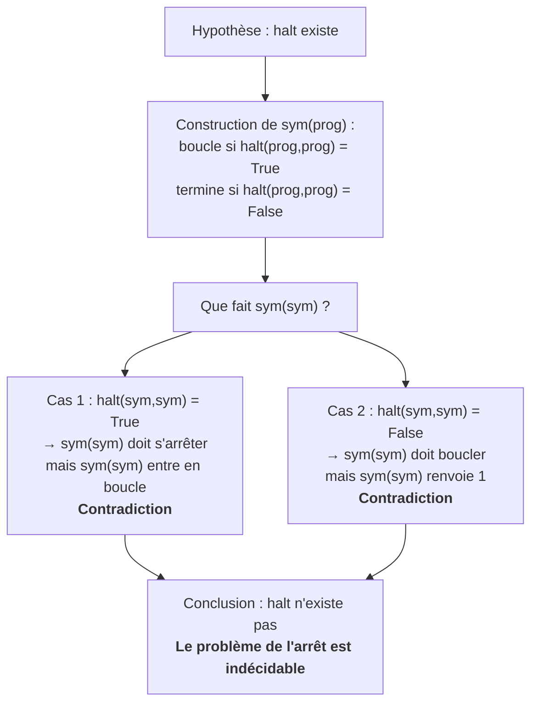

# Séquence 19 — Décidabilité & Calculabilité

> Source : <https://lyotardjulien.forge.apps.education.fr/terminale-specialite-nsi-au-lycee-notre-dame/90_sequence_90/90_sequence_90/>
> Cours détaillé : <https://lyotardjulien.forge.apps.education.fr/bifurcation-site-coilhac-term/decidabilite_calculabilite/cours/>

---

## TL;DR

- Un problème est **décidable** s'il existe un algorithme qui, pour toute entrée, **termine en temps fini** et répond correctement « oui / non ».
- Une fonction est **calculable** s'il existe un algorithme qui, pour toute entrée, **termine en temps fini** et renvoie la bonne sortie. Décidabilité = calculabilité appliquée aux problèmes oui/non.
- Le **problème de l'arrêt** demande : « existe-t-il un programme `halt(P, x)` qui dit si l'exécution du programme `P` sur l'entrée `x` s'arrête ? ». **Réponse (Turing & Church, 1936) : non, il est indécidable.**
- La preuve est un **raisonnement par l'absurde** : on suppose `halt` existe, on construit `sym(prog)` qui boucle ssi `prog(prog)` s'arrête, puis on regarde `sym(sym)` → contradiction dans les deux cas.
- **Au programme strict du bac : uniquement le problème de l'arrêt** (et sa démonstration). Machine de Turing, λ-calcul, thèse de Church-Turing = culture, hors programme.

---

## Plan de la séquence

1. Décidabilité : définition, exemples décidables (parité, primalité).
2. Un programme peut être passé en paramètre à un autre programme.
3. Le problème de l'arrêt : énoncé.
4. Démonstration de l'indécidabilité du problème de l'arrêt (par l'absurde).
5. Calculabilité — lien avec la décidabilité.
6. Bonus historique : Hilbert, Gödel, Turing, Church.

---

## Notions clés

### Décidabilité

> **Un problème de décision est *décidable*** s'il existe un algorithme qui, pour toute instance du problème, **termine en un nombre fini d'étapes** et retourne **`True`** si la réponse au problème est oui, **`False`** sinon.

Exemples de problèmes **décidables** :

- **Parité** : « n est-il pair ? » → `n % 2 == 0`. Termine toujours en O(1).
- **Primalité** : « n est-il premier ? » → on teste `n % k == 0` pour `k` de 2 à `n−1`. Termine toujours.
- Recherche d'un élément dans un tableau, tri d'une liste finie, accessibilité dans un graphe fini, etc.

### Calculabilité

> **Une fonction `f` est *calculable*** s'il existe un algorithme qui, pour toute entrée `x`, **termine en un nombre fini d'étapes** et renvoie `f(x)`.

Lien : un problème oui/non est *décidable* ⟺ sa fonction caractéristique (`x ↦ True/False`) est *calculable*. La décidabilité est donc le **cas particulier** de la calculabilité où la sortie est binaire.

### Un programme est une donnée

Un programme est un **fichier texte**, donc une suite de caractères : on peut le passer en **paramètre** à un autre programme. C'est ce que font tous les jours :

- l'**interpréteur** Python (`python3 test.py` → `python3` reçoit `test.py` en entrée),
- un **compilateur** (`gcc fichier.c`),
- un **antivirus** (analyse un `.exe`),
- un **linter** (`pylint mon_code.py`),
- un **debugger** (exécute un programme pas à pas).

Conséquence : un programme peut s'analyser **lui-même**.

---

## Vocabulaire

| Terme | Définition |
|-------|------------|
| Algorithme | Suite finie d'instructions élémentaires, déterministe, qui termine et résout un problème. |
| Problème de décision | Problème dont la réponse est binaire (oui / non). |
| Décidable | Qui admet un algorithme de décision (terminaison + réponse correcte). |
| Indécidable | Aucun algorithme universel ne peut décider le problème. |
| Calculable | Une fonction pour laquelle il existe un algorithme qui la calcule. |
| Problème de l'arrêt | « Étant donné `P` et `x`, est-ce que `P(x)` termine ? » → indécidable. |
| Raisonnement par l'absurde | Supposer le contraire de ce qu'on veut prouver, dériver une contradiction, conclure. |
| Entscheidungsproblem | « Problème de la décision » de Hilbert (1928) : existe-t-il un algorithme universel répondant à toute question mathématique ? Réponse (1936) : non. |
| Thèse de Church-Turing | Tout ce qui est calculable peut être calculé par une machine de Turing (≡ par un programme dans n'importe quel langage usuel). |

---

## Le problème de l'arrêt

### Énoncé

On cherche à écrire une fonction `halt(prog, x)` qui :

- prend en entrée un programme `prog` (son code-source) et une entrée `x`,
- renvoie `True` si l'exécution de `prog(x)` **s'arrête**,
- renvoie `False` si `prog(x)` **boucle indéfiniment**.

Cette fonction doit elle-même **toujours terminer**, et donner la bonne réponse pour **n'importe quel** programme `prog`.

```python
def halt(prog, x):
    if "prog(x) s'arrête":   # ← impossible à écrire,
        return True           # comme on va le démontrer
    else:
        return False
```

### Théorème (Turing & Church, 1936)

> **Le problème de l'arrêt est indécidable** : il n'existe pas de programme `halt` qui réponde correctement pour toute entrée `(prog, x)`.

Ce résultat est **fondamental** :

- Il ne dit pas qu'écrire `halt` est *difficile* — il dit que c'est **mathématiquement impossible**.
- Il est **indépendant du langage** (Python, C, Java, futur, …).
- Il est **indépendant de la puissance de la machine** (même un ordinateur infiniment rapide ne peut pas).

### Démonstration par l'absurde

**Étape 1 — Hypothèse.** On suppose qu'un programme `halt(prog, x)` existe et fonctionne correctement (termine toujours, répond juste).

**Étape 2 — Construction de `sym`.** Avec `halt`, on peut construire :

```python
def sym(prog):
    if halt(prog, prog) == True:
        while True:
            print("vers l'infini et au-delà !")   # boucle infinie
    else:
        return 1                                  # s'arrête
```

`sym` reçoit un programme `prog` et :

- entre dans une boucle infinie si `prog(prog)` s'arrête ;
- termine en renvoyant 1 si `prog(prog)` ne s'arrête pas.

**Étape 3 — Question diagonale.** Que vaut `sym(sym)` ? Deux cas :

- **Cas 1** : `halt(sym, sym) = True`. Cela signifie que `sym(sym)` *s'arrête*. Mais d'après le code de `sym`, dans ce cas on entre dans la boucle infinie → `sym(sym)` **ne s'arrête pas**. **Contradiction.**
- **Cas 2** : `halt(sym, sym) = False`. Cela signifie que `sym(sym)` *ne s'arrête pas*. Mais d'après le code, dans ce cas `sym` exécute `return 1` → `sym(sym)` **s'arrête**. **Contradiction.**

**Étape 4 — Conclusion.** L'hypothèse de l'existence de `halt` mène à une contradiction dans **tous les cas**. Donc `halt` **n'existe pas** : le problème de l'arrêt est indécidable. **CQFD**

> 💡 La structure « auto-référence + diagonale » est la même que celle de l'argument de Cantor (cardinalité de R) ou du paradoxe de Russell. C'est le procédé clé en théorie de la calculabilité.

---

## Diagramme — l'argument diagonal



---

## Pour aller plus loin (hors programme strict)

### Machine de Turing

Modèle théorique de calcul (Turing, 1936) :

- un **ruban infini** divisé en cases contenant des symboles,
- une **tête de lecture/écriture** qui se déplace ↔,
- un **ensemble fini d'états**,
- une **table de transitions** (symbole lu, état) → (symbole écrit, déplacement, nouvel état).

Une **machine de Turing universelle** peut simuler n'importe quelle autre machine de Turing → c'est **l'ancêtre théorique de l'ordinateur** (un seul matériel, n'importe quel programme).

### λ-calcul

Modèle équivalent (Church, 1936) où **tout est fonction**. Base théorique des langages **fonctionnels** (Lisp, Haskell, OCaml, …). Le mot-clé `lambda` en Python est un héritage direct.

### Thèse de Church-Turing

Tout ce qui est calculable au sens intuitif est calculable par une machine de Turing — équivalent à : par un programme dans n'importe quel langage de programmation usuel. C'est une **thèse** (pas un théorème) car elle relie une notion intuitive à un modèle formel.

### Contexte historique

- **1900** — Hilbert publie ses **23 problèmes** au Congrès de Paris.
- **1928** — Hilbert pose l'**Entscheidungsproblem** : « existe-t-il un algorithme universel qui décide si toute proposition mathématique est vraie ou fausse ? »
- **1931** — **Gödel** démontre ses théorèmes d'**incomplétude** : tout système formel suffisamment puissant contient des énoncés vrais mais non démontrables.
- **1936** — **Turing** (machine de Turing) et **Church** (λ-calcul), indépendamment, démontrent que **l'Entscheidungsproblem n'a pas de solution**, en passant par l'indécidabilité du problème de l'arrêt.

---

## Pièges classiques au bac

- **Confondre indécidable et difficile** : `halt` n'est pas « long à exécuter » — il **ne peut pas exister**. Aucun langage, aucun ordinateur futur ne le permettra.
- **Croire que tout problème de décision est décidable** : c'est faux ; le problème de l'arrêt en est le contre-exemple canonique.
- **Confondre décidabilité et complexité** : un problème peut être décidable mais coûteux (ex. SAT en O(2ⁿ)). Décidable = il existe *un* algo qui termine. Complexité = à quel coût.
- **Oublier que l'algorithme doit terminer pour TOUTES les entrées** : un programme qui répond bien sur 99 % des cas mais boucle parfois ne *décide* pas le problème.
- **Mal mener le raisonnement par l'absurde** : il faut bien partir de l'hypothèse opposée, dériver la contradiction, **puis** conclure. Sauter une étape coûte des points.
- **Sortir du programme** au bac : on attend la démonstration du problème de l'arrêt (avec `halt` et `sym`), pas un cours sur la machine de Turing ou le λ-calcul.

---

## Questions types au bac

**Q1.** *Donner la définition d'un problème décidable.*
> Un problème de décision est décidable s'il existe un algorithme qui, pour toute instance, termine en un nombre fini d'étapes et donne la bonne réponse (oui/non). « Termine **toujours** » est essentiel : un algorithme qui boucle parfois ne décide pas le problème.

**Q2.** *Donner un exemple de problème décidable et expliquer pourquoi.*
> La primalité : tester si `n` est premier en essayant tous les diviseurs `k` de 2 à `n−1`. La boucle se termine après au plus `n−2` itérations, donc l'algorithme termine pour toute entrée et donne la bonne réponse. Le problème est décidable.

**Q3.** *Énoncer le problème de l'arrêt et son statut.*
> Le problème de l'arrêt demande s'il existe un algorithme `halt(P, x)` qui, pour tout programme `P` et toute entrée `x`, termine et renvoie `True` si `P(x)` s'arrête, `False` sinon. Le théorème de Turing (1936) affirme que **le problème de l'arrêt est indécidable** : un tel algorithme n'existe pas.

**Q4.** *Démontrer l'indécidabilité du problème de l'arrêt (raisonnement par l'absurde).*
> Supposons par l'absurde que `halt(prog, x)` existe et fonctionne correctement. On construit le programme `sym(prog)` qui : entre en boucle infinie si `halt(prog, prog) == True`, et renvoie `1` sinon. On considère `sym(sym)` :
> – si `halt(sym, sym) = True`, alors `sym(sym)` doit s'arrêter ; or par construction `sym` entre en boucle infinie : contradiction.
> – si `halt(sym, sym) = False`, alors `sym(sym)` ne doit pas s'arrêter ; or par construction `sym` renvoie 1 : contradiction.
> Dans les deux cas, contradiction. L'hypothèse est fausse : `halt` n'existe pas. Le problème de l'arrêt est indécidable.

**Q5.** *Pourquoi un programme peut-il prendre un autre programme en paramètre ?*
> Parce qu'un programme est un fichier texte, c'est-à-dire une suite de caractères — donc une donnée comme une autre. C'est ce que font les compilateurs, interpréteurs, antivirus, linters, debuggers : ils prennent un programme en entrée. Rien n'empêche un programme de se prendre lui-même comme paramètre, ce qui est essentiel à la démonstration de l'indécidabilité du problème de l'arrêt.

**Q6.** *L'indécidabilité du problème de l'arrêt est-elle une limite technologique ?*
> Non. C'est une limite **mathématique fondamentale**, indépendante du langage de programmation et de la puissance de la machine. Aucun progrès technologique futur ne pourra la lever : c'est aussi vrai en Python aujourd'hui qu'en quantique demain.

---

## Liens

- Page séquence (Lyotard) : <https://lyotardjulien.forge.apps.education.fr/terminale-specialite-nsi-au-lycee-notre-dame/90_sequence_90/90_sequence_90/>
- Cours détaillé : <https://lyotardjulien.forge.apps.education.fr/bifurcation-site-coilhac-term/decidabilite_calculabilite/cours/>
- Exercice type bac : <https://lyotardjulien.forge.apps.education.fr/bifurcation-site-coilhac-term/decidabilite_calculabilite/exercice_calculabilite_bac/>
- TP Capytale (machine de Turing en POO, hors programme) : <https://capytale2.ac-paris.fr/web/c/711c-10383989>
- Vidéo Arte « L'Entscheidungsproblem ou la fin des mathématiques ? » (série *Voyages au pays des maths*, 2023).
- Vidéo Science Étonnante (David Louapre) sur la machine de Turing.
