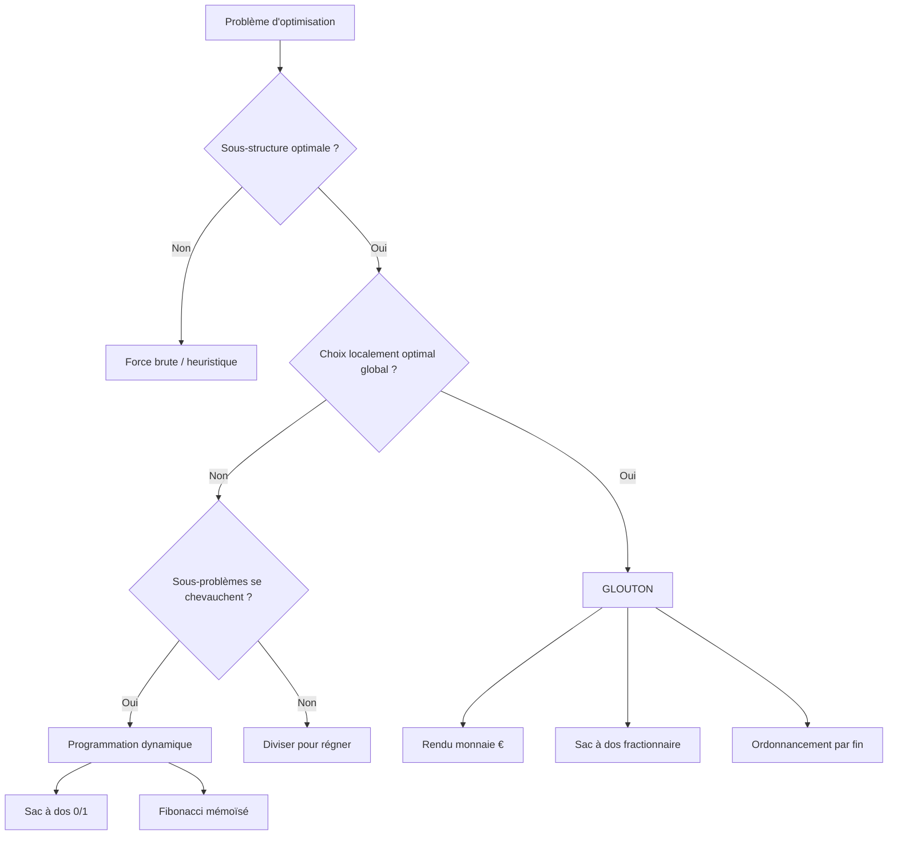
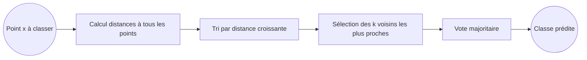

# Séquence 20 — Algorithmes gloutons & K plus proches voisins (KNN)

> Source : <https://lyotardjulien.forge.apps.education.fr/terminale-specialite-nsi-au-lycee-notre-dame/20_sequence_20/20_sequence_20/>

---

## TL;DR

- Un **algorithme glouton** fait à chaque étape le **choix localement optimal**, sans revenir en arrière.
- Le glouton n'est **pas toujours optimal** : il faut une **sous-structure optimale** + une **propriété du choix glouton**.
- Exemples bac : **rendu de monnaie** (système canonique €), **sac à dos fractionnaire**, **ordonnancement d'activités**.
- **KNN** : classification par **vote majoritaire** des `k` voisins les plus proches (distance euclidienne).
- Coût d'une prédiction KNN : **O(n × d)**. Choix de `k` impair pour éviter les égalités.

---

## Plan de la séquence

1. Algorithme glouton — principe.
2. Exemple : rendu de monnaie (canonique vs. quelconque).
3. Exemple : sac à dos fractionnaire vs. 0/1.
4. Exemple : ordonnancement d'activités.
5. KNN — principe et distances.
6. Implémentation Python du KNN.
7. Limites et bonnes pratiques.

---

## Notions clés

### Algorithme glouton

- **Définition** : algorithme qui construit une solution **étape par étape**, en faisant à chaque
  étape le choix qui semble localement le meilleur, **sans jamais revenir** sur ce choix.
- **Conditions d'optimalité** :
  1. **Sous-structure optimale** : une solution optimale du problème contient une solution
     optimale d'un sous-problème.
  2. **Propriété du choix glouton** : il existe un choix localement optimal qui appartient à
     une solution globalement optimale.
- **Avantages** : simple à programmer, souvent rapide.
- **Inconvénients** : ne fournit pas toujours l'optimum (le contre-exemple est l'argument anti-glouton).

### KNN (K-Nearest Neighbors)

- **Apprentissage supervisé** : on dispose d'un **jeu de données étiqueté** (chaque point a une classe).
- Pour classer un nouveau point `x` :
  1. Calculer la **distance** entre `x` et tous les points du jeu.
  2. Garder les `k` plus proches.
  3. Voter à la majorité parmi leurs étiquettes.
- **Distance euclidienne** : `d(x,y) = √Σᵢ (xᵢ − yᵢ)²`.
- **Distance de Manhattan** : `d(x,y) = Σᵢ |xᵢ − yᵢ|`.
- **Choix de k** :
  - Trop petit (k=1) → sensible au bruit.
  - Trop grand → lissage excessif, perd la structure locale.
  - Pour une classification binaire, on prend `k impair` pour éviter les égalités.

---

## Vocabulaire

| Terme | Définition |
|-------|------------|
| Glouton (greedy) | Stratégie de choix localement optimal sans retour en arrière. |
| Système canonique | Système de pièces où l'algorithme glouton donne le rendu optimal (ex. €). |
| Sac à dos | Problème : maximiser la valeur d'objets choisis sous contrainte de poids. |
| Fractionnaire | On peut prendre une fraction d'un objet. |
| 0/1 | On prend l'objet entier ou pas du tout. |
| Ordonnancement | Choix d'un sous-ensemble de tâches compatibles maximisant le nombre. |
| KNN | K Nearest Neighbors — algorithme de classification par voisinage. |
| Apprentissage supervisé | On dispose des étiquettes des exemples. |
| Distance euclidienne | √Σ(xᵢ − yᵢ)². |
| Distance de Manhattan | Σ|xᵢ − yᵢ|. |
| Normalisation | Mise à l'échelle des attributs (entre 0 et 1, par ex.) avant calcul des distances. |
| Curse of dimensionality | Dégradation des performances quand la dimension augmente. |

---

## Algorithmes & code

### 1. Rendu de monnaie — système canonique (glouton optimal)

```python
def rendu_monnaie_glouton(somme, pieces):
    """Rend une somme avec le moins de pièces, en supposant le système canonique.

    Précondition : pieces est une liste triée par valeur DÉCROISSANTE,
                   et le système est canonique (ex : [200, 100, 50, 20, 10, 5, 2, 1]).
    Postcondition : retourne un dictionnaire {valeur_piece: nombre}.
    """
    rendu = {}
    for p in pieces:
        if somme >= p:
            n = somme // p          # nombre de pièces de valeur p à donner
            rendu[p] = n
            somme = somme - n * p   # ce qu'il reste à rendre
    return rendu


# Exemple
PIECES_EUR = [200, 100, 50, 20, 10, 5, 2, 1]
print(rendu_monnaie_glouton(287, PIECES_EUR))
# {200: 1, 50: 1, 20: 1, 10: 1, 5: 1, 2: 1}
```

**Complexité** : O(n) où n = nombre de coupures.

### Contre-exemple — système non canonique

Avec `pieces = [4, 3, 1]` et somme = 6 :
- Glouton : 4 + 1 + 1 → **3 pièces**.
- Optimum : 3 + 3 → **2 pièces**.

→ Le glouton n'est **pas optimal** ici. Il faut alors la **programmation dynamique** (séq. 30).

### 2. Sac à dos fractionnaire (glouton optimal)

```python
def sac_a_dos_fractionnaire(objets, capacite):
    """Maximise la valeur emportée dans un sac de capacité donnée.

    objets : liste de tuples (valeur, poids).
    capacite : capacité maximale (entier ou flottant).
    Retourne : valeur totale emportée + liste (objet, fraction).
    """
    # Tri par ratio valeur/poids décroissant — choix glouton
    objets_tries = sorted(objets, key=lambda x: x[0] / x[1], reverse=True)
    valeur_totale = 0
    detail = []
    for valeur, poids in objets_tries:
        if capacite >= poids:
            # On prend l'objet entier
            capacite -= poids
            valeur_totale += valeur
            detail.append(((valeur, poids), 1.0))
        else:
            # On prend une fraction
            fraction = capacite / poids
            valeur_totale += valeur * fraction
            detail.append(((valeur, poids), fraction))
            break  # sac plein
    return valeur_totale, detail


# Exemple
objets = [(60, 10), (100, 20), (120, 30)]   # (valeur, poids)
print(sac_a_dos_fractionnaire(objets, 50))
# (240.0, [...]) — on prend tout O1, tout O2, et 2/3 d'O3
```

**Complexité** : O(n log n) (tri).

### 3. Sac à dos 0/1 — glouton SOUS-optimal

Avec capacité = 50 et objets `[(60,10), (100,20), (120,30)]` :
- Glouton (par ratio) prend O1 et O2 → 60 + 100 = 160.
- Optimum : prendre O2 et O3 → 100 + 120 = **220**.

→ Le glouton ne fonctionne pas sur le sac à dos 0/1. Voir **séq. 30** (DP).

### 4. Ordonnancement d'activités

On a `n` activités, chacune avec début et fin. Trouver le plus grand sous-ensemble
d'activités **compatibles** (qui ne se chevauchent pas).

**Choix glouton** : trier par **fin la plus tôt**, puis prendre une activité si elle est
compatible avec la dernière prise.

```python
def ordonnancement(activites):
    """Sélectionne le plus grand nombre d'activités compatibles.

    activites : liste de tuples (debut, fin).
    Retourne : liste d'activités sélectionnées.
    """
    # Tri par fin croissante — choix glouton
    activites_tries = sorted(activites, key=lambda a: a[1])
    selection = []
    fin_courante = -float('inf')
    for debut, fin in activites_tries:
        if debut >= fin_courante:    # compatible
            selection.append((debut, fin))
            fin_courante = fin
    return selection


# Exemple
A = [(1, 4), (3, 5), (0, 6), (5, 7), (3, 9), (5, 9), (6, 10), (8, 11), (8, 12), (2, 14), (12, 16)]
print(ordonnancement(A))
# [(1,4), (5,7), (8,11), (12,16)]   — 4 activités
```

**Complexité** : O(n log n).

### 5. KNN — implémentation pédagogique

```python
from math import sqrt
from collections import Counter


def distance_euclidienne(p1, p2):
    """Distance euclidienne entre deux points de même dimension."""
    return sqrt(sum((a - b) ** 2 for a, b in zip(p1, p2)))


def knn_predire(jeu, x, k):
    """Prédit la classe de x à partir d'un jeu de données étiqueté.

    jeu : liste de tuples (point, classe). Ex : [((1.0, 2.0), 'A'), ...]
    x   : point à classer (tuple de coordonnées).
    k   : nombre de voisins à consulter (idéalement impair).
    Retourne : la classe majoritaire parmi les k plus proches voisins.
    """
    # 1. Calculer toutes les distances et associer à la classe
    distances = []
    for point, classe in jeu:
        d = distance_euclidienne(x, point)
        distances.append((d, classe))

    # 2. Trier par distance croissante
    distances.sort(key=lambda item: item[0])

    # 3. Prendre les k plus proches et compter les classes
    voisins = distances[:k]
    classes_voisines = [classe for _, classe in voisins]
    compteur = Counter(classes_voisines)

    # 4. Retourner la classe la plus fréquente
    return compteur.most_common(1)[0][0]


# Exemple jouet
jeu_iris = [
    ((5.1, 3.5), 'setosa'),
    ((4.9, 3.0), 'setosa'),
    ((6.7, 3.0), 'virginica'),
    ((6.3, 2.9), 'virginica'),
    ((5.5, 2.4), 'versicolor'),
    ((6.1, 2.8), 'versicolor'),
]
print(knn_predire(jeu_iris, (6.0, 2.7), k=3))   # 'versicolor'
```

**Complexité** : O(n × d) par prédiction (n = nb de points du jeu, d = dimension).
Pas de phase d'apprentissage à proprement parler (algorithme « paresseux »).

### 6. Importance de la normalisation

Si un attribut va de 0 à 1 et l'autre de 0 à 1000, le second domine totalement la distance.
**Solution** : normaliser entre 0 et 1.

```python
def normaliser(jeu):
    """Normalise chaque attribut entre 0 et 1 (min-max scaling)."""
    n_attr = len(jeu[0][0])
    mins = [min(p[i] for p, _ in jeu) for i in range(n_attr)]
    maxs = [max(p[i] for p, _ in jeu) for i in range(n_attr)]

    def norm(p):
        return tuple(
            (p[i] - mins[i]) / (maxs[i] - mins[i]) if maxs[i] != mins[i] else 0.0
            for i in range(n_attr)
        )

    return [(norm(p), c) for p, c in jeu]
```

---

## Diagramme — Carte de décision





---

## Pièges classiques au bac

- **Confondre glouton et programmation dynamique** : DP mémorise les sous-problèmes ; glouton non.
- **Penser que glouton = toujours optimal**. Donner un **contre-exemple** quand demandé
  (rendu monnaie [4,3,1] pour 6, ou sac 0/1).
- **Sac fractionnaire vs 0/1** : seul le fractionnaire est résolu par glouton.
- **KNN** : oublier la **normalisation** quand les attributs ont des échelles différentes.
- **k pair** : provoque des égalités → toujours **k impair** en classification binaire.
- **Distance euclidienne** : ne pas oublier la **racine carrée** (sinon c'est la distance au carré).
- **KNN apprentissage** : il n'y a **pas de phase d'apprentissage** ; tout se passe à la prédiction.

---

## Questions types au bac

**Q1.** *Donner la définition d'un algorithme glouton.*
> Un algo qui, à chaque étape, fait le choix localement optimal sans revenir en arrière.

**Q2.** *Donner un contre-exemple où l'algorithme glouton de rendu de monnaie n'est pas optimal.*
> Avec les pièces [4, 3, 1], pour rendre 6 : glouton donne 4+1+1 = 3 pièces ; optimum = 3+3 = 2 pièces.

**Q3.** *Dans le sac à dos fractionnaire, sur quel critère trie-t-on les objets ?*
> Sur le ratio valeur/poids décroissant.

**Q4.** *Quelle est la complexité d'une prédiction KNN avec n points en dimension d ?*
> O(n × d).

**Q5.** *Pourquoi normaliser les données avant d'appliquer KNN ?*
> Sinon un attribut à grande échelle domine la distance et fausse la classification.

**Q6.** *Pourquoi choisir k impair pour une classification binaire ?*
> Pour éviter les égalités lors du vote majoritaire.

---

## Liens

- Cours en ligne : <https://lyotardjulien.forge.apps.education.fr/terminale-specialite-nsi-au-lycee-notre-dame/20_sequence_20/20_sequence_20/>
- Voir aussi : [`30_programmation_dynamique.md`](30_programmation_dynamique.md) (alternative au glouton)
- Voir aussi : [`memos/memo_complexites.md`](../memos/memo_complexites.md)
