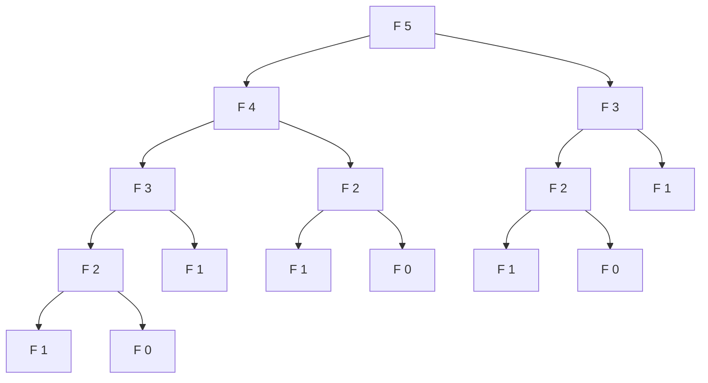
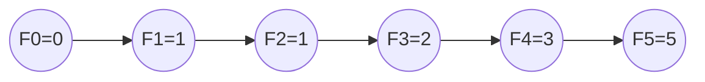

# Séquence 30 — Programmation dynamique

> Source : <https://lyotardjulien.forge.apps.education.fr/terminale-specialite-nsi-au-lycee-notre-dame/30_sequence_30/30_sequence_30/>

---

## TL;DR

- **Programmation dynamique (DP)** : décomposer en sous-problèmes **qui se chevauchent** et
  **mémoriser** les résultats pour ne pas les recalculer.
- Deux approches : **top-down** (mémoïsation, récursif + cache) et **bottom-up** (tabulation, itératif).
- Conditions : **sous-structure optimale** + **chevauchement** des sous-problèmes.
- Exemples bac : **Fibonacci**, **rendu de monnaie**, **sac à dos 0/1**, **PLSC** (plus longue
  sous-séquence commune).
- DP transforme typiquement une complexité **exponentielle en polynomiale** (ex : Fibonacci O(2ⁿ) → O(n)).

---

## Plan de la séquence

1. Principe et conditions d'application.
2. Comparaison avec diviser pour régner et glouton.
3. Mémoïsation (top-down) vs tabulation (bottom-up).
4. Fibonacci en DP.
5. Rendu de monnaie en DP (cas non canonique).
6. Sac à dos 0/1.
7. PLSC (plus longue sous-séquence commune).

---

## Notions clés

### Définition

La **programmation dynamique** s'applique à des problèmes où :
1. La solution optimale du problème dépend des solutions optimales de **sous-problèmes**
   (sous-structure optimale).
2. Les **mêmes sous-problèmes apparaissent plusieurs fois** au cours du calcul (chevauchement).

L'idée est de résoudre **chaque sous-problème une seule fois** et de stocker (mémoriser) son
résultat.

### Comparaison

| Stratégie | Sous-problèmes | Choix |
|-----------|----------------|-------|
| **Diviser pour régner** | Indépendants | — |
| **Glouton** | Pas de retour | Localement optimal |
| **Programmation dynamique** | Se chevauchent | Examen exhaustif des choix mémorisés |

### Mémoïsation (top-down)

On garde l'écriture **récursive** naturelle, et on ajoute un **cache** (dictionnaire ou
décorateur `@functools.lru_cache`) qui stocke les valeurs déjà calculées.

### Tabulation (bottom-up)

On résout les sous-problèmes **du plus petit au plus grand**, en remplissant un **tableau**.
Approche **itérative**.

---

## Vocabulaire

| Terme | Définition |
|-------|------------|
| Sous-structure optimale | La solution optimale se construit à partir de solutions optimales des sous-problèmes. |
| Chevauchement | Les mêmes sous-problèmes reviennent plusieurs fois. |
| Mémoïsation | Stocker les résultats des appels récursifs. |
| Tabulation | Calculer les valeurs dans une table itérativement. |
| Top-down | Approche descendante (récursive + cache). |
| Bottom-up | Approche ascendante (itérative + tableau). |
| `@lru_cache` | Décorateur Python ajoutant un cache LRU à une fonction. |
| dp | Notation usuelle pour le tableau de la programmation dynamique. |

---

## Algorithmes & code

### 1. Fibonacci — naïf vs mémoïsé vs tabulé

#### 1a. Récursif naïf — O(2ⁿ)

```python
def fibo_naif(n):
    """Suite de Fibonacci, version récursive naïve.
    F(0)=0, F(1)=1, F(n) = F(n-1) + F(n-2).
    Complexité : O(2^n) — TRÈS LENT au-delà de n=35.
    """
    if n < 2:
        return n
    return fibo_naif(n - 1) + fibo_naif(n - 2)
```

#### 1b. Mémoïsation top-down — O(n)

```python
def fibo_memo(n, cache=None):
    """Fibonacci avec mémoïsation manuelle (cache = dictionnaire)."""
    if cache is None:
        cache = {}
    if n in cache:
        return cache[n]
    if n < 2:
        return n
    cache[n] = fibo_memo(n - 1, cache) + fibo_memo(n - 2, cache)
    return cache[n]
```

#### 1c. Avec décorateur `@lru_cache`

```python
from functools import lru_cache

@lru_cache(maxsize=None)
def fibo(n):
    if n < 2:
        return n
    return fibo(n - 1) + fibo(n - 2)
```

#### 1d. Tabulation bottom-up — O(n) temps, O(n) espace

```python
def fibo_tab(n):
    """Fibonacci par tabulation."""
    if n < 2:
        return n
    dp = [0] * (n + 1)
    dp[1] = 1
    for i in range(2, n + 1):
        dp[i] = dp[i - 1] + dp[i - 2]
    return dp[n]
```

#### 1e. Tabulation bottom-up — O(n) temps, **O(1) espace** (variables glissantes)

```python
def fibo_o1(n):
    """Fibonacci en O(1) mémoire."""
    if n < 2:
        return n
    a, b = 0, 1
    for _ in range(n - 1):
        a, b = b, a + b
    return b
```

### 2. Rendu de monnaie — DP (cas non canonique)

Quand le système n'est pas canonique, le glouton ne donne pas l'optimum. La DP, oui.

```python
def rendu_dp(somme, pieces):
    """Nombre minimal de pièces pour rendre `somme` avec les valeurs `pieces`.

    Approche bottom-up : dp[s] = nb min de pièces pour la somme s.
    Cas de base : dp[0] = 0.
    Récurrence : dp[s] = 1 + min(dp[s - p]) pour toute p ≤ s dans pieces.
    Complexité : O(somme × len(pieces)).
    """
    INF = float('inf')
    dp = [INF] * (somme + 1)
    dp[0] = 0
    for s in range(1, somme + 1):
        for p in pieces:
            if p <= s and dp[s - p] + 1 < dp[s]:
                dp[s] = dp[s - p] + 1
    return dp[somme] if dp[somme] != INF else -1


# Exemple canonique
print(rendu_dp(287, [200, 100, 50, 20, 10, 5, 2, 1]))  # 6

# Exemple non canonique où le glouton échoue
print(rendu_dp(6, [4, 3, 1]))  # 2  (3 + 3) -- glouton donnerait 3 (4+1+1)
```

### 3. Sac à dos 0/1 — DP

Maximiser la valeur, sous contrainte de capacité, sans pouvoir prendre de fraction.

```python
def sac_a_dos_01(objets, capacite):
    """Sac à dos 0/1 par programmation dynamique.

    objets : liste de tuples (valeur, poids).
    capacite : capacité entière du sac.
    Retourne la valeur maximale réalisable.

    dp[i][w] = valeur max en utilisant les i premiers objets et capacité w.
    Récurrence :
        - sans l'objet i :       dp[i-1][w]
        - avec l'objet i (si w >= poids[i]) : dp[i-1][w - poids[i]] + valeur[i]
    Complexité : O(n × W).
    """
    n = len(objets)
    dp = [[0] * (capacite + 1) for _ in range(n + 1)]
    for i in range(1, n + 1):
        valeur, poids = objets[i - 1]
        for w in range(capacite + 1):
            sans = dp[i - 1][w]
            avec = dp[i - 1][w - poids] + valeur if poids <= w else 0
            dp[i][w] = max(sans, avec)
    return dp[n][capacite]


# Exemple
objets = [(60, 10), (100, 20), (120, 30)]
print(sac_a_dos_01(objets, 50))   # 220 — on prend O2 et O3
```

### 4. Plus Longue Sous-Séquence Commune (PLSC)

Étant donné deux chaînes A et B, trouver la longueur de la plus longue **sous-séquence**
commune (non nécessairement contiguë).

```python
def plsc(A, B):
    """Longueur de la plus longue sous-séquence commune.

    dp[i][j] = PLSC entre A[:i] et B[:j].
    Récurrence :
        - si A[i-1] == B[j-1] : dp[i][j] = dp[i-1][j-1] + 1
        - sinon              : dp[i][j] = max(dp[i-1][j], dp[i][j-1])
    Complexité : O(n × m).
    """
    n, m = len(A), len(B)
    dp = [[0] * (m + 1) for _ in range(n + 1)]
    for i in range(1, n + 1):
        for j in range(1, m + 1):
            if A[i - 1] == B[j - 1]:
                dp[i][j] = dp[i - 1][j - 1] + 1
            else:
                dp[i][j] = max(dp[i - 1][j], dp[i][j - 1])
    return dp[n][m]


print(plsc("ABCBDAB", "BDCAB"))   # 4 ("BCAB" ou "BDAB")
```

---

## Diagramme — explosion exponentielle vs mémoïsation


*Sans mémoïsation, F(3) est calculé 2x, F(2) 3x, F(1) 5x, etc. → O(2ⁿ).*


*Avec mémoïsation/tabulation, chaque F(i) est calculé une seule fois → O(n).*

---

## Pièges classiques au bac

- **Confondre DP et diviser pour régner** : DP suppose que les sous-problèmes se chevauchent.
- **Oublier le cache** dans la version récursive — tu retombes en O(2ⁿ).
- **Initialisation incorrecte** : `dp[0]` doit refléter le cas vide (souvent 0 ou +∞).
- **Sens de remplissage** : en bottom-up, calculer dp[i] AVANT dp[i+1].
- **Confondre sac fractionnaire (glouton) et sac 0/1 (DP)**.
- **Ne pas reconnaître** un problème DP : repérer un cas récursif simple + sous-problèmes répétés.

---

## Questions types au bac

**Q1.** *Quelles sont les deux conditions pour appliquer la programmation dynamique ?*
> Sous-structure optimale + chevauchement des sous-problèmes.

**Q2.** *Quelle est la complexité de Fibonacci naïf vs mémoïsé ?*
> O(2ⁿ) vs O(n).

**Q3.** *Différence entre top-down et bottom-up ?*
> Top-down : récursif + cache. Bottom-up : itératif + tableau rempli du plus petit au plus grand.

**Q4.** *Pourquoi le sac à dos 0/1 ne se résout-il pas par glouton ?*
> Pas de propriété du choix glouton : un choix « localement optimal » peut interdire
  une combinaison globalement meilleure.

**Q5.** *Donner la récurrence du sac à dos 0/1.*
> dp[i][w] = max(dp[i-1][w], dp[i-1][w-poids[i]] + valeur[i]).

**Q6.** *À quoi sert `@functools.lru_cache` ?*
> Ajouter automatiquement un cache à une fonction (mémoïsation).

---

## Liens

- Cours en ligne : <https://lyotardjulien.forge.apps.education.fr/terminale-specialite-nsi-au-lycee-notre-dame/30_sequence_30/30_sequence_30/>
- Voir aussi : [`20_glouton_knn.md`](20_glouton_knn.md) (comparatif glouton/DP)
- Voir aussi : [`07_diviser_pour_regner.md`](07_diviser_pour_regner.md) (autre stratégie récursive)
- Voir aussi : [`memos/memo_complexites.md`](../memos/memo_complexites.md)
