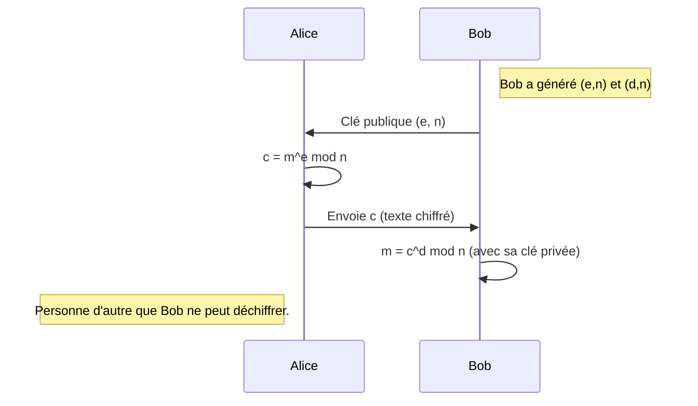
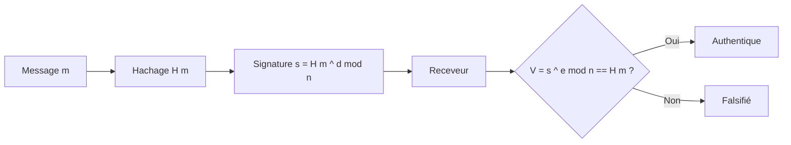

# Séquence 40 — Cryptographie

> Source : <https://lyotardjulien.forge.apps.education.fr/terminale-specialite-nsi-au-lycee-notre-dame/40_sequence_40/40_sequence_40/>

---

## TL;DR

- **Chiffrer** ≠ **coder** : chiffrer rend illisible, coder représente.
- **Symétrique** = même clé pour chiffrer/déchiffrer (rapide). **Asymétrique** = paire (clé
  publique / clé privée).
- **César** (substitution mono-alphabétique) et **Vigenère** (poly-alphabétique) sont
  cassables par analyse fréquentielle.
- **One-time pad (XOR avec clé aléatoire de même longueur)** = sécurité parfaite.
- **RSA** (asymétrique) repose sur la difficulté de factoriser un grand `n = p × q`.
- Une **fonction de hachage** (SHA-256) est rapide, déterministe, à sens unique, anti-collision.

---

## Plan de la séquence

1. Vocabulaire fondamental.
2. Chiffrements historiques : César, Vigenère.
3. Cryptanalyse par fréquences.
4. Chiffrement par bloc et XOR.
5. RSA : principe et exemple chiffré.
6. Signature électronique, certificats, HTTPS.
7. Fonctions de hachage.

---

## Notions clés

### Vocabulaire fondamental

- **Texte clair** (plain text) : message lisible.
- **Texte chiffré** (cipher text) : message illisible obtenu après chiffrement.
- **Clé** : information secrète permettant de chiffrer/déchiffrer.
- **Cryptanalyse** : ensemble des techniques pour casser un chiffrement sans la clé.
- **Cryptographie symétrique** : une **seule clé** pour chiffrer ET déchiffrer (César, Vigenère, AES).
- **Cryptographie asymétrique** : **deux clés** : publique (chiffre) et privée (déchiffre) — RSA.
- **Codage** : représentation des données (ASCII, UTF-8) — pas un chiffrement.
- **Encodage** : traduction d'un format à l'autre (Base64, URL-encoding) — pas un chiffrement.

### Sécurité parfaite (Shannon)

Un chiffrement est **parfaitement sûr** ssi la clé est **aléatoire**, **de même longueur** que
le message, et **utilisée une seule fois** : c'est le **masque jetable** (one-time pad).

---

## Vocabulaire

| Terme | Définition |
|-------|------------|
| Chiffrement | Rendre un message illisible sans la clé. |
| Déchiffrement | Récupérer le clair avec la clé. |
| Décrypter | Retrouver le clair SANS connaître la clé (≈ cryptanalyser). |
| Clé | Donnée secrète paramétrant le chiffrement. |
| César | Décalage circulaire de l'alphabet par k positions. |
| Vigenère | Chiffrement polyalphabétique avec une clé répétée. |
| Substitution | Remplacer chaque symbole par un autre. |
| Transposition | Permuter les symboles sans les changer. |
| Symétrique | Une seule clé partagée. |
| Asymétrique | Paire (clé publique, clé privée). |
| RSA | Algorithme asymétrique (Rivest, Shamir, Adleman, 1977). |
| One-time pad | Masque jetable, sécurité prouvée parfaite. |
| Hachage | Empreinte de taille fixe d'un message de taille quelconque. |
| Collision | Deux messages distincts ayant même haché. |
| Signature | Preuve d'authenticité, faite avec la clé privée. |
| Certificat | Document liant identité + clé publique, signé par une autorité. |

---

## Algorithmes & code

### 1. Chiffrement de César

Décalage circulaire de chaque lettre de `k` positions.

```python
def cesar_chiffrer(texte, k):
    """Chiffre `texte` (lettres a-z, A-Z) par décalage de k positions.

    Les caractères non alphabétiques sont laissés tels quels.
    Retourne la chaîne chiffrée.
    """
    resultat = []
    for c in texte:
        if 'a' <= c <= 'z':
            resultat.append(chr((ord(c) - ord('a') + k) % 26 + ord('a')))
        elif 'A' <= c <= 'Z':
            resultat.append(chr((ord(c) - ord('A') + k) % 26 + ord('A')))
        else:
            resultat.append(c)
    return ''.join(resultat)


def cesar_dechiffrer(texte, k):
    """Déchiffre en décalant de -k."""
    return cesar_chiffrer(texte, -k)


# Exemple
chiffre = cesar_chiffrer("Bonjour, NSI !", 3)
print(chiffre)               # "Erqmrxu, QVL !"
print(cesar_dechiffrer(chiffre, 3))   # "Bonjour, NSI !"
```

**Cryptanalyse de César** : il n'y a que **25 décalages** possibles → force brute en 25 essais.
On peut aussi utiliser l'**analyse de fréquences** (la lettre la plus fréquente du chiffré
correspond souvent à E en français).

### 2. Chiffrement de Vigenère

On utilise une **clé** (mot) répétée. Chaque lettre du clair est décalée par la lettre
correspondante de la clé.

```python
def vigenere_chiffrer(texte, cle):
    """Chiffrement de Vigenère.

    cle : chaîne de lettres (ex : "PYTHON").
    Pour chaque lettre du clair, on décale par (ord(lettre_cle) - ord('A')).
    """
    resultat = []
    cle = cle.upper()
    j = 0   # index dans la clé
    for c in texte:
        if c.isalpha():
            decalage = ord(cle[j % len(cle)]) - ord('A')
            base = ord('a') if c.islower() else ord('A')
            resultat.append(chr((ord(c) - base + decalage) % 26 + base))
            j += 1
        else:
            resultat.append(c)
    return ''.join(resultat)


def vigenere_dechiffrer(texte, cle):
    """Déchiffrement : on décale dans l'autre sens."""
    cle_inverse = ''.join(chr((26 - (ord(c) - ord('A'))) % 26 + ord('A')) for c in cle.upper())
    return vigenere_chiffrer(texte, cle_inverse)


print(vigenere_chiffrer("ATTAQUEZALAUBE", "CITRON"))   # CBMRENGHTOOIST
```

**Cryptanalyse de Vigenère** : test de **Kasiski** + analyse fréquentielle par tranche
(on sépare les lettres aux positions 0, k, 2k, ... et on applique César sur chaque tranche).

### 3. Chiffrement par XOR (one-time pad)

```python
def xor_chiffrer(message_octets, cle_octets):
    """Chiffrement XOR octet par octet.

    message_octets, cle_octets : objets bytes.
    Si la clé est ALÉATOIRE et de MÊME LONGUEUR, c'est le one-time pad
    (sécurité parfaite, démontrée par Shannon).
    """
    return bytes(m ^ k for m, k in zip(message_octets, cle_octets))


# Exemple
import os
message = "Bonjour".encode('utf-8')
cle = os.urandom(len(message))     # clé aléatoire
chiffre = xor_chiffrer(message, cle)
print(chiffre.hex())
print(xor_chiffrer(chiffre, cle).decode('utf-8'))   # 'Bonjour'
```

**Pourquoi XOR ?** Parce que `(m XOR k) XOR k = m`. Le XOR est sa propre inverse.

### 4. RSA — chiffrement asymétrique

#### 4.1 Génération de la paire de clés

1. Choisir 2 grands nombres premiers `p` et `q`.
2. Calculer `n = p × q`.
3. Calculer `φ(n) = (p − 1) × (q − 1)` (indicatrice d'Euler).
4. Choisir `e` tel que `1 < e < φ(n)` et `pgcd(e, φ(n)) = 1`.
5. Calculer `d` tel que `e × d ≡ 1 (mod φ(n))` (inverse modulaire de `e`).
6. **Clé publique** : `(e, n)` — diffusée à tous.
7. **Clé privée** : `(d, n)` — gardée secrète.

#### 4.2 Chiffrement / Déchiffrement

- Chiffrer un entier `m` (avec `0 ≤ m < n`) : `c = m^e mod n`.
- Déchiffrer : `m = c^d mod n`.

#### 4.3 Exemple pédagogique avec petits nombres

```python
def pgcd(a, b):
    while b:
        a, b = b, a % b
    return a


def inverse_modulaire(e, phi):
    """Calcule d tel que (e * d) % phi == 1, par algorithme d'Euclide étendu."""
    g, x, _ = euclide_etendu(e, phi)
    if g != 1:
        raise ValueError("e et phi ne sont pas premiers entre eux.")
    return x % phi


def euclide_etendu(a, b):
    """Renvoie (pgcd, x, y) tels que a*x + b*y = pgcd."""
    if b == 0:
        return a, 1, 0
    g, x1, y1 = euclide_etendu(b, a % b)
    return g, y1, x1 - (a // b) * y1


# Exemple : p=11, q=13
p, q = 11, 13
n = p * q          # 143
phi = (p - 1) * (q - 1)   # 120
e = 7              # premier avec 120
d = inverse_modulaire(e, phi)   # 103

# Chiffrement de m = 9
m = 9
c = pow(m, e, n)         # 9^7 mod 143 = 48
print("chiffré :", c)    # 48
print("déchiffré :", pow(c, d, n))   # 9
```

**Sécurité RSA** : casser RSA = factoriser `n` en `p × q` → réputé **infaisable** pour
`n` de 2048 bits ou plus.

### 5. Signature électronique

- **Bob** veut prouver qu'il est l'auteur d'un message.
- Il calcule un **haché** `h` du message (SHA-256).
- Il **signe** : `s = h^d mod n` (utilisation de sa **clé privée**).
- Tout le monde peut vérifier avec sa **clé publique** : `h' = s^e mod n` ; on compare `h'`
  au haché du message reçu.

### 6. Fonctions de hachage

Une fonction `H` est une **fonction de hachage cryptographique** si :
- Elle est **déterministe** : `H(m)` toujours le même.
- Elle est **rapide** à calculer.
- Elle a une **sortie de taille fixe** (256 bits pour SHA-256).
- Elle est **résistante aux pré-images** (sens unique : étant donné `h`, trouver `m` tel que
  `H(m) = h` est infaisable).
- Elle est **résistante aux collisions** : trouver `m₁ ≠ m₂` tels que `H(m₁) = H(m₂)` est
  infaisable.

```python
import hashlib
print(hashlib.sha256(b"Bonjour").hexdigest())
# 9b7d34d4d3...
```

⚠️ **MD5 est obsolète** (collisions trouvées dès 2004). N'utiliser **que SHA-256** (ou plus).

---

## Diagramme — Flux RSA Alice → Bob





---

## Pièges classiques au bac

- **Confondre coder, encoder, chiffrer**.
  - Coder : représenter (ASCII, UTF-8).
  - Encoder : transformer le format (Base64).
  - Chiffrer : rendre secret (avec clé).
- **Décrypter ≠ déchiffrer**. Décrypter = casser sans clé. Déchiffrer = avec clé.
- **Clé publique pour chiffrer, clé privée pour déchiffrer** (RSA, sens « chiffrement »).
- **Clé privée pour signer, clé publique pour vérifier** (sens « signature »).
- **One-time pad** : seulement parfait si clé aléatoire **et** unique **et** même taille.
- **Vigenère est NON cassable** ssi la clé est aussi longue que le message ET aléatoire (cas
  particulier du one-time pad). Sinon cassable par Kasiski.
- **MD5** ne doit plus être utilisé en cryptographie.

---

## Questions types au bac

**Q1.** *Quelle est la différence entre cryptographie symétrique et asymétrique ?*
> Symétrique : une seule clé partagée. Asymétrique : paire (publique pour chiffrer, privée
> pour déchiffrer).

**Q2.** *Donner un exemple de chiffrement par substitution mono-alphabétique.*
> César.

**Q3.** *Pourquoi le chiffrement de César est-il facile à casser ?*
> Il n'y a que 25 décalages possibles → force brute. Aussi : analyse fréquentielle.

**Q4.** *Quelle est la base mathématique de la sécurité de RSA ?*
> La difficulté de factoriser un grand entier `n = p × q` en ses deux facteurs premiers.

**Q5.** *Citer trois propriétés d'une bonne fonction de hachage cryptographique.*
> Déterministe, rapide, à sens unique (résistant aux pré-images), résistant aux collisions.

**Q6.** *Comment Alice peut-elle prouver qu'elle a écrit un document ?*
> Elle calcule un haché du document, le signe avec sa clé privée. Toute personne peut
> vérifier avec sa clé publique.

---

## Liens

- Cours en ligne : <https://lyotardjulien.forge.apps.education.fr/terminale-specialite-nsi-au-lycee-notre-dame/40_sequence_40/40_sequence_40/>
- Voir aussi : [`10_reseaux.md`](10_reseaux.md) (HTTPS = HTTP + TLS)
- Voir aussi : [`memos/memo_vocabulaire.md`](../memos/memo_vocabulaire.md)
