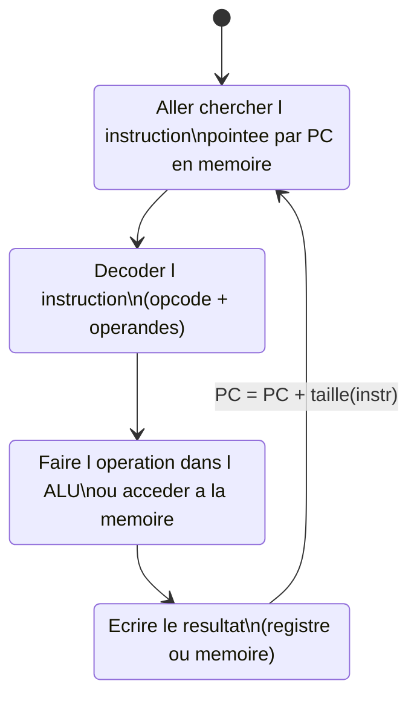
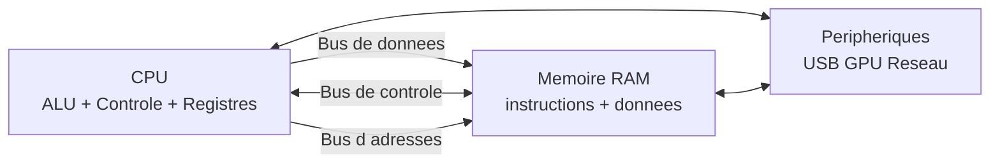

# Séquence 50 — Architecture & System on Chip (SoC)

> Source : <https://lyotardjulien.forge.apps.education.fr/terminale-specialite-nsi-au-lycee-notre-dame/50_sequence_50/50_sequence_50/>
> *Note : la page de cours en ligne pour cette séquence est très succincte. Cette fiche
> s'appuie sur le programme officiel NSI Terminale (BO 2020).*

---

## TL;DR

- Un **SoC (System on Chip)** intègre **CPU, GPU, mémoire, contrôleurs** sur une seule puce.
- **Architecture de von Neumann** : instructions et données partagent la même mémoire.
  **Architecture de Harvard** : mémoires séparées.
- Cycle d'exécution d'une instruction : **Fetch → Decode → Execute → Writeback**.
- Hiérarchie mémoire : **registres → cache (L1/L2/L3) → RAM → mémoire de masse**.
- Exemples : **Raspberry Pi**, smartphones (Apple Ax, Snapdragon).

---

## Plan de la séquence

1. Composants d'un ordinateur — vue interne.
2. Architectures von Neumann vs Harvard.
3. CPU : ALU, unité de contrôle, registres.
4. Hiérarchie mémoire et cache.
5. Bus.
6. Cycle d'exécution d'une instruction.
7. Notion de SoC et systèmes embarqués (IoT, GPIO).

---

## Notions clés

### Architecture de von Neumann

Architecture dans laquelle :
- **CPU**, **mémoire** et **périphériques** sont reliés par des **bus**.
- **Mémoire unique** stocke à la fois **instructions et données**.
- Inventée en 1945, c'est l'architecture standard de la quasi-totalité des ordinateurs modernes.

### Architecture de Harvard

- Mémoires **séparées** pour les instructions et les données.
- Chacune avec son propre bus.
- Avantage : on peut lire une instruction et accéder à une donnée **simultanément** → plus rapide.
- Utilisée dans certains processeurs embarqués (DSP, microcontrôleurs).

### CPU (Central Processing Unit)

- **ALU** (Unité Arithmétique et Logique) : effectue les opérations (ADD, SUB, AND, OR, XOR…).
- **Unité de contrôle** : décode les instructions, pilote ALU et bus.
- **Registres** : petites mémoires rapides à l'intérieur du CPU :
  - **PC** (Program Counter / compteur ordinal) : adresse de la prochaine instruction.
  - **IR** (Instruction Register) : instruction en cours.
  - **Accumulateur** / registres généraux.

### Mémoires (hiérarchie)

| Niveau | Vitesse | Capacité typique | Volatile ? |
|--------|---------|------------------|------------|
| Registres | ≈ 1 cycle | Quelques octets | Oui |
| Cache L1 | ≈ 4 cycles | 32 Ko | Oui |
| Cache L2 | ≈ 12 cycles | 256 Ko | Oui |
| Cache L3 | ≈ 40 cycles | 8 Mo | Oui |
| RAM | ≈ 200 cycles | 8–64 Go | **Oui** (perdu à l'extinction) |
| SSD / disque | ≈ 1 ms / 10 ms | 256 Go – plusieurs To | Non |

> Plus on monte dans la hiérarchie, plus c'est rapide… et plus c'est petit et cher.

### Bus

- **Bus de données** : transporte les valeurs.
- **Bus d'adresses** : indique d'où / où lire ou écrire.
- **Bus de contrôle** : signaux de commande (lecture/écriture, horloge, interruption).

### SoC (System on Chip)

Circuit intégré regroupant sur **une seule puce** :
- CPU multi-cœurs.
- GPU (graphismes).
- Mémoire (parfois).
- Contrôleurs (USB, réseau, audio, caméra…).
- DSP, modem.

→ Avantages : compact, faible consommation, faible coût.
→ Très utilisé dans les smartphones, tablettes, Raspberry Pi.

### Systèmes embarqués & IoT

- Système informatique **dédié à une fonction**, intégré dans un objet.
- Contraintes : faible énergie, mémoire réduite, temps réel.
- **IoT** (Internet of Things) : objets connectés au réseau.
- **GPIO** (General Purpose Input/Output) : broches programmables permettant de relier
  des **capteurs** (entrée) et des **actionneurs** (sortie).

---

## Vocabulaire

| Terme | Définition |
|-------|------------|
| ALU | Unité arithmétique et logique du CPU. |
| Bus | Ensemble de fils transportant données / adresses / contrôle. |
| Cache | Mémoire rapide entre CPU et RAM. |
| CPU | Processeur central. |
| Cycle d'horloge | Top d'horloge cadençant le CPU (ns). |
| Fetch | Étape : aller chercher l'instruction. |
| Decode | Étape : décoder l'instruction. |
| Execute | Étape : exécuter via l'ALU. |
| Writeback | Étape : écrire le résultat en mémoire/registre. |
| GPIO | Broche programmable d'entrée/sortie. |
| GPU | Processeur graphique. |
| Harvard | Architecture à mémoires séparées. |
| IoT | Objets connectés. |
| IR | Registre d'instruction. |
| PC | Compteur ordinal (Program Counter). |
| Pipeline | Exécution en parallèle des étapes d'instructions. |
| RAM | Mémoire vive volatile. |
| Registre | Petite mémoire ultra-rapide dans le CPU. |
| ROM | Mémoire morte (non volatile). |
| SoC | System on Chip. |
| Volatil | Perd son contenu hors tension. |
| von Neumann | Architecture à mémoire unique partagée instructions/données. |

---

## Cycle d'exécution d'une instruction

### Pipeline (parallélisme d'instructions)

Les CPUs modernes exécutent **plusieurs étapes en parallèle** sur des instructions
différentes :

| Cycle | Instr 1 | Instr 2 | Instr 3 | Instr 4 |
|-------|---------|---------|---------|---------|
| 1 | Fetch | | | |
| 2 | Decode | Fetch | | |
| 3 | Execute | Decode | Fetch | |
| 4 | Writeback | Execute | Decode | Fetch |

→ À pipeline saturé, **1 instruction par cycle** au lieu de 1 toutes les 4 sans pipeline.

---

## Schéma d'un ordinateur (von Neumann)

---

## Pièges classiques au bac

- **Confondre RAM (volatile) et ROM/Flash (non volatile)**.
- **Confondre fréquence d'horloge et performance** : à fréquence égale, deux CPUs peuvent
  avoir des performances très différentes (pipeline, cores, cache).
- **Penser que l'unité de mesure des fréquences est le bit/s** — non, c'est le **Hz** (cycles/s).
- **Confondre architecture matérielle et système d'exploitation**. Le SoC c'est le **matériel**.
- **Oublier que la RAM est volatile** → toutes les données sont perdues à l'extinction.

---

## Questions types au bac

**Q1.** *Donner les 3 composants principaux d'un CPU.*
> ALU, unité de contrôle, registres.

**Q2.** *Quelle est la différence entre architecture de von Neumann et de Harvard ?*
> Von Neumann : mémoire unique pour instructions et données. Harvard : mémoires séparées.

**Q3.** *Énumérer les 4 étapes du cycle d'exécution d'une instruction.*
> Fetch, Decode, Execute, Writeback.

**Q4.** *Pourquoi utilise-t-on un cache entre le CPU et la RAM ?*
> La RAM est trop lente. Le cache, plus rapide mais plus petit, garde les données
> récemment utilisées.

**Q5.** *Qu'est-ce qu'un SoC ?*
> Un circuit intégré regroupant CPU, GPU, mémoire, contrôleurs sur une seule puce.

**Q6.** *Citer deux contraintes des systèmes embarqués.*
> Faible consommation énergétique et mémoire limitée (ou : taille réduite, temps réel).

**Q7.** *À quoi sert une broche GPIO ?*
> À connecter et piloter un capteur ou un actionneur depuis le programme.

---

## Liens

- Cours en ligne : <https://lyotardjulien.forge.apps.education.fr/terminale-specialite-nsi-au-lycee-notre-dame/50_sequence_50/50_sequence_50/>
- Voir aussi : [`08_processus.md`](08_processus.md) (le système d'exploitation pilote ce matériel)
- Voir aussi : [`09_linux.md`](09_linux.md) (Raspberry Pi tourne sous Linux)
